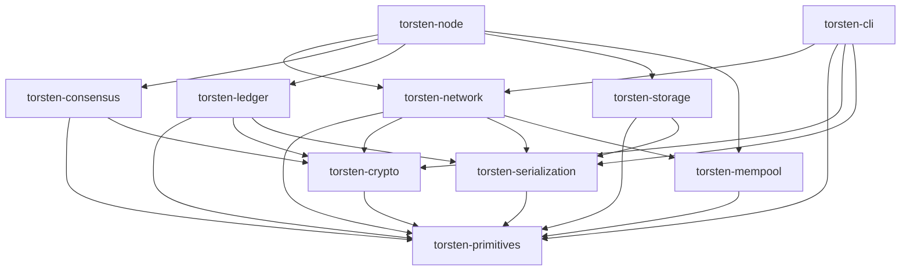

# Torsten

A Cardano node implementation written in Rust, aiming for 100% compatibility with [cardano-node](https://github.com/IntersectMBO/cardano-node).

Built by [Sandstone Pool](https://www.sandstone.io/)

[](https://github.com/michaeljfazio/torsten/actions/workflows/ci.yml)
[](https://michaeljfazio.github.io/torsten/)

> **Warning:** Torsten is in early development and is **not recommended for production use**. APIs, storage formats, and behavior may change without notice. Use at your own risk on testnets only.

## Quick Start

```bash
# Build
cargo build --release

# Fast sync with Mithril snapshot (recommended)
./target/release/torsten-node mithril-import \
  --network-magic 2 \
  --database-path ./db-preview

# Run the node
./target/release/torsten-node run \
  --config config/preview-config.json \
  --topology config/preview-topology.json \
  --database-path ./db-preview \
  --socket-path ./node.sock \
  --host-addr 0.0.0.0 \
  --port 3001
```

See the [full documentation](https://michaeljfazio.github.io/torsten/) for detailed setup instructions, CLI reference, and architecture guides.

## Architecture

Torsten is organized as a 10-crate Cargo workspace:

| Crate | Description |
|-------|-------------|
| `torsten-primitives` | Core types: hashes, blocks, transactions, addresses, values, protocol parameters (Byron–Conway) |
| `torsten-crypto` | Ed25519 keys, VRF, KES, text envelope format |
| `torsten-serialization` | CBOR encoding/decoding for Cardano wire format via pallas |
| `torsten-network` | Ouroboros mini-protocols (ChainSync, BlockFetch, TxSubmission, KeepAlive), N2N/N2C |
| `torsten-consensus` | Ouroboros Praos, chain selection, epoch transitions, slot leader checks |
| `torsten-ledger` | UTxO set, transaction validation, ledger state, certificates, native scripts, rewards |
| `torsten-mempool` | Thread-safe transaction mempool |
| `torsten-storage` | ChainDB (ImmutableDB via RocksDB + VolatileDB in-memory) |
| `torsten-node` | Main binary, config, topology, pipelined chain sync, Mithril import |
| `torsten-cli` | cardano-cli compatible CLI |



## Key Features

- **Full Ouroboros Praos** consensus with VRF leader election, KES validation, epoch nonce computation
- **Multi-era support** from Byron through Conway (CIP-1694 governance)
- **Pipelined multi-peer sync** with parallel block fetching from up to 4 peers
- **Mithril snapshot import** for fast initial sync (4M blocks in ~60 seconds)
- **N2N server** with ChainSync, BlockFetch, TxSubmission2, PeerSharing, KeepAlive
- **N2C server** with LocalStateQuery, LocalTxSubmission, LocalTxMonitor
- **Plutus V1/V2/V3** script evaluation via UPLC CEK machine
- **P2P peer management** with adaptive selection, EWMA latency tracking, reputation scoring
- **Block production** with VRF proofs, operational certificates, and block announcement
- **cardano-cli compatible** CLI for key generation, transaction building, and queries
- **Prometheus metrics** on port 12798

## Network Magic

| Network | Magic |
|---------|-------|
| Mainnet | `764824073` |
| Preview | `2` |
| Preprod | `1` |

## Development

```bash
cargo test --all
cargo clippy --all-targets -- -D warnings
cargo fmt --all -- --check
```

Zero-warning policy enforced — all code must compile cleanly with clippy and pass formatting checks.

## License

MIT
