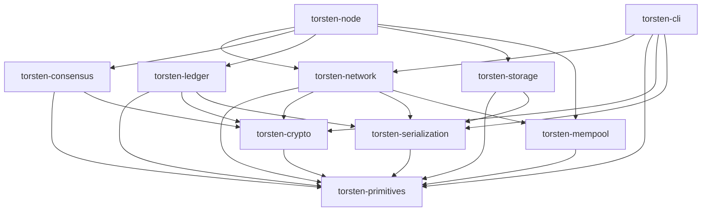

# Torsten

A Cardano node implementation written in Rust, aiming for 100% compatibility with [cardano-node](https://github.com/IntersectMBO/cardano-node).

Built by [Sandstone Pool](https://www.sandstone.io/)

[](https://github.com/michaeljfazio/torsten/actions/workflows/ci.yml)
[](https://michaeljfazio.github.io/torsten/)

> [!CAUTION]
> **Torsten is in early development and is NOT recommended for production use.**
> APIs, storage formats, and on-chain behavior may change without notice. Ledger validation is incomplete and may accept invalid transactions or reject valid ones. **Do not use this software to operate a stake pool, manage real funds, or participate in mainnet governance.** Use at your own risk on testnets only.

## Quick Start

```bash
# Build
cargo build --release

# Fast sync with Mithril snapshot (recommended)
./target/release/torsten-node mithril-import \
  --network-magic 2 \
  --database-path ./db-preview

# Run the node
./target/release/torsten-node run \
  --config config/preview-config.json \
  --topology config/preview-topology.json \
  --database-path ./db-preview \
  --socket-path ./node.sock \
  --host-addr 0.0.0.0 \
  --port 3001
```

See the [full documentation](https://michaeljfazio.github.io/torsten/) for detailed setup instructions, CLI reference, and architecture guides.

## Architecture

Torsten is organized as a 10-crate Cargo workspace:

| Crate | Description |
|-------|-------------|
| `torsten-primitives` | Core types: hashes, blocks, transactions, addresses, values, protocol parameters (Byron–Conway) |
| `torsten-crypto` | Ed25519 keys, VRF, KES, text envelope format |
| `torsten-serialization` | CBOR encoding/decoding for Cardano wire format via pallas |
| `torsten-network` | Ouroboros mini-protocols (ChainSync, BlockFetch, TxSubmission, KeepAlive), N2N/N2C |
| `torsten-consensus` | Ouroboros Praos, chain selection, epoch transitions, slot leader checks |
| `torsten-ledger` | UTxO set (LSM-backed via UTxO-HD), transaction validation, ledger state, certificates, native scripts, rewards |
| `torsten-mempool` | Thread-safe transaction mempool |
| `torsten-storage` | ChainDB (ImmutableDB append-only chunk files + VolatileDB in-memory) |
| `torsten-node` | Main binary, config, topology, pipelined chain sync, Mithril import |
| `torsten-cli` | cardano-cli compatible CLI |



## Key Features

- **Full Ouroboros Praos** consensus with VRF leader election, KES validation, epoch nonce computation
- **Multi-era support** from Byron through Conway (CIP-1694 governance)
- **Pipelined multi-peer sync** with parallel block fetching from up to 4 peers
- **Mithril snapshot import** for fast initial sync (4M blocks in ~2 minutes)
- **N2N server** with ChainSync, BlockFetch, TxSubmission2, PeerSharing, KeepAlive
- **N2C server** with LocalChainSync (block delivery), LocalStateQuery, LocalTxSubmission, LocalTxMonitor
- **Plutus V1/V2/V3** script evaluation via UPLC CEK machine
- **P2P peer management** with adaptive selection, EWMA latency tracking, reputation scoring
- **Block production** with VRF proofs, operational certificates, and block announcement
- **cardano-cli compatible** CLI for key generation, transaction building, and queries
- **Prometheus metrics** on port 12798

## Feature Status

| Feature | Status |
|---------|--------|
| **Consensus** | |
| Ouroboros Praos leader election (VRF) | :white_check_mark: |
| KES signature validation | :white_check_mark: |
| Epoch nonce computation | :white_check_mark: |
| Chain selection (longest chain) | :white_check_mark: |
| Epoch transitions (mark/set/go snapshots) | :white_check_mark: |
| Reward calculation and distribution | :white_check_mark: |
| **Ledger** | |
| UTxO management (HashMap, O(1) lookups) | :white_check_mark: |
| Transaction validation (Phase-1) | :white_check_mark: |
| Plutus script execution (Phase-2, V1/V2/V3) | :white_check_mark: |
| Native script evaluation | :white_check_mark: |
| Certificate processing (stake, delegation, pool) | :white_check_mark: |
| Multi-era support (Byron–Conway) | :white_check_mark: |
| **Conway Governance (CIP-1694)** | |
| DRep registration, voting, delegation | :white_check_mark: |
| Constitutional committee | :white_check_mark: |
| Governance proposals and ratification | :white_check_mark: |
| Treasury withdrawals | :white_check_mark: |
| Stake-weighted voting thresholds | :white_check_mark: |
| **Networking (N2N)** | |
| Ouroboros multiplexer | :white_check_mark: |
| Handshake (V14/V15) | :white_check_mark: |
| ChainSync (pipelined, ~275 blocks/s) | :white_check_mark: |
| BlockFetch (multi-peer, up to 4 fetchers) | :white_check_mark: |
| TxSubmission2 | :white_check_mark: |
| KeepAlive | :white_check_mark: |
| PeerSharing | :white_check_mark: |
| N2N server (inbound connections) | :white_check_mark: |
| **Networking (N2C)** | |
| LocalStateQuery (protocol params, UTxO, stake, governance) | :white_check_mark: |
| LocalChainSync (block delivery) | :white_check_mark: |
| LocalTxSubmission (with Phase-1/Phase-2 validation) | :white_check_mark: |
| LocalTxMonitor | :white_check_mark: |
| **P2P** | |
| Peer manager (cold/warm/hot lifecycle) | :white_check_mark: |
| DNS multi-resolution | :white_check_mark: |
| Ledger-based peer discovery (SPO relays) | :white_check_mark: |
| Adaptive peer selection (EWMA latency) | :white_check_mark: |
| **Block Production** | |
| VRF proof generation | :white_check_mark: |
| Block forging with KES signing | :white_check_mark: |
| Operational certificate handling | :white_check_mark: |
| Block announcement (active push) | :white_check_mark: |
| **Storage** | |
| ImmutableDB (append-only chunk files) | :white_check_mark: |
| VolatileDB (in-memory) | :white_check_mark: |
| UTxO-HD (cardano-lsm, on-disk UTxO set) | :white_check_mark: |
| io_uring async I/O (Linux) | :white_check_mark: |
| Rollback support (DiffSeq) | :white_check_mark: |
| Mithril snapshot import | :white_check_mark: |
| Ledger state snapshots (time-based policy) | :white_check_mark: |
| **CLI** | |
| Key generation (payment, stake, VRF, KES, node) | :white_check_mark: |
| Address building (payment, stake, enterprise) | :white_check_mark: |
| Transaction build, sign, submit | :white_check_mark: |
| Query commands (tip, utxo, params, stake, governance) | :white_check_mark: |
| Governance commands (drep, committee, vote, action) | :white_check_mark: |
| **Observability** | |
| Prometheus metrics (port 12798) | :white_check_mark: |
| SIGHUP topology reload | :white_check_mark: |
| Full VRF/KES cryptographic verification | :white_check_mark: |
| **Pending** | |
| Mainnet integration testing | :construction: |
| Genesis bootstrap from peers | :construction: |
| Independent block validation (without trusting upstream) | :construction: |

## Production Readiness

> [!WARNING]
> **Torsten is alpha-quality software.** It has not undergone the extensive human-driven QA, formal auditing, or prolonged mainnet soak testing required for production use. The assessments below reflect automated testing only and should not be taken as endorsement for mainnet deployment.

### Relay Node

Torsten can function as a **testnet relay node** with the following capabilities:

- Syncs to chain tip on preview/preprod testnets via pipelined ChainSync
- Serves blocks to downstream peers (N2N server: ChainSync, BlockFetch, KeepAlive, TxSubmission2)
- Accepts and validates transactions (Phase-1 + Phase-2 Plutus) for mempool admission
- Responds to all cardano-cli queries via N2C socket (V16–V22)
- Handles graceful shutdown on SIGINT/SIGTERM with ChainDB + ledger snapshot persistence
- Recovers from crash with snapshot fallback (latest → previous → fresh)
- Persists ChainDB at epoch transitions to limit replay window on crash

**Known limitations:**
- Mainnet sync has not been verified to chain tip
- No formal protocol conformance testing against the Cardano specification
- No long-duration stability testing (multi-day uptime under load)
- Block validation trusts upstream peers — independent full validation not yet verified

### Block Producer

The block production pipeline is **implemented but untested on a live network**:

- VRF proof generation and slot leader election (exact 34-digit fixed-point arithmetic matching Haskell)
- KES key loading, evolution, and block signing (Sum6Kes)
- Operational certificate parsing and period validation
- Block forging with mempool transaction selection
- Block announcement to connected peers

**Not yet verified:**
- No testnet block has been forged by Torsten
- Stake pool registration and delegation flow not end-to-end tested
- KES key rotation across multiple KES periods not tested in production
- Mempool transaction ordering and priority not optimized

## Performance

Measured on Apple M2 Max (32 GB), Preview testnet, release build (`cargo build --release`).

### Resource Usage

| Metric | Value |
|--------|-------|
| Binary size | 9.0 MB |
| Memory at tip (RSS) | ~4.5 GB |
| Memory peak (snapshot load) | ~6.4 GB |
| CPU at tip (idle) | <1% |
| ImmutableDB size | 12 GB |
| Ledger snapshot size | 1.1 GB |
| Total database | 16 GB |

### Sync Performance

| Phase | Speed |
|-------|-------|
| Mithril import (4M blocks) | ~2 minutes |
| Block replay from snapshot | ~10,600 blocks/s |
| Pipelined ChainSync (bulk) | ~275 blocks/s |
| At-tip block processing | 1 block/~20s (network rate) |

### Chain State (Preview Testnet)

| Metric | Value |
|--------|-------|
| UTxO count | ~2.9M |
| Delegations | ~11.5K |
| Stake pools | ~657 |
| DReps | ~8.8K |
| Active proposals | 2 |

### Prometheus Metrics (port 12798)

Torsten exports the following metrics:

- `torsten_blocks_received_total` / `torsten_blocks_applied_total` — block counters
- `torsten_slot_number` / `torsten_block_number` / `torsten_epoch_number` — chain position
- `torsten_sync_progress_percent` — sync progress (100% = at tip)
- `torsten_utxo_count` / `torsten_delegation_count` — ledger state
- `torsten_peers_connected` / `torsten_peers_hot` / `torsten_peers_warm` / `torsten_peers_cold` — P2P
- `torsten_mempool_tx_count` / `torsten_mempool_bytes` — mempool
- `torsten_treasury_lovelace` / `torsten_drep_count` / `torsten_proposal_count` / `torsten_pool_count` — governance
- `torsten_transactions_received_total` / `torsten_transactions_validated_total` / `torsten_transactions_rejected_total` — tx processing
- `torsten_disk_available_bytes` — storage

## Network Magic

| Network | Magic |
|---------|-------|
| Mainnet | `764824073` |
| Preview | `2` |
| Preprod | `1` |

## Development

```bash
cargo test --all
cargo clippy --all-targets -- -D warnings
cargo fmt --all -- --check
```

Zero-warning policy enforced — all code must compile cleanly with clippy and pass formatting checks.

### Running Benchmarks

Torsten includes Criterion-based benchmarks for the storage and ledger subsystems:

```bash
# Storage benchmarks (ChainDB, ImmutableDB, BlockIndex, scaling)
cargo bench -p torsten-storage --bench storage_bench

# UTxO store benchmarks (insert, lookup, apply_tx, LSM configs, scaling)
cargo bench -p torsten-ledger --bench utxo_bench

# Run a specific benchmark group
cargo bench -p torsten-storage --bench storage_bench -- "scaling/"
cargo bench -p torsten-ledger --bench utxo_bench -- "utxo_scaling/"
```

Results are saved to `target/criterion/` with HTML reports at `target/criterion/report/index.html`. Baseline results are tracked in `benches/results/`.

### Storage Profiles

Torsten supports configurable storage profiles via `--storage-profile`:

```bash
# Default: mmap block index, 128MB memtable, 256MB cache
./target/release/torsten-node run --storage-profile high-memory ...

# Constrained environments: mmap, 64MB memtable, 128MB cache
./target/release/torsten-node run --storage-profile low-memory ...

# Individual parameter overrides
./target/release/torsten-node run \
  --storage-profile high-memory \
  --utxo-memtable-size-mb 256 \
  --utxo-block-cache-size-mb 512 ...
```

## License

MIT
