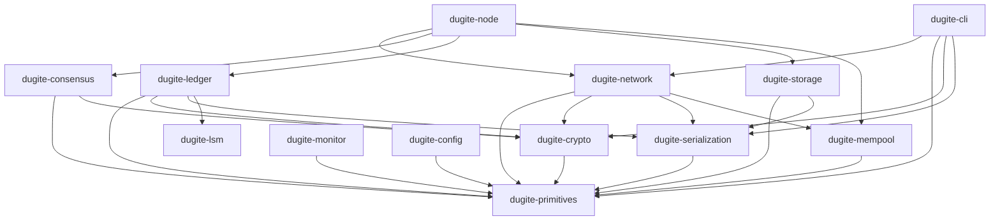

# Dugite

A Cardano node implementation written in Rust, aiming for 100% compatibility with [cardano-node](https://github.com/IntersectMBO/cardano-node).

Built by [Sandstone Pool](https://www.sandstone.io/)

[Documentation](https://michaeljfazio.github.io/dugite/) | [Benchmarks](https://michaeljfazio.github.io/dugite/reference/benchmarks.html) | [Developer Wiki](https://github.com/michaeljfazio/dugite/wiki) | [Discussions](https://github.com/michaeljfazio/dugite/discussions)

[](https://github.com/michaeljfazio/dugite/actions/workflows/ci.yml)
[](https://github.com/michaeljfazio/dugite/actions/workflows/code-scanning.yml)
[](https://codecov.io/gh/michaeljfazio/dugite)
[](https://github.com/michaeljfazio/dugite/actions/workflows/benchmarks.yml)
[](https://michaeljfazio.github.io/dugite/)
[](LICENSE)
[](https://www.rust-lang.org/)
[](https://cardano.org/)
[](https://github.com/michaeljfazio/dugite/discussions)
[](https://github.com/michaeljfazio/dugite/stargazers)

> [!CAUTION]
> **Dugite is in early development and is NOT recommended for production use.**
> APIs, storage formats, and on-chain behavior may change without notice. Ledger validation is incomplete and may accept invalid transactions or reject valid ones. **Do not use this software to operate a stake pool, manage real funds, or participate in mainnet governance.** Use at your own risk on testnets only.

## Quick Start

```bash
# Build
cargo build --release

# Fast sync with Mithril snapshot (recommended)
./target/release/dugite-node mithril-import \
  --network-magic 2 \
  --database-path ./db-preview

# Run the node
./target/release/dugite-node run \
  --config config/preview-config.json \
  --topology config/preview-topology.json \
  --database-path ./db-preview \
  --socket-path ./node.sock \
  --host-addr 0.0.0.0 \
  --port 3001
```

See the [full documentation](https://michaeljfazio.github.io/dugite/) for detailed setup instructions, CLI reference, and architecture guides.

## Architecture

Dugite is organized as a 14-crate Cargo workspace:

| Crate | Description |
|-------|-------------|
| `dugite-primitives` | Core types: hashes, blocks, transactions, addresses, values, protocol parameters (Byron-Conway) |
| `dugite-crypto` | Ed25519 keys, VRF (ECVRF-ED25519-SHA512-Elligator2), KES (Sum6Kes), text envelope format |
| `dugite-serialization` | CBOR encoding/decoding for Cardano wire format via pallas |
| `dugite-lsm` | Pure Rust LSM-tree engine with WAL, compaction, bloom filters, snapshots |
| `dugite-network` | Ouroboros mini-protocols (ChainSync, BlockFetch, TxSubmission, KeepAlive), N2N/N2C multiplexer |
| `dugite-consensus` | Ouroboros Praos, chain selection, epoch transitions, VRF slot leader checks |
| `dugite-ledger` | UTxO set (LSM-backed via UTxO-HD), transaction validation (Phase-1/Phase-2), ledger state, certificates, rewards, governance |
| `dugite-mempool` | Thread-safe transaction mempool with Phase-1/Phase-2 admission control, input-conflict checking, and TTL sweep |
| `dugite-storage` | ChainDB (ImmutableDB append-only chunk files + VolatileDB in-memory) |
| `dugite-node` | Main binary: config, topology, pipelined sync, Mithril import, block forging, Prometheus metrics |
| `dugite-cli` | cardano-cli compatible CLI (38+ subcommands) |
| `dugite-monitor` | Terminal monitoring dashboard (ratatui-based, real-time metrics via Prometheus polling) |
| `dugite-config` | Interactive TUI configuration editor with tree navigation, inline editing, type validation, search/filter, diff view, and init/validate/get/set CLI subcommands |



## Key Features

### Consensus
- **Full Ouroboros Praos** with VRF leader election using exact 34-digit fixed-point arithmetic (dashu-int IBig, matching Haskell's FixedPoint E34)
- **KES signature validation** via Sum6Kes (pallas-crypto), with period evolution and key rotation
- **Epoch nonce computation** with evolving nonce, candidate nonce freeze, and lab nonce tracking
- **Chain selection** with longest-chain rule, density tie-breaking, and rollback support
- **Epoch transitions** using Cardano's mark/set/go snapshot model with deferred reward distribution (RUPD timing matching Haskell exactly)
- **TPraos/Praos split**: Shelley-Alonzo uses raw 64-byte VRF output (certNatMax=2^512); Babbage/Conway uses Blake2b-256 hash (certNatMax=2^256)
- **VRF leader check**: Euler continued fraction for ln(1+x), Taylor series for exp() with error bounds for early comparison termination
- **Genesis Sync Manager (GSM)**: PreSyncing/Syncing/CaughtUp state machine with tip age tracking and ChainSync idle detection

### Ledger
- **UTxO-HD** on-disk storage via dugite-lsm (pure Rust LSM-tree with WAL for crash recovery, lazy levelling compaction, bloom filters, 64KB pages for large inline datums)
- **Phase-1 transaction validation**: inputs exist, fees sufficient, value conservation, TTL, witness verification, multi-asset, reference inputs, CIP-0112 tiered reference script fees
- **Phase-2 Plutus evaluation**: V1/V2/V3 script execution via uplc CEK machine with full cost model application
- **Native script evaluation**: timelock, sig, allOf, anyOf, nOf
- **Reward calculation**: BigInt rational arithmetic (no overflow), monetary expansion, apparent performance, maxPool' pledge influence, operator/member split - all verified against Koios on-chain data
- **Deferred RUPD timing**: rewards computed at epoch E->E+1, applied at E+1->E+2, matching Haskell's pulsing reward schedule
- **Certificate processing**: stake registration/deregistration, delegation, pool registration/retirement, Conway-era certs (DRep, committee, vote delegation, combined certs)
- **Multi-era support**: Byron through Conway with era-specific validation rules

### Conway Governance (CIP-1694)
- **DRep lifecycle**: registration, voting, delegation, activity tracking, expiration
- **Constitutional committee**: hot key authorization, cold key resignation, member expiration, quorum threshold tracking
- **7 governance action types**: ParameterChange, HardFork, TreasuryWithdrawals, NoConfidence, UpdateCommittee, NewConstitution, InfoAction
- **Ratification thresholds**: 4 DRep PP group thresholds, 5 SPO voting thresholds, exact rational arithmetic via u128 cross-multiplication
- **Proposal lifecycle**: submission, voting, ratification, expiration with deposit refunds
- **Constitution tracking**: anchor + optional guardrail script

### Networking (N2N)
- **Protocol versions**: V14/V15 (matching cardano-node 10.x)
- **Pipelined ChainSync**: configurable pipeline depth (default 300, via `DUGITE_PIPELINE_DEPTH`)
- **Multi-peer BlockFetch**: up to 4 concurrent fetchers with chunk-based retry on failure
- **N2N server**: handshake (magic verification), ChainSync, BlockFetch, KeepAlive, TxSubmission2, PeerSharing
- **Block relay**: synced blocks announced to downstream peers via broadcast channel (full relay behavior)
- **Ouroboros multiplexer**: full duplex, mini-protocol demuxing

### Networking (N2C)
- **Protocol versions**: V16-V22 with bit-15 version encoding (cardano-cli 10.15 compatibility)
- **LocalStateQuery**: all 39 Shelley BlockQuery tags (0-38) fully implemented including:
  - GetUTxO (whole/filtered), GetCurrentPParams, GetStakeDistribution, GetRewardProvenance
  - GetDRepState, GetCommitteeState, GetConstitution, GetGovState, GetRatifyState
  - GetPoolState, GetPoolDistr2, GetStakePoolDefaultVote, GetLedgerPeerSnapshot
  - Debug tags (8, 12, 13), GetCBOR wrapper (tag 9)
  - Credential type discrimination (KeyHash vs ScriptHash) in all responses
- **LocalChainSync**: per-client cursor, block delivery
- **LocalTxSubmission**: with Phase-1/Phase-2 validation before mempool admission
- **LocalTxMonitor**: HasTx, NextTx, GetSizeAndCapacity

### P2P Peer Management
- **Cold/warm/hot lifecycle**: automatic promotion and demotion based on peer behavior
- **EWMA latency tracking**: exponentially weighted moving average for peer quality assessment
- **Reputation scoring**: failure count decay (halves every 5 minutes), slot staleness detection
- **Peer categories**: LocalRoot, PublicRoot, BigLedgerPeer, LedgerPeer with category-aware selection
- **DNS multi-resolution**: A/AAAA/SRV record support for relay discovery
- **Ledger-based peer discovery**: SPO relay addresses from pool_params when past useLedgerAfterSlot
- **Peer sharing (gossip)**: protocol for decentralized peer discovery

### Block Production
- **VRF proof generation**: ECVRF-ED25519-SHA512-Elligator2 via vrf_dalek
- **Block forging**: `forge_block()` with mempool transaction selection
- **KES signing**: Sum6Kes key loading, period validation, block signing
- **Operational certificates**: raw-bytes signable format, counter tracking for replay protection
- **Block announcement**: forged + synced blocks broadcast to downstream N2N peers

### Storage
- **ImmutableDB**: append-only chunk files with sequential I/O, secondary index (56-byte entries, big-endian, CRC32), memory-mapped I/O (memmap2)
- **VolatileDB**: in-memory HashMap for volatile chain tip, rollback support via DiffSeq
- **dugite-lsm**: pure Rust LSM-tree engine (BTreeMap memtable, WAL with CRC32, SSTable pages, blocked bloom filters, fence pointer indexes, clock-sweep LRU cache, lazy levelling compaction T=4, jumbo pages for 13KB+ inline datums, hard-link snapshots, exclusive session lock)
- **io_uring async I/O**: optional Linux-only feature for high-performance disk access
- **Mithril snapshot import**: digest verification (SHA256 beacon hash + file digests), secondary index parsing, resume support, ~2 minute import for 4M blocks
- **Ledger snapshots**: TRSN magic + blake2b checksum, bincode serialization, time-based snapshot policy matching Haskell (72min normal, 50K blocks + 6min bulk, max 2 retained)

### CLI (cardano-cli compatible)
- **Key management**: `key gen`, `key sign`, `key verify`, `key convert-itn`
- **Address**: `address build`, `address key-gen`, `address info`, `address key-hash`
- **Node operations**: `node key-gen`, `node key-gen-kes`, `node key-gen-vrf`, `node issue-op-cert`, `node new-counter`
- **Transactions**: `transaction build`, `transaction build-raw`, `transaction sign`, `transaction submit`, `transaction txid`, `transaction calculate-min-fee`, `transaction calculate-min-required-utxo`, `transaction view`, `transaction witness`, `transaction assemble`, `transaction policyid`
- **Queries**: `query tip`, `query utxo`, `query protocol-parameters`, `query stake-distribution`, `query stake-address-info`, `query gov-state`, `query drep-state`, `query committee-state`, `query tx-mempool`, `query stake-pools`, `query stake-snapshot`, `query pool-params`, `query treasury`, `query constitution`, `query ratify-state`, `query leadership-schedule`, `query slot-number`, `query kes-period-info`
- **Staking**: `stake-address gen`, `stake-address key-gen`, `stake-address registration-certificate`, `stake-address deregistration-certificate`, `stake-address delegate-vote`, `stake-address stake-and-vote-deleg-certificate`
- **Pools**: `stake-pool registration-certificate`, `stake-pool deregistration-certificate`, `stake-pool id`, `stake-pool metadata-hash`
- **Governance**: `governance vote`, `governance action`, `governance query-constitution`

### Observability
- **28+ Prometheus metrics** on port 12798 (blocks, slots, epochs, UTxO count, delegations, treasury, mempool, peers, transactions, DReps, proposals, pools, disk, memory, uptime, tip age)
- **dugite-monitor**: Terminal monitoring dashboard with real-time sync progress, block rate sparkline, peer breakdown (out/in/total, hot/warm/cold), governance summary, and color-coded health indicators. Run: `dugite-monitor --metrics-url http://localhost:12798/metrics`
- **dugite-config**: Interactive TUI configuration editor with tree navigation, inline editing, type validation, search/filter, and diff view. Subcommands: `init`, `edit`, `validate`, `get`, `set`
- **Structured logging** with tracing-subscriber (env-filter, JSON output, journald)
- **SIGHUP topology reload** for live configuration updates
- **GSM state tracking**: PreSyncing/Syncing/CaughtUp with tip age monitoring

### Testing
- **2,900+ automated tests**: unit tests, property tests (proptest), integration tests, conformance tests (against official Cardano test vectors), golden tests (VRF, N2C wire format)
- **Reward cross-validation**: 11 tests verified against Koios on-chain data (preview epochs 1232-1235)
- **LSM stress tests**: 50K-entry UTxO workload, WAL crash recovery, snapshot consistency
- **Zero-warning policy**: `cargo clippy --all-targets -- -D warnings` enforced in CI

## Testnet Validation

Dugite has been validated on the **Cardano preview testnet** (network magic=2):

| Metric | Value |
|--------|-------|
| Blocks synced | 4,147,000+ (100% to tip) |
| UTxO count | ~2.9M |
| Validation errors | 0 (across full 4.1M+ block replay) |
| Replay throughput | 13,728 blocks/sec (LSM backend) |
| Epoch transitions | 1,251+ (including all protocol version changes) |
| Pools | 650+ registered |
| DReps | 8,700+ registered |
| Block production | Active soak testing via Sandstone Pool [SAND] |

## Production Readiness

> [!WARNING]
> **Dugite is alpha-quality software.** It has not undergone the extensive human-driven QA, formal auditing, or prolonged mainnet soak testing required for production use. The assessments below reflect automated testing only and should not be taken as endorsement for mainnet deployment.

### Relay Node

Dugite can function as a **testnet relay node** with the following capabilities:

- Syncs to chain tip on preview/preprod testnets via pipelined ChainSync
- Serves blocks to downstream peers (N2N server: ChainSync, BlockFetch, KeepAlive, TxSubmission2, PeerSharing)
- Accepts and validates transactions (Phase-1 + Phase-2 Plutus) for mempool admission
- Responds to all cardano-cli queries via N2C socket (V16-V22, all 39 query tags)
- Handles graceful shutdown on SIGINT/SIGTERM with ChainDB + ledger snapshot persistence
- Recovers from crash with WAL replay (dugite-lsm) + snapshot fallback (latest -> previous -> fresh)
- Persists ChainDB at epoch transitions to limit replay window on crash
- Correctly defers reward distribution matching Haskell's RUPD timing

**Known limitations:**
- Mainnet sync has not been verified to chain tip
- No formal protocol conformance testing against the Cardano CDDL specification
- No long-duration stability testing (multi-day uptime under load)
- Plutus uplc evaluator has marginal cost accounting differences vs Haskell (~0.04% for complex scripts near budget limits)

### Block Producer

The block production pipeline is **actively soak-tested** on the Cardano preview testnet via **Sandstone Pool [SAND]** (pool ID `ff9f5e5a5102c86fca0de6300b322b555172dd206f4771e5297527d5`):

- VRF proof generation and slot leader election (exact 34-digit fixed-point arithmetic matching Haskell)
- KES key loading, evolution, and block signing (Sum6Kes)
- Operational certificate parsing and period validation
- Block forging with mempool transaction selection
- Block announcement to connected peers
- Automated restart cycles with snapshot recovery verification
- Koios cross-validation of UTxO counts, pool stake, and governance state

**Known limitations:**
- Mainnet block production has not been tested
- KES key rotation across multiple KES periods not tested in production
- Mempool transaction ordering and priority not optimized

## Performance

See the [latest benchmark results](benches/2026-03-14-all-profiles.md) for detailed storage, UTxO, and cryptographic operation benchmarks across all storage profiles.

### Sync Performance

| Metric | Preview Testnet |
|--------|----------------|
| Mithril import | ~9 min (2.7 GB snapshot, 4M blocks) |
| Ledger replay (LSM backend) | ~300 sec (13,728 blk/s) |
| Tip catch-up | ~22 sec for 500 blocks |
| Memory at tip | ~5.8 GB RSS (high-memory profile) |
| UTxO store on-disk | ~1.8 GB |
| Total DB size | ~15 GB |

### Prometheus Metrics (port 12798)

Dugite exports 28+ metrics including:

- `dugite_blocks_received_total` / `dugite_blocks_applied_total` - block counters
- `dugite_slot_number` / `dugite_block_number` / `dugite_epoch_number` - chain position
- `dugite_sync_progress_percent` - sync progress (100% = at tip)
- `dugite_utxo_count` / `dugite_delegation_count` - ledger state
- `dugite_peers_connected` / `dugite_peers_hot` / `dugite_peers_warm` / `dugite_peers_cold` - P2P
- `dugite_mempool_tx_count` / `dugite_mempool_bytes` - mempool
- `dugite_treasury_lovelace` / `dugite_drep_count` / `dugite_proposal_count` / `dugite_pool_count` - governance
- `dugite_transactions_received_total` / `dugite_transactions_validated_total` / `dugite_transactions_rejected_total` - tx processing
- `dugite_tip_age_seconds` / `dugite_chainsync_idle_secs` - freshness
- `dugite_mem_resident_bytes` / `dugite_disk_available_bytes` - resources

## Network Magic

| Network | Magic |
|---------|-------|
| Mainnet | `764824073` |
| Preview | `2` |
| Preprod | `1` |

## Development

```bash
# Run all tests (unit, property, conformance, golden, integration)
cargo test --all

# Lint
cargo clippy --all-targets -- -D warnings

# Format check
cargo fmt --all -- --check
```

Zero-warning policy enforced - all code must compile cleanly with clippy and pass formatting checks.

### Running Benchmarks

Dugite includes Criterion-based benchmarks for the storage and ledger subsystems:

```bash
# Storage benchmarks (ChainDB, ImmutableDB, BlockIndex, scaling)
cargo bench -p dugite-storage --bench storage_bench

# UTxO store benchmarks (insert, lookup, apply_tx, LSM configs, scaling)
cargo bench -p dugite-ledger --bench utxo_bench

# Run a specific benchmark group
cargo bench -p dugite-storage --bench storage_bench -- "scaling/"
cargo bench -p dugite-ledger --bench utxo_bench -- "utxo_scaling/"
```

Results are saved to `target/criterion/` with HTML reports at `target/criterion/report/index.html`. Baseline results are tracked in `benches/`.

### Storage Profiles

Dugite supports configurable storage profiles via `--storage-profile`:

```bash
# 32GB systems: 2GB memtable, 24GB cache (~27GB RSS)
./target/release/dugite-node run --storage-profile ultra-memory ...

# 16GB systems (default): 1GB memtable, 12GB cache (~14GB RSS)
./target/release/dugite-node run --storage-profile high-memory ...

# 8GB systems: 512MB memtable, 5GB cache (~6.5GB RSS)
./target/release/dugite-node run --storage-profile low-memory ...

# 4GB systems: 256MB memtable, 2GB cache (~3GB RSS)
./target/release/dugite-node run --storage-profile minimal ...

# Individual parameter overrides
./target/release/dugite-node run \
  --storage-profile low-memory \
  --utxo-memtable-size-mb 256 \
  --utxo-block-cache-size-mb 1024 ...
```

## Soak Testing

Dugite is actively soak-tested on the **Cardano preview testnet** via **Sandstone Pool [SAND]**:

| Field | Value |
|-------|-------|
| Pool ID | `ff9f5e5a5102c86fca0de6300b322b555172dd206f4771e5297527d5` |
| Bech32 | `pool1l704ukj3qtyxljsduccqkv3t24gh9hfqdarhreffw5na2uknf5k` |
| Ticker | SAND |
| Homepage | [https://sandstone.io](https://sandstone.io) |
| Pledge | 1,000 ADA |
| Margin | 5% |
| Fixed cost | 340 ADA |
| Network | Preview (magic=2) |

The soak test script (`scripts/soak-test.sh`) automates:

- Periodic node restart cycles to test recovery and snapshot consistency
- Transaction submission to verify mempool admission and propagation
- Koios cross-validation of UTxO counts, pool stake, and governance state
- Error log monitoring with automated alerting on unexpected failures

Results from each soak run are logged with timestamps and compared against the previous run to detect regressions.

## Acknowledgments

Special thanks to the following individuals for their contributions and support:

- **Andrew Westberg** (BCSH)
- **Samuel Leathers**
- **Homer J** (AAA)

## License

Apache-2.0
