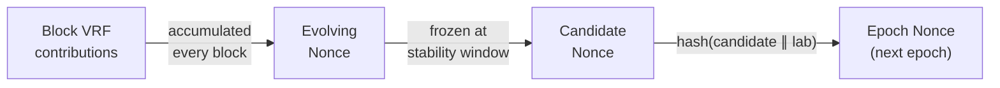
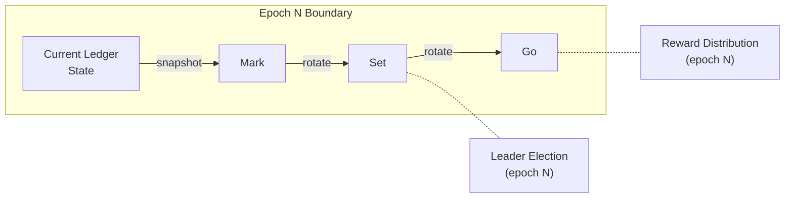

# Consensus

Torsten implements the Ouroboros Praos consensus protocol, the proof-of-stake protocol used by Cardano since the Shelley era.

## Ouroboros Praos Overview

Ouroboros Praos divides time into fixed-length slots. Each slot, a slot leader is selected based on their stake proportion. The leader is entitled to produce a block for that slot. Key properties:

- **Slot-based** — Time is divided into slots (1 second each on mainnet)
- **Epoch-based** — Slots are grouped into epochs (432000 slots / 5 days on mainnet)
- **Stake-proportional** — The probability of being elected is proportional to the pool's active stake
- **Private leader selection** — Only the pool operator knows if they are elected (until they publish the block)

## Slot Leader Election

### VRF-Based Selection

Each slot, the pool operator evaluates a VRF (Verifiable Random Function) using:
- Their VRF signing key
- The slot number
- The epoch nonce

The VRF produces:
1. A **VRF output** — A deterministic pseudo-random value
2. A **VRF proof** — A proof that the output was correctly computed

### Leader Threshold

The VRF output is compared against a threshold derived from:
- The pool's relative stake (sigma)
- The active slot coefficient (f = 0.05 on mainnet)

The threshold is computed using the phi function:

```
phi(sigma) = 1 - (1 - f)^sigma
```

A slot leader is elected if `VRF_output < phi(sigma)`.

### VRF Exact Rational Arithmetic

The leader check is a critical consensus operation — any deviation from the Haskell reference implementation would cause a node to disagree on which blocks are valid. Torsten uses **exact 34-digit fixed-point arithmetic** via `dashu-int` `IBig`, matching Haskell's `FixedPoint E34` type exactly. No floating-point operations are used anywhere in the VRF computation path.

**Era-dependent VRF modes:**

| Era | Protocol Version | VRF Output Derivation | certNatMax |
|---|---|---|---|
| Shelley — Alonzo (TPraos) | proto < 7 | Raw 64-byte VRF output | 2^512 |
| Babbage — Conway (Praos) | proto >= 7 | Blake2b-256("L" \|\| output) | 2^256 |

In TPraos mode (Shelley through Alonzo), the raw 64-byte VRF output is used directly for the leader check, with a certNatMax of 2^512 defining the output space. In Praos mode (Babbage onward), the VRF output is hashed with `Blake2b-256("L" || output)` to produce a 32-byte value, reducing certNatMax to 2^256. The `"L"` prefix distinguishes the leader VRF output from the nonce VRF output (which uses `"N"`).

**Mathematical primitives:**

- **`ln(1 + x)`** — Uses the Euler continued fraction expansion, matching Haskell's `lncf` function. This converges for all `x >= 0`, unlike Taylor series which has a limited radius of convergence.
- **`taylorExpCmp`** — Computes `exp()` via Taylor series with rigorous error bounds, enabling early termination when the comparison result can be determined without computing the full expansion. This avoids unnecessary precision in the common case where the VRF output is far from the threshold.

### Epoch Nonce

The epoch nonce is computed at each epoch boundary:

```
epoch_nonce = hash(candidate_nonce || lab_nonce)
```

Where:
- `candidate_nonce` is the evolving nonce frozen at the stability window boundary of the previous epoch
- `lab_nonce` is a hash derived from the previous epoch's first block (the "laboratory" nonce)

The initial nonce is derived from the Shelley genesis hash.

### Nonce Establishment

The nonce lifecycle follows a precise sequence across epoch boundaries:

1. **Evolving nonce** — Accumulates VRF nonce contributions from every block: `evolving_nonce = hash(prev_evolving_nonce || hash(vrf_nonce_output))`
2. **Candidate nonce** — The evolving nonce is frozen (snapshotted) at the stability window boundary within each epoch. After this point, new VRF contributions only affect the evolving nonce, not the candidate.
3. **Epoch nonce** — At the epoch boundary, the new epoch nonce is computed as `hash(candidate_nonce_from_prev_epoch || lab_nonce)`.



**Nonce establishment after startup:**

- **After snapshot load or Mithril import:** The nonce is not immediately valid. At least one full epoch transition must occur during live operation for `nonce_established` to become true. The replay of blocks during the first partial epoch counts toward building the evolving nonce.
- **After full genesis replay:** The nonce is immediately valid because all VRF contributions from every block have been accumulated during the replay.

### Era-Dependent Nonce Stabilisation Window

The stability window determines how early in an epoch the candidate nonce is frozen. This varies by era:

| Era | Protocol Version | Stability Window |
|---|---|---|
| Shelley — Babbage | proto < 10 | 3k/f slots |
| Conway | proto >= 10 | 4k/f slots |

Where `k` is the security parameter (2160 on mainnet) and `f` is the active slot coefficient (0.05 on mainnet). The longer Conway window provides additional time for nonce contributions to accumulate, improving randomness quality.

## Chain Selection

When multiple valid chains exist, Ouroboros Praos selects the chain with the most blocks (longest chain rule). Torsten implements:

1. **Chain comparison** — Compare the block height of competing chains
2. **Rollback support** — Roll back up to k=2160 blocks to switch to a longer chain
3. **Immutability** — Blocks deeper than k are considered final

## Epoch Transitions

At each epoch boundary, Torsten performs:

### Stake Snapshot Rotation

Torsten uses the mark/set/go snapshot model:
- **Mark** — The current epoch boundary snapshot (will be used for leader election two epochs from now)
- **Set** — The previous epoch's mark (used for leader election in the current epoch)
- **Go** — Two epochs ago (used for reward distribution in the current epoch)

At each epoch boundary:
1. Go becomes the active snapshot for reward distribution
2. Set moves to go
3. Mark moves to set
4. A new mark is taken from the current ledger state



### Snapshot Establishment

After a node starts, the snapshots are not immediately trustworthy for block production:

- **`snapshots_established`** requires at least **3 live (post-replay) epoch transitions** before returning true. This ensures that all three snapshot positions (mark, set, go) have been populated by the running node with precise stake calculations.
- **Replay-built snapshots** may contain approximate stake values due to differences in reward calculation during fast replay versus live operation. These are sufficient for validation but not authoritative for forging.
- **VRF leader eligibility failures are non-fatal** until snapshots are fully established. During the establishment period, a pool may fail leader checks because the stake distribution in the snapshot does not yet reflect the true on-chain state. The node logs these failures but continues normal operation.

### Reward Calculation and Distribution

At each epoch boundary, rewards are calculated and distributed:

1. **Monetary expansion** — New ADA is created from the reserves based on the monetary expansion rate
2. **Fee collection** — Transaction fees from the epoch are collected
3. **Treasury cut** — A fraction (tau) of rewards goes to the treasury
4. **Pool rewards** — Remaining rewards are distributed to pools based on their performance
5. **Member distribution** — Pool rewards are split between the operator and delegators based on pool parameters (cost, margin, pledge)

## Validation Checks

Torsten validates the following consensus-level properties:

### KES Period Validation

The KES (Key Evolving Signature) period in the block header must be within the valid range for the operational certificate:

```
opcert_start_kes_period <= current_kes_period < opcert_start_kes_period + max_kes_evolutions
```

### VRF Verification

Full VRF verification includes:

1. **VRF key binding** — `blake2b_256(header.vrf_vkey)` must match the pool's registered `vrf_keyhash`
2. **VRF proof verification** — The VRF proof is cryptographically verified against the VRF public key
3. **Leader eligibility** — The VRF leader value is checked against the Praos threshold for the pool's relative stake using the phi function

### Operational Certificate Verification

The operational certificate's Ed25519 signature is verified against the raw bytes signable format (matching Haskell's `OCertSignable`):

```
signable = hot_vkey(32 bytes) || counter(8 bytes BE) || kes_period(8 bytes BE)
signature = sign(cold_skey, signable)
```

The counter must be monotonically increasing per pool to prevent certificate replay.

### KES Signature Verification

Block headers are signed using the Sum6Kes scheme (depth-6 binary sum composition over Ed25519). The KES key is evolved to the correct period offset from the operational certificate's start period. Verification checks:

1. The KES signature over the header body bytes is valid
2. The KES period matches the expected value for the block's slot

### Slot Leader Eligibility

The VRF proof is checked to confirm the block producer was indeed elected for the slot, given the epoch nonce and their pool's stake.
