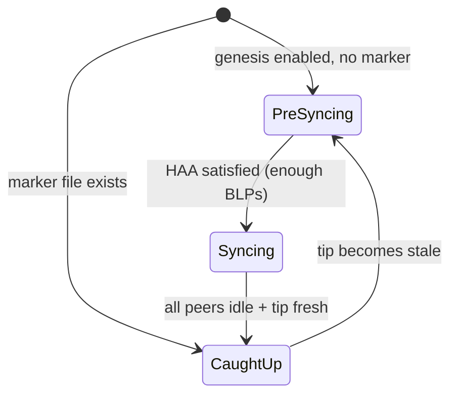

# Ouroboros Genesis Support

Torsten includes a basic Genesis State Machine (GSM) that tracks the node's sync progression. This page documents the current state of Genesis protocol support and its limitations.

## Current State

The GSM implements three states matching the Ouroboros Genesis specification:

- **PreSyncing** — Waiting for enough trusted big ledger peers (BLPs). The Historical Availability Assumption (HAA) requires a minimum number of active BLPs before sync begins.
- **Syncing** — Active block download with density-based peer evaluation. The GSM monitors chain density across peers and can disconnect peers with insufficient chain density (GDD).
- **CaughtUp** — Normal Praos operation. The node is at or near the chain tip and participates in standard consensus.

### Enabling Genesis Mode

Genesis mode is opt-in via the `--consensus-mode genesis` CLI flag:

```bash
torsten-node run \
  --consensus-mode genesis \
  --config config/preview-config.json \
  ...
```

When not enabled (the default `praos` mode), the GSM immediately enters `CaughtUp` and all Genesis constraints are disabled. This is the recommended mode for nodes that sync from Mithril snapshots.

### State Transitions



A `caught_up.marker` file is written to the database directory when the node reaches `CaughtUp`, enabling fast restart without re-evaluating the Genesis bootstrap.

### Implemented Features

- **State tracking**: PreSyncing/Syncing/CaughtUp with automatic transitions
- **Big Ledger Peer identification**: Pools in the top 90% of active stake are classified as BLPs
- **Genesis Density Disconnector (GDD)**: Compares chain density across peers within the genesis window and disconnects peers with insufficient density
- **Limit on Eagerness (LoE)**: Computes the maximum immutable tip slot based on candidate chain tips (method available but not yet enforced in block application)
- **Peer snapshot loading**: JSON-based peer snapshot for initial peer discovery

## Missing Features

The following Ouroboros Genesis features are not yet implemented:

### Lightweight Checkpointing

The Genesis specification calls for lightweight checkpoints — trusted anchor points that allow a new node to skip validation of ancient history. Without this, Genesis bootstrap must validate the entire chain from the genesis block, which is significantly slower than Mithril snapshot import.

### Genesis-Specific Peer Selection

Full Genesis requires a dedicated peer selection policy during PreSyncing and Syncing that:
- Prioritizes connections to big ledger peers
- Uses a different target count for warm/hot peers during bootstrap
- Implements the "Limit on Patience" for slow peers

Currently, the standard P2P governor peer selection policy is used in all states.

### LoE Enforcement

The `loe_limit()` method computes the constraint on immutable tip advancement, but it is not yet integrated into the block application pipeline. This means blocks are applied eagerly regardless of the GSM state.

## Impact

These limitations **do not affect normal operation**. The recommended deployment path uses Mithril snapshot import for fast sync, which bypasses the Genesis bootstrap entirely. The Genesis protocol features are future-proofing for the Ouroboros Genesis hard fork, which will enable fully trustless bootstrap from an empty database.

For production deployments, use the default `praos` consensus mode with Mithril:

```bash
# Import a Mithril snapshot first
torsten-node mithril-import --network-magic 2 --database-path ./db

# Then run in default praos mode
torsten-node run --config config/preview-config.json --database-path ./db ...
```
