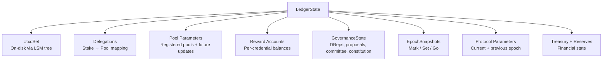
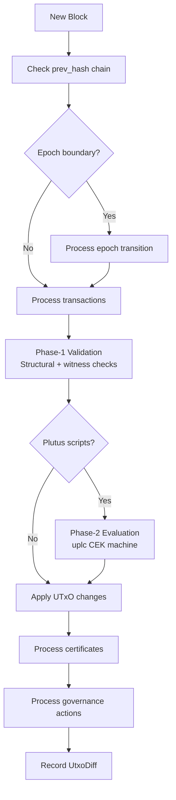
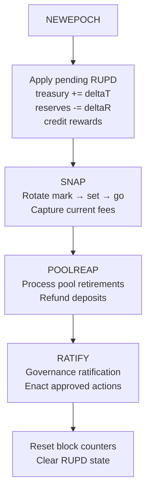

# Ledger

Dugite's ledger layer (`dugite-ledger`) implements full Cardano transaction validation, UTxO management, stake distribution, reward calculation, and Conway-era governance. It closely follows the Haskell cardano-ledger STS (State Transition System) rules.

## Ledger State

The `LedgerState` is the complete mutable state of the Cardano ledger at a given point in the chain:

Key design decisions:

- **Arc-wrapped collections** — Large mutable fields (`delegations`, `pool_params`, `reward_accounts`, `governance`) are wrapped in `Arc` for copy-on-write semantics. Cloning `LedgerState` bumps reference counts; mutations via `Arc::make_mut()` only copy when shared.
- **On-disk UTxO** — The UTxO set lives in an LSM tree (`dugite-lsm`) rather than in memory, matching Haskell's UTxO-HD architecture. At mainnet scale (~20M UTxOs), this avoids multi-gigabyte memory pressure.
- **Exact rational arithmetic** — Reward calculations use `Rat` (backed by `num_bigint::BigInt`) for lossless intermediate computation, with a single floor operation at the end matching Haskell's `rationalToCoinViaFloor`.

## Block Application Pipeline

When a new block arrives, `apply_block()` processes it through this pipeline:

### Block Validation Modes

| Mode | Plutus Evaluation | Use Case |
|------|------------------|----------|
| `ValidateAll` | Re-evaluate, verify `is_valid` flag | New blocks from peers |
| `ApplyOnly` | Trust `is_valid` flag | ImmutableDB replay, Mithril import, self-forged blocks |

Invalid transactions (`is_valid: false`) skip normal input/output processing. Instead, collateral inputs are consumed and collateral return is added.

## Transaction Validation

### Phase-1 (Structural + Witness)

Phase-1 validation checks structural rules without executing scripts:

1. **Inputs exist** — All transaction inputs are present in the UTxO set
2. **Fee sufficient** — Fee covers minimum fee based on tx size, execution units, and reference script size (CIP-0112 tiered pricing in Conway)
3. **Value conserved** — Inputs = outputs + fee (+ minting/burning for multi-asset)
4. **TTL valid** — Transaction has not expired (time-to-live check against current slot)
5. **Witness verification** — Ed25519 signatures match required signers from inputs, withdrawals, and certificates
6. **Multi-asset rules** — No negative quantities, minting requires policy witness
7. **Reference inputs** — All reference inputs exist (not consumed, only read)
8. **Output minimum** — Each output meets the minimum lovelace requirement
9. **Transaction size** — Does not exceed max transaction size
10. **Network ID** — Matches the expected network

### Phase-2 (Plutus Script Execution)

For transactions containing Plutus scripts (V1/V2/V3):

1. **Script data hash** — Matches the hash of redeemers + datums + cost models
2. **Collateral** — Sufficient collateral provided (150% of estimated fees in Conway)
3. **Execution units** — Each redeemer's CPU and memory within budget
4. **Script evaluation** — Each script is executed via the uplc CEK machine with the appropriate cost model
5. **Block budget** — Total execution units across all transactions do not exceed block limits

Scripts are evaluated in parallel using rayon when the `parallel-verification` feature is enabled (default).

### Validation Error Types

The `ValidationError` enum covers 50+ error variants across all categories: structural, UTxO, fees, witnesses, time, scripts, collateral, Plutus, era-gating, certificates, governance, datums, withdrawals, network, and auxiliary data.

## Certificate Processing

Dugite processes all Shelley through Conway certificate types:

| Certificate | Description |
|------------|-------------|
| StakeRegistration | Register a stake credential (deposit required) |
| StakeDeregistration | Deregister a stake credential (deposit refunded) |
| StakeDelegation | Delegate stake to a pool |
| PoolRegistration | Register a new stake pool |
| PoolRetirement | Schedule pool retirement at a future epoch |
| RegDRep | Register a delegated representative (Conway) |
| UnregDRep | Deregister a DRep (Conway) |
| UpdateDRep | Update DRep metadata anchor (Conway) |
| VoteDelegation | Delegate voting power to a DRep (Conway) |
| StakeVoteDelegation | Combined stake + vote delegation (Conway) |
| RegStakeDeleg | Combined registration + stake delegation (Conway) |
| RegStakeVoteDeleg | Combined registration + stake + vote delegation (Conway) |
| CommitteeHotAuth | Authorize a hot key for a constitutional committee member (Conway) |
| CommitteeColdResign | Resign a constitutional committee cold key (Conway) |
| MoveInstantaneousRewards | Transfer between treasury and reserves (pre-Conway) |

## Governance (CIP-1694)

The `GovernanceState` tracks all Conway-era governance:

### DRep Lifecycle

- **Registration** — DReps register with a deposit, becoming eligible to vote
- **Activity tracking** — DReps must vote within `drepActivity` epochs or become inactive
- **Expiration** — Inactive DReps' delegated stake counts as abstaining
- **Delegation** — Stake credentials delegate voting power to DReps, AlwaysAbstain, or AlwaysNoConfidence

### Constitutional Committee

- **Hot key authorization** — Cold keys authorize hot keys for voting
- **Member expiration** — Each member has an epoch-based term limit
- **Quorum** — Threshold fraction of non-expired, non-resigned members must approve

### Governance Actions

Seven action types with per-type ratification thresholds:

| Action | DRep Threshold | SPO Threshold | CC Required |
|--------|---------------|---------------|-------------|
| ParameterChange | Varies by param group (4 groups) | Varies by param group (5 groups) | Yes |
| HardForkInitiation | DRep threshold | SPO threshold | Yes |
| TreasuryWithdrawals | DRep threshold | No | Yes |
| NoConfidence | DRep threshold | SPO threshold | No |
| UpdateCommittee | DRep threshold | SPO threshold | No (if NoConfidence) |
| NewConstitution | DRep threshold | No | Yes |
| InfoAction | No threshold | No threshold | No |

### Ratification

Ratification uses a **two-epoch delay**: proposals and votes from epoch E are considered at the E+1 → E+2 boundary using a frozen `RatificationSnapshot`. This prevents mid-epoch voting from affecting the current epoch's ratification. Thresholds use exact rational arithmetic via u128 cross-multiplication.

## Epoch Transitions

At each epoch boundary, `process_epoch_transition()` follows the Haskell NEWEPOCH STS rule:

### Reward Distribution (RUPD)

Rewards follow a deferred schedule matching Haskell's pulsing reward computation:

1. **Epoch E → E+1**: Compute RUPD (monetary expansion + fees - treasury cut)
2. **Epoch E+1 → E+2**: Apply RUPD (credit rewards to accounts, update treasury/reserves)

The reward calculation uses the "go" snapshot (two epochs old) for stake distribution, ensuring a stable base for computation.

### Stake Snapshots

The mark/set/go model ensures different subsystems use consistent, non-overlapping snapshots:

| Snapshot | Age | Used For |
|----------|-----|----------|
| Mark | Current epoch boundary | Future leader election (2 epochs later) |
| Set | Previous epoch boundary | Current epoch leader election |
| Go | Two epochs ago | Current epoch reward distribution |

## UTxO Storage

### UtxoStore

The persistent UTxO set wraps a `dugite-lsm` LSM tree:

- **36-byte keys** — 32-byte transaction hash + 4-byte output index (big-endian)
- **Bincode values** — `TransactionOutput` serialized via bincode
- **Address index** — In-memory `HashMap<Address, HashSet<TransactionInput>>` for N2C LocalStateQuery `GetUTxOByAddress` efficiency
- **Bloom filters** — 10 bits per key (~1% false positive rate) for fast negative lookups during validation

### DiffSeq (Rollback Support)

Each block produces a `UtxoDiff` recording inserted and deleted UTxOs. The `DiffSeq` holds the last k=2160 diffs, enabling O(1) rollback by applying diffs in reverse without reloading snapshots.

### LedgerSeq (Anchored State Sequence)

`LedgerSeq` implements Haskell's V2 LedgerDB architecture:

- **Anchor** — One full `LedgerState` at the immutable tip (persisted to disk)
- **Volatile deltas** — Per-block `LedgerDelta` for the last k blocks
- **Checkpoints** — Full state snapshots every ~100 blocks for fast reconstruction
- **Rollback** — Drop trailing deltas and reconstruct from the nearest checkpoint

This avoids the 17-34 GB memory overhead of storing k full state copies.

## CompositeUtxoView (Mempool Support)

All `validate_transaction_*` functions accept any `UtxoLookup` implementation. The `CompositeUtxoView` layers a mempool overlay on top of the on-chain UTxO set, enabling validation of chained mempool transactions (where one tx spends outputs of another unconfirmed tx) without mutating the live ledger state.
