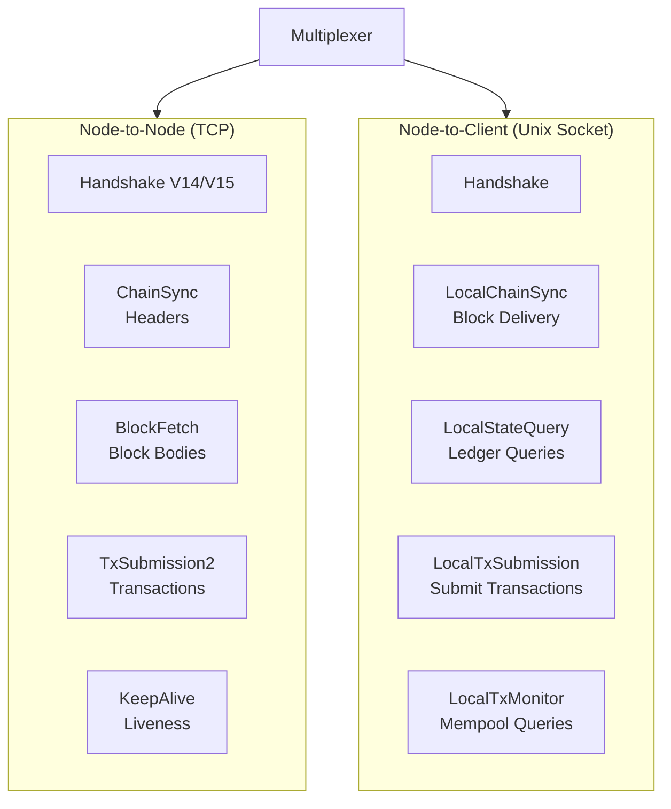
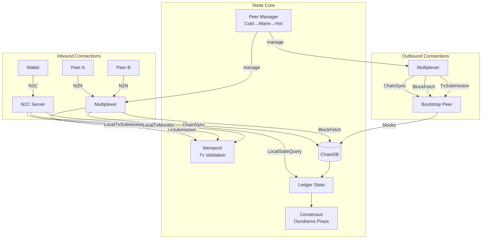

# Networking

Torsten implements the full Ouroboros network protocol stack, supporting both Node-to-Node (N2N) and Node-to-Client (N2C) communication.

## Protocol Stack



## Relay Node Architecture



## Node-to-Node (N2N) Protocol

N2N connections use TCP and carry multiple mini-protocols over a multiplexed connection.

### Handshake (V14/V15)

The N2N handshake negotiates the protocol version and network parameters:
- Protocol version V14 (Plomin HF) and V15 (SRV DNS support)
- Network magic number
- Diffusion mode: `InitiatorOnly` or `InitiatorAndResponder`
- Peer sharing flags

### ChainSync

The ChainSync mini-protocol synchronizes block headers between peers:

- **Client mode:** Requests headers sequentially from a peer to track the chain
- **Server mode:** Serves headers to connected peers, with per-peer cursor tracking

Key messages:
- `MsgFindIntersect` -- Find a common chain point
- `MsgRequestNext` -- Request the next header
- `MsgRollForward` -- Header delivered
- `MsgRollBackward` -- Chain reorganization
- `MsgAwaitReply` -- Peer has no new headers (at tip)

### BlockFetch

The BlockFetch mini-protocol retrieves block bodies by hash:

- **Client mode:** Requests ranges of blocks from peers
- **Server mode:** Serves blocks to peers, validates block existence before serving

Key messages:
- `MsgRequestRange` -- Request blocks in a slot range
- `MsgBlock` -- Block delivered
- `MsgNoBlocks` -- Requested blocks not available
- `MsgBatchDone` -- End of batch

### TxSubmission2

The TxSubmission2 mini-protocol propagates transactions between peers:

- Bidirectional handshake (`MsgInit`)
- Flow-controlled transaction exchange with ack/req counts
- Inflight tracking per peer
- Mempool integration for serving transaction IDs and bodies

### KeepAlive

The KeepAlive mini-protocol maintains connection liveness with periodic heartbeat messages.

### PeerSharing

The PeerSharing mini-protocol enables gossip-based peer discovery. Peers exchange addresses of other known peers to help the network self-organize.

## Node-to-Client (N2C) Protocol

N2C connections use Unix domain sockets and serve local clients (wallets, CLI tools). The N2C handshake supports versions V16-V22 (Conway era) with automatic detection of the Haskell bit-15 version encoding used by cardano-cli 10.x.

### LocalStateQuery

Supports a wide range of ledger queries:

| Query | Tag | Description |
|-------|-----|-------------|
| Chain tip | 0 | Current slot, hash, block number |
| Current epoch | 1 | Active epoch number |
| Current era | -- | Active era (Byron through Conway) |
| Block number | -- | Current chain height |
| System start | -- | Network genesis time |
| Protocol parameters | 2 | Live protocol parameters |
| Proposed PP updates | 4 | Proposed parameter updates (empty in Conway) |
| Stake distribution | 5 | Pool stake and pledge |
| UTxO by address | 6 | UTxO set filtered by address |
| Stake address info | 10 | Delegation and rewards |
| Genesis config | 11 | System start, epoch length, slot length, security param |
| UTxO by TxIn | 15 | UTxO set filtered by transaction inputs |
| Stake pools | 16 | Set of registered pool key hashes |
| Pool parameters | 17 | Registered pool parameters |
| Pool state | 19 | Pool state (same as pool parameters) |
| Stake snapshots | 20 | Mark/set/go snapshots |
| Pool distribution | 21 | Pool stake distribution with VRF keys |
| Stake deleg deposits | 22 | Deposit amounts per registered stake credential |
| Constitution | 23 | Constitution anchor and guardrail script |
| Governance state | 24 | Active proposals, committee, and voting state |
| DRep state | 25 | Registered DReps with delegators |
| DRep stake distr | 26 | Total delegated stake per DRep |
| Committee state | 27 | Constitutional committee members |
| Vote delegatees | 28 | Vote delegation map per credential |
| Account state | 29 | Treasury and reserves |
| SPO stake distribution | 30 | Per-pool stake distribution (filtered by pool IDs) |
| Proposals | 31 | Active governance proposals (optional filter) |
| Ratify state | 32 | Enacted/expired proposals and delayed flag |
| Future PParams | 33 | Pending protocol parameter changes (if any) |
| Ledger peer snapshot | 34 | SPO relays weighted by stake for peer discovery |
| Pool default vote | 35 | Default vote per pool based on DRep delegation |
| Pool distribution 2 | 36 | Extended pool distribution with total active stake |
| Stake distribution 2 | 37 | Extended stake distribution with total active stake |
| Max major proto ver | 38 | Maximum supported major protocol version |
| Non-myopic rewards | 6* | Estimated rewards per pool for given stake amounts |

The query protocol uses an acquire/query/release pattern:
1. `MsgAcquire` -- Lock the ledger state at the current tip
2. `MsgQuery` -- Execute queries against the locked state
3. `MsgRelease` -- Release the lock

### LocalTxSubmission

Submits transactions from local clients to the node's mempool:

| Message | Description |
|---------|-------------|
| `MsgSubmitTx` | Submit a transaction (era ID + CBOR bytes) |
| `MsgAcceptTx` | Transaction accepted into mempool |
| `MsgRejectTx` | Transaction rejected with reason |

Submitted transactions undergo both Phase-1 (structural) and Phase-2 (Plutus script) validation before mempool admission.

### LocalTxMonitor

Monitors the transaction mempool:

| Message | Description |
|---------|-------------|
| `MsgAcquire` | Acquire a mempool snapshot |
| `MsgHasTx` | Check if a transaction is in the mempool |
| `MsgNextTx` | Get the next transaction from the mempool |
| `MsgGetSizes` | Get mempool capacity, size, and transaction count |

## Peer Manager

The peer manager classifies peers into three categories following the cardano-node model:

- **Cold** -- Known but not connected
- **Warm** -- Connected but not actively syncing
- **Hot** -- Actively syncing (ChainSync + BlockFetch)

### Peer Lifecycle

```
Cold --> Warm (TCP connection established)
Warm --> Hot  (Mini-protocols activated)
Hot  --> Warm (Demotion for poor performance)
Warm --> Cold (Disconnection)
```

### Failure Handling

- Exponential backoff on connection failures
- Latency-based ranking and reputation scoring (EWMA metrics)
- Adaptive peer selection preferring low-latency, reliable peers

### Inbound Connections

- Per-IP token bucket rate limiting for DoS protection
- N2N server handles handshake, ChainSync, BlockFetch, KeepAlive, and TxSubmission2
- Bidirectional diffusion mode supports both initiator and responder roles

### Peer Discovery

Peers are discovered through multiple channels:
1. **Topology file** -- Bootstrap peers, local roots, and public roots
2. **PeerSharing protocol** -- Gossip-based discovery from connected peers
3. **Ledger-based discovery** -- SPO relay addresses extracted from pool registration certificates (enabled after `useLedgerAfterSlot`)

## Multiplexer

All mini-protocols run over a single TCP connection (N2N) or Unix socket (N2C), multiplexed by protocol ID:

| Protocol ID | Mini-Protocol |
|-------------|---------------|
| 0 | Handshake |
| 2 | ChainSync (N2N) |
| 3 | BlockFetch (N2N) |
| 4 | TxSubmission2 (N2N) |
| 8 | KeepAlive (N2N) |
| 10 | PeerSharing (N2N) |
| 5 | LocalChainSync (N2C) |
| 6 | LocalTxSubmission (N2C) |
| 7 | LocalStateQuery (N2C) |
| 9 | LocalTxMonitor (N2C) |

The multiplexer uses length-prefixed frames with protocol ID headers, matching the Ouroboros specification.
