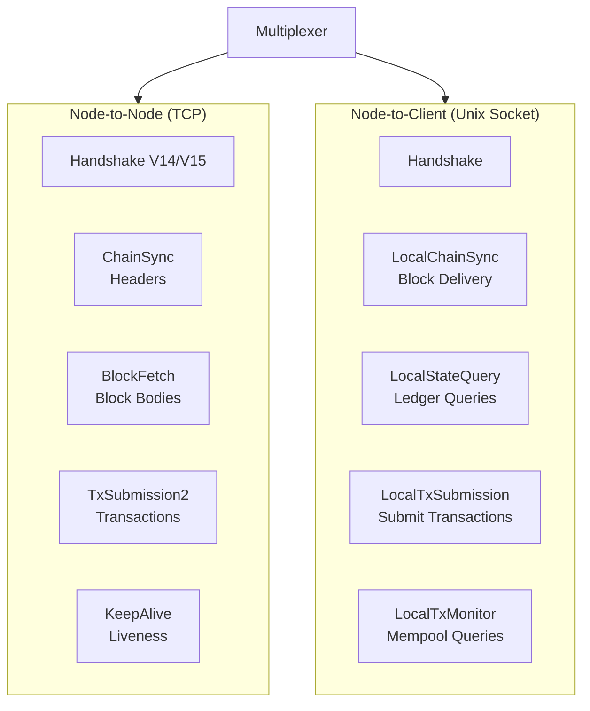
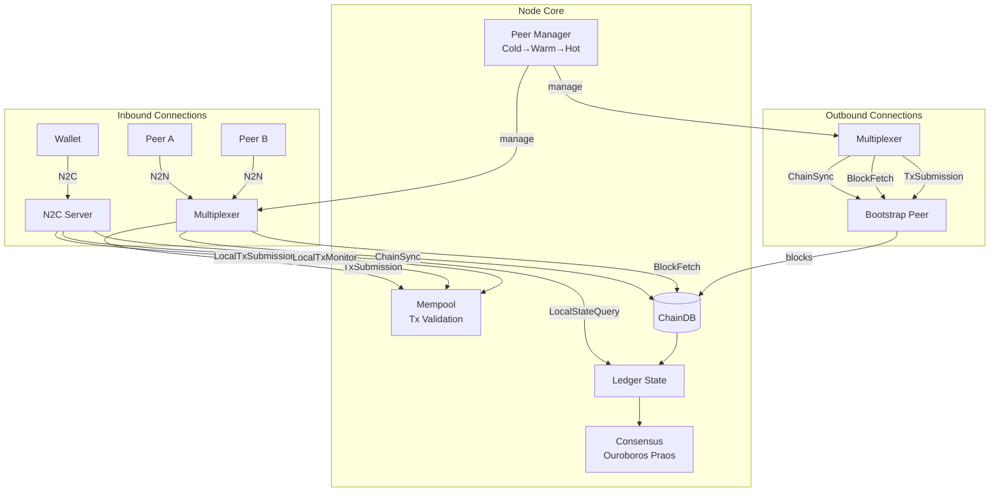
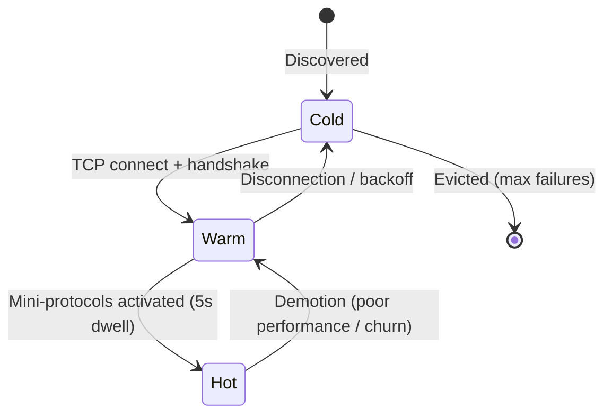

# Networking

Dugite implements the full Ouroboros network protocol stack, supporting both Node-to-Node (N2N) and Node-to-Client (N2C) communication.

## Protocol Stack



## Relay Node Architecture



## Node-to-Node (N2N) Protocol

N2N connections use TCP and carry multiple mini-protocols over a multiplexed connection.

### Handshake (V14/V15)

The N2N handshake negotiates the protocol version and network parameters:
- Protocol version V14 (Plomin HF) and V15 (SRV DNS support)
- Network magic number
- Diffusion mode: `InitiatorOnly` or `InitiatorAndResponder`
- Peer sharing flags

### ChainSync

The ChainSync mini-protocol synchronizes block headers between peers:

- **Client mode:** Requests headers sequentially from a peer to track the chain
- **Server mode:** Serves headers to connected peers, with per-peer cursor tracking

Key messages:
- `MsgFindIntersect` — Find a common chain point
- `MsgRequestNext` — Request the next header
- `MsgRollForward` — Header delivered
- `MsgRollBackward` — Chain reorganization
- `MsgAwaitReply` — Peer has no new headers (at tip)

### BlockFetch

The BlockFetch mini-protocol retrieves block bodies by hash:

- **Client mode:** Requests ranges of blocks from peers
- **Server mode:** Serves blocks to peers, validates block existence before serving

Key messages:
- `MsgRequestRange` — Request blocks in a slot range
- `MsgBlock` — Block delivered
- `MsgNoBlocks` — Requested blocks not available
- `MsgBatchDone` — End of batch

### TxSubmission2

The TxSubmission2 mini-protocol propagates transactions between peers:

- Bidirectional handshake (`MsgInit`)
- Flow-controlled transaction exchange with ack/req counts
- Inflight tracking per peer
- Mempool integration for serving transaction IDs and bodies

### KeepAlive

The KeepAlive mini-protocol maintains connection liveness with periodic heartbeat messages.

### PeerSharing

The PeerSharing mini-protocol enables gossip-based peer discovery. Peers exchange addresses of other known peers to help the network self-organize.

## Node-to-Client (N2C) Protocol

N2C connections use Unix domain sockets and serve local clients (wallets, CLI tools). The N2C handshake supports versions V16-V22 (Conway era) with automatic detection of the Haskell bit-15 version encoding used by cardano-cli 10.x.

### LocalStateQuery

Supports all 39 Shelley BlockQuery tags (0-38) plus cross-era queries, providing full compatibility with cardano-node. The query protocol uses an acquire/query/release pattern:

1. `MsgAcquire` — Lock the ledger state at the current tip
2. `MsgQuery` — Execute queries against the locked state
3. `MsgRelease` — Release the lock

All BlockQuery messages are wrapped in the Hard Fork Combinator (HFC) envelope. Results from era-specific `BlockQuery` tags are returned inside an `array(1)` success wrapper, while `QueryAnytime` and `QueryHardFork` results are returned unwrapped.

#### Shelley BlockQuery Tags 0-38

| Tag | Query | Description |
|-----|-------|-------------|
| 0 | GetLedgerTip | Current slot, hash, and block number |
| 1 | GetEpochNo | Active epoch number |
| 2 | GetCurrentPParams | Live protocol parameters (positional `array(31)` CBOR encoding matching Haskell `ConwayPParams EncCBOR`) |
| 3 | GetProposedPParamsUpdates | Proposed parameter updates (empty map in Conway) |
| 4 | GetStakeDistribution | Pool stake distribution with pledge |
| 5 | GetNonMyopicMemberRewards | Estimated rewards per pool for given stake amounts |
| 6 | GetUTxOByAddress | UTxO set filtered by address (Cardano wire format `Map<[tx_hash, index], {0: addr, 1: value, 2: datum}>`) |
| 7 | GetUTxOWhole | Entire UTxO set (expensive; used by testing tools) |
| 8 | DebugEpochState | Simplified epoch state summary (treasury, reserves, active stake totals) |
| 9 | GetCBOR | Meta-query that wraps the result of an inner query in CBOR `tag(24)`, returning raw bytes |
| 10 | GetFilteredDelegationsAndRewardAccounts | Delegation targets and reward balances for a set of stake credentials |
| 11 | GetGenesisConfig | System start, epoch length, slot length, and security parameter |
| 12 | DebugNewEpochState | Simplified new epoch state summary (epoch number, block count, snapshot state) |
| 13 | DebugChainDepState | Chain-dependent state summary (last applied block, operational certificate counters) |
| 14 | GetRewardProvenance | Reward calculation provenance: reward pot, treasury tax rate, total active stake, per-pool reward breakdown |
| 15 | GetUTxOByTxIn | UTxO set filtered by transaction inputs |
| 16 | GetStakePools | Set of all registered pool key hashes |
| 17 | GetStakePoolParams | Registered pool parameters (owner, cost, margin, pledge, relays, metadata) |
| 18 | GetRewardInfoPools | Per-pool reward breakdown: relative stake, leader and member reward splits, pool margin, fixed cost, and performance metrics |
| 19 | GetPoolState | `QueryPoolStateResult` encoded as `array(4)`: `[poolParams, futurePoolParams, retiring, deposits]` |
| 20 | GetStakeSnapshots | Mark/set/go stake snapshots used for leader schedule calculation |
| 21 | GetPoolDistr | Pool stake distribution with VRF verification key hashes |
| 22 | GetStakeDelegDeposits | Deposit amounts per registered stake credential |
| 23 | GetConstitution | Constitution anchor (URL + hash) and optional guardrail script hash |
| 24 | GetGovState | `ConwayGovState` encoded as `array(7)` CBOR: active proposals, committee state, constitution, current/previous protocol parameters, future parameters, and DRep pulse state |
| 25 | GetDRepState | Registered DReps with their delegation counts and deposit balances (supports credential filter) |
| 26 | GetDRepStakeDistr | Total delegated stake per DRep (lovelace) |
| 27 | GetCommitteeMembersState | Constitutional committee members, iterating `committee_expiration` entries with `hot_credential_type` for each member |
| 28 | GetFilteredVoteDelegatees | Vote delegation map per stake credential |
| 29 | GetAccountState | Treasury and reserves balances |
| 30 | GetSPOStakeDistr | Per-pool stake distribution filtered by a set of pool IDs |
| 31 | GetProposals | Active governance proposals with optional governance action ID filter |
| 32 | GetRatifyState | Enacted and expired proposals along with the `ratify_delayed` flag |
| 33 | GetFuturePParams | Pending protocol parameter changes scheduled for the next epoch (if any) |
| 34 | GetLedgerPeerSnapshot | SPO relay addresses weighted by relative stake, used for P2P ledger-based peer discovery |
| 35 | QueryStakePoolDefaultVote | Default vote per pool derived from its DRep delegation (AlwaysAbstain, AlwaysNoConfidence, or specific DRep vote) |
| 36 | GetPoolDistr2 | Extended pool distribution including `total_active_stake` alongside per-pool entries |
| 37 | GetStakeDistribution2 | Extended stake distribution including `total_active_stake` |
| 38 | GetMaxMajorProtocolVersion | Maximum supported major protocol version (returns 10) |

#### Cross-Era Queries

In addition to the Shelley BlockQuery tags, the following queries operate outside the HFC era-specific envelope:

| Query | Description |
|-------|-------------|
| GetCurrentEra | Active era (Byron through Conway) |
| GetChainBlockNo | Current chain height, `WithOrigin` encoded as `[1, blockNo]` for `At` or `[0]` for `Origin` |
| GetChainPoint | Current tip point, encoded as `[]` for `Origin` or `[slot, hash]` for a specific point |
| GetSystemStart | Network genesis time as `UTCTime` encoded `[year, dayOfYear, picosOfDay]` |
| GetEraHistory | Indefinite array of `EraSummary` entries (Byron `safe_zone = k*2`, Shelley+ `safe_zone = 3k/f`) |

#### CBOR Encoding Notes

- **PParams** are encoded as a positional `array(31)` with integer keys 0-33, matching Haskell's `EncCBOR` instance (not JSON string keys).
- **CBOR Sets** (e.g., pool IDs, stake key owners) use `tag(258)` and elements must be sorted for canonical encoding.
- **Value encoding**: plain integer for ADA-only UTxOs, `[coin, multiasset_map]` for multi-asset UTxOs.

### LocalTxSubmission

Submits transactions from local clients to the node's mempool:

| Message | Description |
|---------|-------------|
| `MsgSubmitTx` | Submit a transaction (era ID + CBOR bytes) |
| `MsgAcceptTx` | Transaction accepted into mempool |
| `MsgRejectTx` | Transaction rejected with reason |

Submitted transactions undergo both Phase-1 (structural) and Phase-2 (Plutus script) validation before mempool admission.

### LocalTxMonitor

Monitors the transaction mempool:

| Message | Description |
|---------|-------------|
| `MsgAcquire` | Acquire a mempool snapshot |
| `MsgHasTx` | Check if a transaction is in the mempool |
| `MsgNextTx` | Get the next transaction from the mempool |
| `MsgGetSizes` | Get mempool capacity, size, and transaction count |

## P2P Networking

Dugite implements the full Ouroboros P2P peer selection governor, enabled by default (`EnableP2P: true`). The governor manages peer connections through a target-driven state machine that continuously maintains optimal connectivity.

### Diffusion Mode

The `DiffusionMode` config field controls how the node participates in the network:

- **`InitiatorAndResponder`** (default) — Full relay mode. The node opens a listening port and accepts inbound N2N connections from other peers, in addition to making outbound connections. This is the correct mode for relay nodes.
- **`InitiatorOnly`** — Block producer mode. The node only makes outbound connections to its configured relays and never opens a listening port. This prevents direct internet exposure of block producers.

### Peer Sharing

The PeerSharing mini-protocol enables gossip-based peer discovery. When enabled, the node exchanges addresses of known routable peers with connected peers.

Peer sharing behaviour is auto-configured by default:
- **Relays** — Peer sharing is enabled, allowing the node to both request and serve peer addresses.
- **Block producers** — Peer sharing is disabled (when `--shelley-kes-key` is provided) to avoid leaking the BP's network position.

Override with the `PeerSharing` config field (`true`/`false`) if needed.

The PeerSharing protocol filters out non-routable addresses (RFC1918, CGNAT, loopback, link-local, IPv6 ULA) before sharing.

## Peer Manager

The peer manager classifies peers into three temperature categories following the cardano-node model:

- **Cold** — Known but not connected
- **Warm** — TCP connected, keepalive running, but not actively syncing
- **Hot** — Fully active with ChainSync, BlockFetch, and TxSubmission2

### Peer Lifecycle



Warm peers must dwell for at least 5 seconds before promotion to Hot, preventing rapid cycling.

### Peer Sources

Peers enter the Cold pool from four sources:

| Source | Description |
|--------|-------------|
| **Topology** | Bootstrap peers, local roots, and public roots from the topology file |
| **DNS** | A/AAAA resolution of hostname-based topology entries |
| **Ledger** | SPO relay addresses from pool registration certificates (after `useLedgerAfterSlot`) |
| **PeerSharing** | Addresses received via the gossip protocol from connected peers |

### Peer Selection & Scoring

Peers are ranked using a composite score:

```
score = 0.4 × reputation + 0.4 × latency_score + 0.2 × failure_score
```

Where:
- **Reputation** — 0.0 (worst) to 1.0 (best), adjusted +0.01 per success, -0.1 per failure
- **Latency score** — `1 / (1 + ms/200)`, based on EWMA latency (smoothing α=0.3)
- **Failure score** — `max(1.0 - failures×0.1, 0.0)`, failure counts decay (halve every 5 minutes)

Subnet diversity is enforced: peers from the same /24 (IPv4) or /48 (IPv6) subnet receive a selection penalty.

### Failure Handling

- **Exponential backoff** on connection failures: 5s → 10s → 20s → 40s → 80s → 160s (capped), with ±2s random fuzz
- **Max cold failures**: 5 consecutive failures before a peer is evicted from the peer table
- **Failure decay**: Failure counts halve every 5 minutes, allowing peers to recover reputation over time
- **Circuit breaker**: Closed → Open → HalfOpen with exponential cooldown

### Inbound Connections

- Per-IP token bucket rate limiting for DoS protection
- N2N server handles handshake, ChainSync, BlockFetch, KeepAlive, TxSubmission2, and PeerSharing
- `DiffusionMode` controls whether inbound connections are accepted

## P2P Governor

The governor runs as a tokio task on a 30-second interval, continuously evaluating peer counts against configured targets and emitting promotion/demotion/connect/disconnect actions.

### Target Counts

The governor maintains six independent target counts (matching cardano-node defaults):

| Target | Default | Description |
|--------|---------|-------------|
| `TargetNumberOfKnownPeers` | 85 | Total peers in the peer table (cold + warm + hot) |
| `TargetNumberOfEstablishedPeers` | 40 | Warm + hot peers (TCP connected) |
| `TargetNumberOfActivePeers` | 15 | Hot peers (fully syncing) |
| `TargetNumberOfKnownBigLedgerPeers` | 15 | Known big ledger peers |
| `TargetNumberOfEstablishedBigLedgerPeers` | 10 | Established big ledger peers |
| `TargetNumberOfActiveBigLedgerPeers` | 5 | Active big ledger peers |

When any target is not met, the governor promotes peers to fill the deficit. When any target is exceeded, the governor demotes the lowest-scoring surplus peers. Local root peers are never demoted.

### Sync-State-Aware Targeting

The governor adjusts behaviour based on sync state:
- **PreSyncing / Syncing** — Big ledger peers are prioritised for fast block download
- **CaughtUp** — Normal target enforcement with balanced peer selection

### Churn

The governor periodically rotates a subset of peers to discover better alternatives:
- Configurable churn interval (default: 20% target reduction cycle)
- Local root peers are exempt from churn
- Churn ensures the node explores the peer landscape rather than settling on suboptimal connections

### Prometheus Metrics

The P2P subsystem exports the following metrics:

| Metric | Description |
|--------|-------------|
| `dugite_p2p_enabled` | Whether P2P governance is active (gauge: 0 or 1) |
| `dugite_diffusion_mode` | Current diffusion mode (0=InitiatorOnly, 1=InitiatorAndResponder) |
| `dugite_peer_sharing_enabled` | Whether peer sharing is active (gauge: 0 or 1) |
| `dugite_peers_cold` | Number of cold (known, unconnected) peers |
| `dugite_peers_warm` | Number of warm (established) peers |
| `dugite_peers_hot` | Number of hot (active) peers |

### Peer Discovery

Peers are discovered through multiple channels:
1. **Topology file** — Bootstrap peers, local roots, and public roots
2. **PeerSharing protocol** — Gossip-based discovery from connected peers
3. **Ledger-based discovery** — SPO relay addresses extracted from pool registration certificates

#### Ledger-Based Peer Discovery

Once the node has synced past the slot threshold configured by `useLedgerAfterSlot` in the topology file, it activates ledger-based peer discovery. This mechanism extracts SPO relay addresses directly from pool registration parameters (`pool_params`) stored in the ledger state.

The discovery process runs on a periodic 5-minute interval and works as follows:

1. **Slot check** — The current ledger tip slot is compared against `useLedgerAfterSlot`. If the topology sets this value to a negative number or omits it entirely, ledger peer discovery remains disabled.
2. **Relay extraction** — All registered pool parameters are iterated, extracting relay entries of three types:
   - `SingleHostAddr` — IPv4 address and port
   - `SingleHostName` — DNS hostname and port
   - `MultiHostName` — DNS hostname with default port 3001
3. **Sampling** — A deterministic subset (up to 20 relays) is sampled from the full relay set to avoid resolving thousands of addresses at once. The sample offset rotates based on the current slot for coverage diversity.
4. **DNS resolution** — Hostnames are resolved to socket addresses via async DNS lookup.
5. **Peer manager integration** — Resolved addresses are added as cold peers with `PeerSource::Ledger` classification, alongside existing bootstrap and public root peers.

As pool registrations change over time (new pools register, existing pools update relay addresses, pools retire), the ledger peer set evolves dynamically. This provides a protocol-native discovery mechanism that does not depend on any centralized directory.

## Block Relay

Dugite implements full relay node behavior, propagating blocks received from upstream peers to all downstream N2N connections. This ensures that blocks flow through the network without requiring every node to sync directly from the block producer.

### Broadcast Architecture

Block propagation uses a `tokio::sync::broadcast` channel with a capacity of 64 announcements. The architecture has three components:

1. **Sender** — The node core holds a `broadcast::Sender<BlockAnnouncement>` obtained from the N2N server at startup. When the sync pipeline processes new blocks or the forge module produces a new block, it sends an announcement containing the slot, block hash, and block number.
2. **Receivers** — Each N2N server connection spawns with its own `broadcast::Receiver` subscription. The connection handler uses `tokio::select!` to concurrently service mini-protocol messages and listen for block announcements.
3. **Delivery** — When a downstream peer is waiting at the tip (having received `MsgAwaitReply` from ChainSync), an incoming block announcement triggers a `MsgRollForward` message to that peer, along with the block header. The peer can then fetch the full block body via BlockFetch.

### Relay vs. Forger Announcements

Both synced and forged blocks flow through the same broadcast channel:

- **Synced blocks** — When the pipelined ChainSync client receives blocks from an upstream peer and the node is following the tip (strict mode), each batch's final block is announced to all downstream connections. This enables relay behavior where blocks received from one upstream peer propagate to all other connected peers.
- **Forged blocks** — When the block producer creates a new block, it is announced through the same channel after being written to ChainDB and applied to the ledger.

A parallel `broadcast::Sender<RollbackAnnouncement>` handles chain rollbacks, sending `MsgRollBackward` to downstream peers when the node's chain selection switches to a different fork.

### Lagged Receivers

If a downstream peer falls behind (e.g., slow network or processing), the broadcast channel's bounded capacity means the receiver may lag. Lagged receivers skip missed announcements and log the gap, ensuring a slow peer does not block propagation to others.

## Multiplexer

All mini-protocols run over a single TCP connection (N2N) or Unix socket (N2C), multiplexed by protocol ID:

| Protocol ID | Mini-Protocol |
|-------------|---------------|
| 0 | Handshake |
| 2 | ChainSync (N2N) |
| 3 | BlockFetch (N2N) |
| 4 | TxSubmission2 (N2N) |
| 8 | KeepAlive (N2N) |
| 10 | PeerSharing (N2N) |
| 5 | LocalChainSync (N2C) |
| 6 | LocalTxSubmission (N2C) |
| 7 | LocalStateQuery (N2C) |
| 9 | LocalTxMonitor (N2C) |

The multiplexer uses length-prefixed frames with protocol ID headers, matching the Ouroboros specification.
