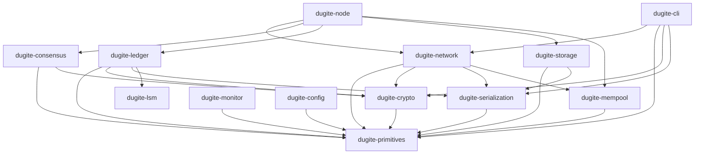

# Architecture Overview

Dugite is organized as a 14-crate Cargo workspace. Each crate has a focused responsibility and well-defined dependencies.

## Crate Workspace

| Crate | Description |
|-------|-------------|
| `dugite-primitives` | Core types: hashes, blocks, transactions, addresses, values, protocol parameters (Byron through Conway) |
| `dugite-crypto` | Ed25519 keys, VRF, KES, text envelope format |
| `dugite-serialization` | CBOR encoding/decoding for Cardano wire format via pallas |
| `dugite-lsm` | Pure Rust LSM-tree engine with WAL, compaction, bloom filters, and snapshots |
| `dugite-network` | Ouroboros mini-protocols (ChainSync, BlockFetch, TxSubmission, KeepAlive), N2N client/server, N2C server, multi-peer block fetch pool |
| `dugite-consensus` | Ouroboros Praos, chain selection, epoch transitions, slot leader checks |
| `dugite-ledger` | UTxO set (LSM-backed via UTxO-HD), transaction validation, ledger state, certificate processing, native script evaluation, reward calculation |
| `dugite-mempool` | Thread-safe transaction mempool with input-conflict checking and TTL sweep |
| `dugite-storage` | ChainDB (ImmutableDB append-only chunk files + VolatileDB in-memory) |
| `dugite-node` | Main binary, config, topology, pipelined chain sync loop, Mithril import, block forging |
| `dugite-cli` | cardano-cli compatible CLI (38+ subcommands) |
| `dugite-monitor` | Terminal monitoring dashboard (ratatui-based, real-time metrics via Prometheus polling) |
| `dugite-config` | Interactive TUI configuration editor with tree navigation, inline editing, type validation, and diff view |

## Crate Dependency Graph

## Key Dependencies

Dugite leverages the [pallas](https://github.com/txpipe/pallas) family of crates (v1.0.0-alpha.5) for Cardano wire-format compatibility:

- **pallas-network** — Ouroboros multiplexer and handshake
- **pallas-codec** — CBOR encoding/decoding
- **pallas-primitives** — Cardano primitive types
- **pallas-traverse** — Multi-era block traversal
- **pallas-crypto** — Cryptographic primitives
- **pallas-addresses** — Address parsing and construction

Other key dependencies:

- **tokio** — Async runtime
- **dugite-lsm** — Pure Rust LSM tree for the on-disk UTxO set (UTxO-HD)
- **minicbor** — CBOR encoding for custom types
- **ed25519-dalek** — Ed25519 signatures
- **blake2b_simd** — SIMD-accelerated Blake2b hashing
- **uplc** — Plutus CEK machine for script evaluation
- **clap** — CLI argument parsing
- **tracing** — Structured logging

## Design Principles

### Zero-Warning Policy

All code must compile with `RUSTFLAGS="-D warnings"` and pass `cargo clippy --all-targets -- -D warnings`. This is enforced by CI.

### Pallas Interoperability

Dugite uses pallas for network protocol handling and block deserialization, ensuring wire-format compatibility with cardano-node. Internal types (in `dugite-primitives`) are converted from pallas types during deserialization.

Key conversion patterns:
- `Transaction.hash` is set during deserialization from `pallas tx.hash()`
- `ChainSyncEvent::RollForward` uses `Box<Block>` to avoid large enum variant size
- Invalid transactions (`is_valid: false`) are skipped during `apply_block`
- Pool IDs are `Hash28` (Blake2b-224), not `Hash32`

### Multi-Era Support

Dugite handles all Cardano eras from Byron through Conway. The serialization layer handles era-specific block formats transparently, while the ledger layer applies era-appropriate validation rules.
