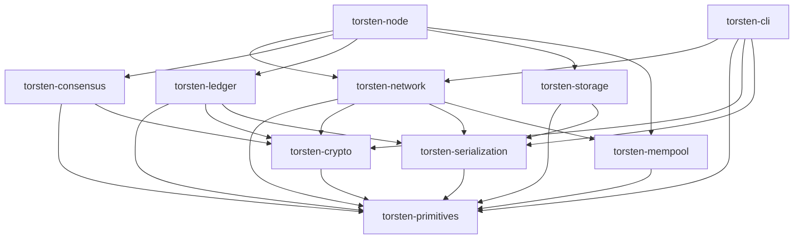

# Architecture Overview

Torsten is organized as a 10-crate Cargo workspace. Each crate has a focused responsibility and well-defined dependencies.

## Crate Workspace

| Crate | Description |
|-------|-------------|
| `torsten-primitives` | Core types: hashes, blocks, transactions, addresses, values, protocol parameters (Byron--Conway) |
| `torsten-crypto` | Ed25519 keys, VRF, KES, text envelope format |
| `torsten-serialization` | CBOR encoding/decoding for Cardano wire format via pallas |
| `torsten-network` | Ouroboros mini-protocols (ChainSync, BlockFetch, TxSubmission, KeepAlive), N2N client/server, N2C server, multi-peer block fetch pool |
| `torsten-consensus` | Ouroboros Praos, chain selection, epoch transitions, slot leader checks |
| `torsten-ledger` | UTxO set (LSM-backed via UTxO-HD), transaction validation, ledger state, certificate processing, native script evaluation, reward calculation |
| `torsten-mempool` | Thread-safe transaction mempool |
| `torsten-storage` | ChainDB (ImmutableDB append-only chunk files + VolatileDB in-memory) |
| `torsten-node` | Main binary, config, topology, pipelined chain sync loop |
| `torsten-cli` | cardano-cli compatible CLI |

## Crate Dependency Graph

## Key Dependencies

Torsten leverages the [pallas](https://github.com/txpipe/pallas) family of crates (v1.0.0-alpha.5) for Cardano wire-format compatibility:

- **pallas-network** -- Ouroboros multiplexer and handshake
- **pallas-codec** -- CBOR encoding/decoding
- **pallas-primitives** -- Cardano primitive types
- **pallas-traverse** -- Multi-era block traversal
- **pallas-crypto** -- Cryptographic primitives
- **pallas-addresses** -- Address parsing and construction

Other key dependencies:

- **tokio** -- Async runtime
- **cardano-lsm** -- Pure Rust LSM tree for the on-disk UTxO set (UTxO-HD)
- **minicbor** -- CBOR encoding for custom types
- **ed25519-dalek** -- Ed25519 signatures
- **blake2** -- Blake2b hashing
- **uplc** -- Plutus CEK machine for script evaluation
- **clap** -- CLI argument parsing
- **tracing** -- Structured logging

## Design Principles

### Zero-Warning Policy

All code must compile with `RUSTFLAGS="-D warnings"` and pass `cargo clippy --all-targets -- -D warnings`. This is enforced by CI.

### Pallas Interoperability

Torsten uses pallas for network protocol handling and block deserialization, ensuring wire-format compatibility with cardano-node. Internal types (in `torsten-primitives`) are converted from pallas types during deserialization.

Key conversion patterns:
- `Transaction.hash` is set during deserialization from `pallas tx.hash()`
- `ChainSyncEvent::RollForward` uses `Box<Block>` to avoid large enum variant size
- Invalid transactions (`is_valid: false`) are skipped during `apply_block`
- Pool IDs are `Hash28` (Blake2b-224), not `Hash32`

### Multi-Era Support

Torsten handles all Cardano eras from Byron through Conway. The serialization layer handles era-specific block formats transparently, while the ledger layer applies era-appropriate validation rules.
