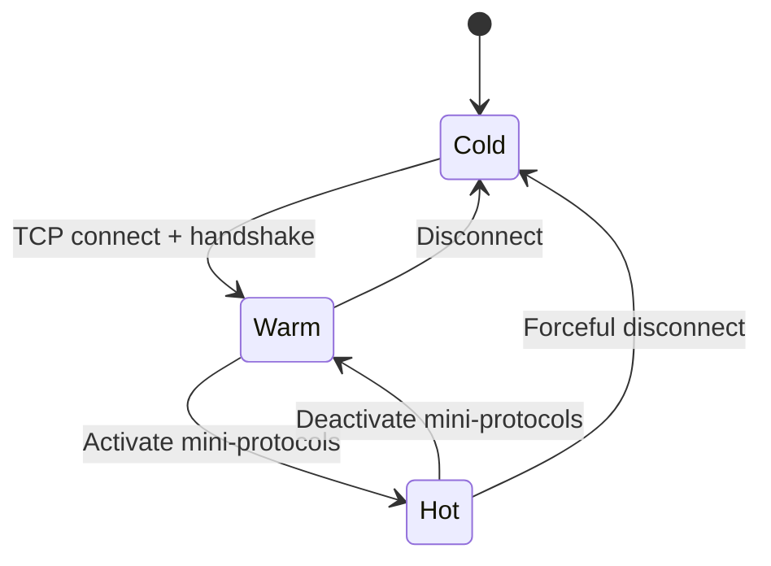

# P2P Governor

This document describes Dugite's peer management architecture, implementing the
Ouroboros P2P peer selection governor.

---

## Architecture

Two modules implement peer management in `dugite-network`:

### PeerManager (`peer_manager.rs`)

The data layer. Tracks every known peer in a flat `HashMap<SocketAddr, PeerInfo>`
together with three `HashSet`s for the cold/warm/hot buckets.

| Feature | Description |
|---|---|
| Cold / Warm / Hot temperature tracking | Three-tier peer classification matching Ouroboros |
| `PeerCategory` | LocalRoot, PublicRoot, BigLedgerPeer, LedgerPeer, Shared, Bootstrap |
| `ConnectionDirection` | Inbound / Outbound tracking |
| `PeerSource` | Config, PeerSharing, Ledger |
| `PeerPerformance` | EWMA handshake RTT + block fetch latency |
| Reputation scoring | Composite of latency + volume + reliability + recency |
| Circuit breaker | Closed / Open / HalfOpen with exponential cooldown |
| Subnet diversity penalty | /24 IPv4, /48 IPv6 penalisation for peer selection |
| Trustable-first ordering | Two-tier ordering for `peers_to_connect()` |
| Inbound connection limit | Configurable max inbound connections |
| `DiffusionMode` | InitiatorOnly / InitiatorAndResponder |
| Failure-count time decay | Halves every 5 minutes |

### Governor (`governor.rs`)

The policy layer. Runs on a 30-second `tokio::interval` in `dugite-node`.

| Feature | Description |
|---|---|
| `PeerTargets` | root/known/established/active + BLP variants |
| Sync-state-aware target switching | Adjusts targets for PreSyncing / Syncing / CaughtUp |
| Hard/soft connection limits | `ConnectionDecision` for accept/reject |
| Big-ledger-peer promotion priority | BLPs promoted first during sync |
| Active (hot) peer target enforcement | Promotes/demotes to meet active target |
| Established (warm+hot) target enforcement | Maintains established peer count |
| Surplus reduction | Demote/disconnect lowest reputation, local-root protected |
| Churn mechanism | 20% target reduction cycle at configurable intervals |
| Default targets | active=15, established=40, known=85 (matching cardano-node) |

---

## Wiring

The governor runs as a standalone `tokio::spawn` task in `node/mod.rs`.
Every 30 seconds it:

1. Acquires a read lock on `Arc<RwLock<PeerManager>>` and calls
   `governor.evaluate()` and `governor.maybe_churn()`.
2. Acquires a write lock and applies the resulting `GovernorEvent`s by calling
   `promote_to_hot`, `demote_to_warm`, `peer_disconnected`, and
   `recompute_reputations`.
3. `GovernorEvent::Connect` is acknowledged but not executed here — outbound
   connections originate from the main connection loop via `peers_to_connect()`.

---

## Peer Selection State Machine

Peers progress through a formal state machine:

---

## Target Counts

The governor maintains six independent target counts:

| Target | Default |
|---|---|
| Known peers | 100 |
| Established peers | 40 |
| Active peers | 15 |
| Known big-ledger peers | 15 |
| Established big-ledger peers | 10 |
| Active big-ledger peers | 5 |

When any target is not met, the governor attempts to satisfy the deficit.
When any target is exceeded, surplus peers are demoted by lowest reputation.

---

## Local Root Peer Pinning

Local root peers (from `localRoots` in the topology file) have pinned targets
that override the normal target counts. Local roots are never demoted for
surplus reduction and are never churned.

---

## Churn

The governor performs periodic churn to rotate peers:

- **Deadline churn (normal mode)** — Approximately every 55 minutes, a fraction
  of established and active peers are replaced.
- **Bulk sync churn** — During active block download, churn cycles are more
  aggressive (~15 minutes) to shed peers with poor block-fetch performance.

---

## Big Ledger Peer Preference During Sync

Big ledger peers (SPOs in the top 90% of stake, obtained via
`GetLedgerPeerSnapshot`) serve as trusted anchors during bulk block download.
The governor maintains a separate target bucket for BLPs. When `SyncState` is
`Syncing` or `PreSyncing`, BLP targets take priority.

---

## Thread Safety

The `PeerManager` is wrapped in `Arc<RwLock<PeerManager>>`. The governor task
acquires a read lock for `evaluate()` and a write lock only for event
application, keeping the write-lock window minimal.

---

## Files

| File | Purpose |
|---|---|
| `crates/dugite-network/src/governor.rs` | Policy decisions and target enforcement |
| `crates/dugite-network/src/peer_manager.rs` | Peer state tracking and reputation |
| `crates/dugite-node/src/node/mod.rs` | Governor task wiring |
| `crates/dugite-node/src/config.rs` | Topology parsing |
