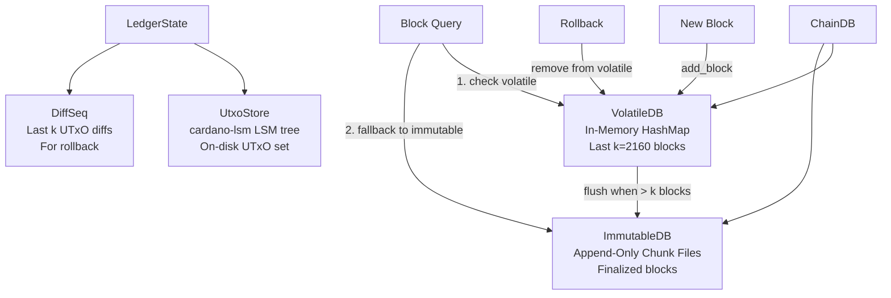

# Storage

Torsten's storage layer is implemented in the `torsten-storage` and `torsten-ledger` crates. It closely mirrors the cardano-node architecture with three distinct storage subsystems coordinated by ChainDB.

## Storage Architecture



## Block Storage

### ImmutableDB (Append-Only Chunk Files)

The ImmutableDB stores finalized blocks in append-only chunk files on disk. This matches cardano-node's ImmutableDB design -- blocks are simply appended to files and are inherently durable without any snapshot mechanism.

Properties:
- **Always durable** -- append-only writes survive process crashes without special persistence logic
- **No LSM tree** -- plain chunk files, no compaction or memtable overhead
- **Sequential access** -- optimized for the append-heavy, read-sequential block storage workload
- **Secondary indexes** -- slot-to-offset and hash-to-slot mappings for efficient lookups

### VolatileDB (In-Memory HashMap)

The VolatileDB stores recent blocks (the last k=2160 blocks) in an in-memory `HashMap`. This enables:

- **Fast reads** -- no disk I/O for recent blocks
- **Efficient rollback** -- blocks can be removed without touching disk
- **Simple eviction** -- when a block becomes k-deep, it is flushed to the ImmutableDB

The VolatileDB has no on-disk representation -- it exists only in memory and is rebuilt from the ImmutableDB tip on restart.

### ChainDB

ChainDB is the unified interface for block storage. It coordinates the ImmutableDB and VolatileDB:

1. New blocks arrive from peers and are added to the **VolatileDB**
2. Once a block is more than **k** slots deep (k=2160 for mainnet), it is flushed from the VolatileDB to the **ImmutableDB**
3. Flushed blocks are removed from the VolatileDB

When querying for a block:
1. The VolatileDB is checked first (fast, in-memory)
2. If not found, the ImmutableDB is consulted (disk-based)

### Block Range Queries

ChainDB supports querying blocks by slot range:
- VolatileDB scans its HashMap for matching slots
- ImmutableDB uses secondary indexes for slot range scanning
- Results from both databases are merged

## UTxO Storage (UTxO-HD)

The UTxO set is stored on disk using [cardano-lsm](https://crates.io/crates/cardano-lsm), a pure Rust LSM tree. This matches Haskell cardano-node's UTxO-HD architecture, where the UTxO set lives in an LSM-backed on-disk store rather than entirely in memory.

### UtxoStore

The `UtxoStore` (in `torsten-ledger`) wraps a cardano-lsm `LsmTree` and provides:

- **Disk-backed UTxO set** -- the full UTxO set lives on disk, not in memory
- **Efficient point lookups** -- bloom filters for fast negative lookups
- **Batch writes** -- UTxO inserts and deletes are batched per block
- **Snapshots** -- periodic snapshots for crash recovery

cardano-lsm configuration:
- 128MB write buffer (memtable)
- 256MB block cache
- 10 bits per key bloom filter
- Hybrid compaction: tiered L0 (size ratio 4.0), leveled L1+ (size ratio 10.0)

### DiffSeq (Rollback Support)

The `DiffSeq` (in `torsten-ledger`) maintains the last k blocks of UTxO diffs, enabling rollback without replaying blocks:

- Each block produces a `UtxoDiff` recording which UTxOs were added and removed
- The `DiffSeq` holds the last k=2160 diffs
- On rollback, diffs are applied in reverse to restore the UTxO set

### io_uring Support (Linux)

On Linux with kernel 5.1+, enable io_uring for async I/O in the UTxO LSM tree:

```bash
cargo build --release --features io-uring
```

On other platforms (macOS, Windows), the feature flag is accepted but falls back to synchronous I/O automatically.

## Snapshot Policy

Torsten uses a time-based snapshot policy matching Haskell's cardano-node:

- **Normal sync**: snapshots every 72 minutes (k * 2 seconds, where k=2160)
- **Bulk sync**: snapshots every 50,000 blocks plus 6 minutes of wall-clock time
- **Maximum retained**: 2 snapshots on disk at any time

Ledger snapshots include the full ledger state (stake distribution, protocol parameters, governance state, etc.). The UTxO set is persisted separately via the UtxoStore's LSM snapshots.

## Tip Recovery

When the node restarts:
1. The ImmutableDB tip is read from the chunk files (always durable)
2. The VolatileDB starts empty (in-memory state is rebuilt)
3. The ledger state is restored from the most recent snapshot
4. The UTxO set is restored from the UtxoStore's LSM snapshot
5. The node resumes syncing from the recovered tip

## Disk Layout

```
database-path/
  immutable/          # Append-only block chunk files
    chunks/           # Block data files
    index/            # Secondary indexes (slot, hash)
  utxo/               # cardano-lsm database (UTxO set)
    active/           # Current SSTables
    snapshots/        # Durable snapshots
  ledger/             # Ledger state snapshots
```

## Performance Considerations

- **Block writes** -- append-only chunk files provide consistent write performance without compaction pauses
- **UTxO lookups** -- LSM tree with bloom filters provides efficient point lookups for transaction validation
- **Memory usage** -- the VolatileDB holds approximately k blocks in memory (typically a few hundred MB). The UTxO set lives on disk, significantly reducing memory pressure compared to an all-in-memory approach
- **Batch size** -- the flush batch size balances memory usage against write efficiency

## Benchmarks

Run storage benchmarks with:

```bash
cargo bench -p torsten-storage
```
