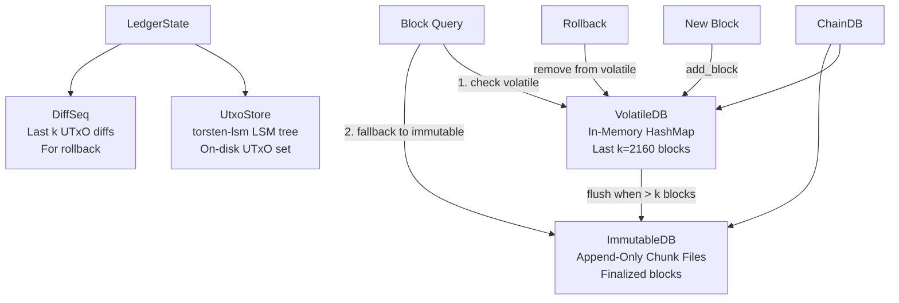
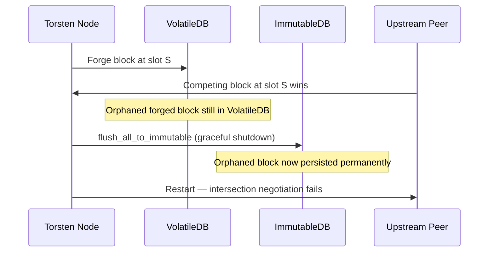

# Storage

Torsten's storage layer is implemented in the `torsten-storage` and `torsten-ledger` crates. It closely mirrors the cardano-node architecture with three distinct storage subsystems coordinated by ChainDB.

## Storage Architecture



## Block Storage

### ImmutableDB (Append-Only Chunk Files)

The ImmutableDB stores finalized blocks in append-only chunk files on disk. This matches cardano-node's ImmutableDB design — blocks are simply appended to files and are inherently durable without any snapshot mechanism.

Properties:
- **Always durable** — append-only writes survive process crashes without special persistence logic
- **No LSM tree** — plain chunk files, no compaction or memtable overhead
- **Sequential access** — optimized for the append-heavy, read-sequential block storage workload
- **Secondary indexes** — slot-to-offset and hash-to-slot mappings for efficient lookups
- **Memory-mapped block index** — on-disk open-addressing hash table (`hash_index.dat`) provides 3-5x faster lookups than in-memory HashMap while using near-zero RSS

### VolatileDB (In-Memory HashMap)

The VolatileDB stores recent blocks (the last k=2160 blocks) in an in-memory `HashMap`. This enables:

- **Fast reads** — no disk I/O for recent blocks
- **Efficient rollback** — blocks can be removed without touching disk
- **Simple eviction** — when a block becomes k-deep, it is flushed to the ImmutableDB

The VolatileDB has no on-disk representation — it exists only in memory and is rebuilt from the ImmutableDB tip on restart.

### ChainDB

ChainDB is the unified interface for block storage. It coordinates the ImmutableDB and VolatileDB:

1. New blocks arrive from peers and are added to the **VolatileDB**
2. Once a block is more than **k** slots deep (k=2160 for mainnet), it is flushed from the VolatileDB to the **ImmutableDB**
3. Flushed blocks are removed from the VolatileDB

When querying for a block:
1. The VolatileDB is checked first (fast, in-memory)
2. If not found, the ImmutableDB is consulted (disk-based)

### Block Range Queries

ChainDB supports querying blocks by slot range:
- VolatileDB scans its HashMap for matching slots
- ImmutableDB uses secondary indexes for slot range scanning
- Results from both databases are merged

## UTxO Storage (UTxO-HD)

The UTxO set is stored on disk using `torsten-lsm`, a pure Rust LSM tree. This matches Haskell cardano-node's UTxO-HD architecture, where the UTxO set lives in an LSM-backed on-disk store rather than entirely in memory.

### UtxoStore

The `UtxoStore` (in `torsten-ledger`) wraps a torsten-lsm `LsmTree` and provides:

- **Disk-backed UTxO set** — the full UTxO set lives on disk, not in memory
- **Efficient point lookups** — bloom filters for fast negative lookups
- **Batch writes** — UTxO inserts and deletes are batched per block
- **Snapshots** — periodic snapshots for crash recovery

torsten-lsm is configured via storage profiles that maximize available system memory:

| Profile | Target System | Memtable | Block Cache | Expected RSS |
|---------|--------------|----------|-------------|-------------|
| `ultra-memory` | 32GB | 2GB | 24GB | ~27GB |
| `high-memory` (default) | 16GB | 1GB | 12GB | ~14GB |
| `low-memory` | 8GB | 512MB | 5GB | ~6.5GB |
| `minimal` | 4GB | 256MB | 2GB | ~3GB |

All profiles use 10 bits per key bloom filters and hybrid compaction (tiered L0, leveled L1+).

### DiffSeq (Rollback Support)

The `DiffSeq` (in `torsten-ledger`) maintains the last k blocks of UTxO diffs, enabling rollback without replaying blocks:

- Each block produces a `UtxoDiff` recording which UTxOs were added and removed
- The `DiffSeq` holds the last k=2160 diffs
- On rollback, diffs are applied in reverse to restore the UTxO set

### io_uring Support (Linux)

On Linux with kernel 5.1+, enable io_uring for async I/O in the UTxO LSM tree:

```bash
cargo build --release --features io-uring
```

On other platforms (macOS, Windows), the feature flag is accepted but falls back to synchronous I/O automatically.

## Snapshot Policy

Torsten uses a time-based snapshot policy matching Haskell's cardano-node:

- **Normal sync**: snapshots every 72 minutes (k * 2 seconds, where k=2160)
- **Bulk sync**: snapshots every 50,000 blocks plus 6 minutes of wall-clock time
- **Maximum retained**: 2 snapshots on disk at any time

Ledger snapshots include the full ledger state (stake distribution, protocol parameters, governance state, etc.). The UTxO set is persisted separately via the UtxoStore's LSM snapshots.

## Tip Recovery

When the node restarts:
1. The ImmutableDB tip is read from the chunk files (always durable)
2. The VolatileDB starts empty (in-memory state is rebuilt)
3. The ledger state is restored from the most recent snapshot
4. The UTxO set is restored from the UtxoStore's LSM snapshot
5. The node resumes syncing from the recovered tip

## Disk Layout

```
database-path/
  immutable/          # Append-only block chunk files
    chunks/           # Block data files
    index/            # Secondary indexes (slot, hash)
    hash_index.dat    # Mmap block index (open-addressing hash table)
  utxo-store/         # torsten-lsm database (UTxO set)
    active/           # Current SSTables
    snapshots/        # Durable snapshots
  ledger/             # Ledger state snapshots
```

## Performance Considerations

- **Block writes** — append-only chunk files provide consistent write performance without compaction pauses
- **UTxO lookups** — LSM tree with bloom filters provides efficient point lookups for transaction validation
- **Memory usage** — the VolatileDB holds approximately k blocks in memory (typically a few hundred MB). The UTxO set lives on disk, significantly reducing memory pressure compared to an all-in-memory approach
- **Batch size** — the flush batch size balances memory usage against write efficiency

## Storage Profiles

Torsten provides four storage profiles sized to maximize available system memory:

```bash
# Select a profile via CLI
./torsten-node run --storage-profile high-memory ...

# Override individual parameters
./torsten-node run --storage-profile low-memory --utxo-block-cache-size-mb 4096 ...
```

Profiles can also be set in the node configuration file:

```json
{
  "storage": {
    "profile": "high-memory",
    "utxoBlockCacheSizeMb": 8192
  }
}
```

Resolution order: profile defaults < config file overrides < CLI overrides.

## Fork Recovery & ImmutableDB Contamination

### Problem

When a forged block loses a slot battle, `flush_all_to_immutable` on graceful shutdown can persist orphaned blocks permanently in the ImmutableDB. Since the ImmutableDB is append-only and designed for finalized blocks, these orphaned blocks contaminate the canonical chain history and can cause intersection failures on reconnect.



### Detection

- **`ChainDB.get_chain_points()`** walks backwards through volatile blocks via `prev_hash` links, providing the peer with enough ancestry for intersection even when the tip is orphaned.
- **`ImmutableDB.get_historical_points()`** samples older chunk secondary indexes in reverse order, providing canonical intersection points even when the immutable tip is contaminated.
- When fork divergence is detected, contaminated ChainDB chain points are excluded from intersection negotiation, preventing the node from advertising orphaned blocks to peers.

### Recovery

- **Case A (Origin intersection):** The volatile DB is cleared, the ledger state is reset, and the node reconnects from genesis. This is the fallback when no valid intersection can be found.
- **Case B (Intersection behind ledger):** A targeted ImmutableDB replay is performed up to the intersection slot using a detached LSM store, achieving approximately 50K blocks/second replay speed. This avoids a full resync while restoring the ledger to a consistent state.

## Benchmarks

Run storage benchmarks with:

```bash
# Storage benchmarks (block index, ImmutableDB, ChainDB, scaling to 1M entries)
cargo bench -p torsten-storage --bench storage_bench

# UTxO store benchmarks (insert, lookup, apply_tx, LSM configs, scaling to 1M entries)
cargo bench -p torsten-ledger --bench utxo_bench

# Crypto benchmarks (Ed25519, blake2b keyhash)
cargo bench -p torsten-crypto --bench crypto_bench

# Hash benchmarks (blake2b_256, blake2b_224, batch hashing)
cargo bench -p torsten-primitives --bench hash_bench
```

Results are saved to `target/criterion/` with HTML reports. Baseline results are tracked in `benches/results/`.

### Latest Results (Apple M2 Max, 32GB, 2026-03-14)

#### Block Index Lookup (500 random lookups, mmap vs in-memory HashMap)

| Size | In-Memory | Mmap | Speedup |
|------|-----------|------|---------|
| 10K | 10.0µs | 2.83µs | **3.5x** |
| 100K | 10.1µs | 2.17µs | **4.7x** |
| 1M | 10.6µs | 2.01µs | **5.3x** |

Mmap lookup advantage grows with scale — at mainnet block counts (~10M), the gap widens further.

#### UTxO Store Scaling (torsten-lsm LSM tree)

| Size | Insert (per-entry) | Lookup (per-entry) | Total Lovelace Scan |
|------|-------------------|-------------------|-------------------|
| 10K | 455ns | 191ns | 2.38ms |
| 100K | 479ns | 236ns | 29.1ms |
| 1M | 569ns | 308ns | 330ms |

Insert and lookup scale near-linearly. At mainnet scale (~20M UTxOs), estimated full scan ~6.6s.

#### Crypto & Hashing

| Operation | Time |
|-----------|------|
| Ed25519 verify (single) | 28.6µs |
| Blake2b-224 keyhash (32B) | 128ns |
| Blake2b-256 tx hash (1KB) | 949ns |

A typical block with 50 witnesses: ~1.4ms for signature verification, ~6.4µs for keyhash computation.

#### LSM Config Comparison (100K entries)

All storage profiles perform identically at benchmark scale — config differences emerge at mainnet scale (20M+ UTxOs) where working set exceeds cache capacity.

See `benches/results/2026-03-14-all-profiles.md` for full results.
