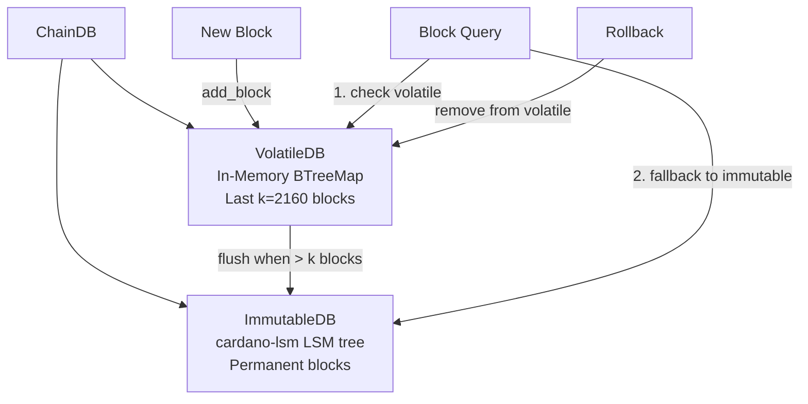

# Storage

Torsten's storage layer is implemented in the `torsten-storage` crate, centered around ChainDB -- a two-tier block storage system modeled after cardano-node's design.

## Storage Architecture



## Storage Backend

The ImmutableDB uses [cardano-lsm](https://crates.io/crates/cardano-lsm), a pure Rust LSM tree designed specifically for Cardano blockchain indexing. It provides:

- **Blockchain-optimized compaction** -- hybrid tiered/leveled strategy tuned for block write patterns
- **Bloom filters** -- efficient negative lookups
- **Cheap snapshots** -- reference-counted snapshots for fast rollback and durable persistence
- **No system dependencies** -- pure Rust, no native libraries needed
- **Optional io_uring** -- batched concurrent reads on Linux for NVMe drives (`--features io-uring`)

Configuration (in `LsmImmutableDB::open`):
- 128MB write buffer (memtable)
- 256MB block cache
- 10 bits per key bloom filter
- Hybrid compaction: tiered L0 (size ratio 4.0), leveled L1+ (size ratio 10.0)

### io_uring Support (Linux)

On Linux with kernel 5.1+, enable io_uring for async I/O during compaction:

```bash
cargo build --release --features io-uring
```

On other platforms (macOS, Windows), the feature flag is accepted but falls back to synchronous I/O automatically.

## ChainDB

ChainDB is the unified interface for block storage. It manages two underlying databases:

- **VolatileDB** -- Recent blocks that may be rolled back
- **ImmutableDB** -- Permanent blocks that are considered final

### Block Lifecycle

1. New blocks arrive from peers and are added to the **VolatileDB**
2. Once a block is more than **k** slots deep (k=2160 for mainnet), it is flushed from the VolatileDB to the **ImmutableDB**
3. Flushed blocks are removed from the VolatileDB

### Block Queries

When querying for a block:
1. The VolatileDB is checked first (fast, in-memory)
2. If not found, the ImmutableDB is consulted (disk-based)

### Slot Range Queries

ChainDB supports querying blocks by slot range:
- VolatileDB uses `BTreeMap::range()` for efficient slot-based lookups
- ImmutableDB uses range iterators for slot range scanning
- Results from both databases are merged

## VolatileDB

The VolatileDB stores recent blocks in an in-memory `BTreeMap` indexed by slot number. This enables:

- **Fast reads** -- No disk I/O for recent blocks
- **Efficient rollback** -- Blocks can be removed without touching disk
- **Ordered iteration** -- BTreeMap provides natural slot ordering

The VolatileDB holds the last k=2160 blocks (the security parameter). Once a block is deeper than k, it is considered immutable and flushed to the ImmutableDB.

## ImmutableDB

The ImmutableDB stores blocks permanently on disk using the cardano-lsm LSM tree.

### WriteBatch

Blocks are written in batches. When the VolatileDB flushes blocks to the ImmutableDB, it creates a single batch containing all blocks to be flushed. This provides:

- **Atomicity** -- All blocks in the batch are written together or not at all
- **Performance** -- A single disk sync for multiple blocks
- **Consistency** -- No partial writes on crash

### Key Format

Blocks are stored with their slot number as the key, enabling efficient range scans for slot-based queries. Secondary indexes map block hashes to slots and slots to hashes.

### Metadata

The ImmutableDB tracks:
- **Tip slot** -- The highest slot stored
- **Tip block number** -- The highest block number stored
- **Tip hash** -- The hash of the highest block

This metadata is persisted to enable tip recovery on restart.

### Persistence Model

cardano-lsm uses ephemeral writes -- data is held in an in-memory memtable and periodically flushed to SSTables on disk. To ensure durability across process restarts, Torsten calls `persist()` which creates a named snapshot. On the next open, the snapshot is restored automatically.

Key persistence points:
- **Node shutdown** -- `persist_immutable()` is called after flushing volatile blocks
- **Mithril import** -- `persist()` is called after the bulk import completes
- **Background compaction** -- runs on node startup to consolidate SSTables

## Tip Recovery

When the node restarts, it recovers its tip from persisted metadata:
1. The ImmutableDB tip is read from the latest snapshot
2. The VolatileDB starts empty (in-memory state is lost on restart)
3. The node resumes syncing from the ImmutableDB tip

## Ledger State Snapshots

In addition to block storage, the node periodically saves ledger state snapshots to disk. This allows the node to recover its full state (UTxO set, stake distribution, protocol parameters) without replaying all blocks from genesis.

## Disk Layout

```
database-path/
  immutable/          # cardano-lsm database
    active/           # Current SSTables
    snapshots/        # Durable snapshots (hard-linked)
      latest/         # Most recent persist() snapshot
```

The VolatileDB has no on-disk representation -- it exists only in memory.

## Performance Considerations

- **Batch size** -- The flush batch size balances memory usage (larger batches use more memory) against write efficiency (fewer disk syncs)
- **Memory usage** -- The VolatileDB holds approximately k blocks in memory. At ~2160 blocks, this is typically a few hundred MB depending on block sizes

## Benchmarks

Run storage benchmarks with:

```bash
cargo bench -p torsten-storage
```
