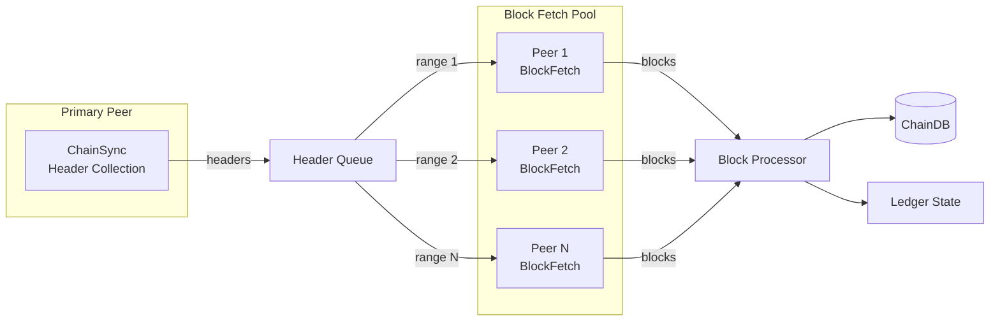

# Sync Pipeline

Torsten uses a pipelined multi-peer architecture for block synchronization, separating header collection from block fetching for maximum throughput.

## Architecture

## Pipeline Stages

### 1. Header Collection (ChainSync)

A primary peer is selected for the ChainSync protocol. The node requests block headers sequentially using the N2N ChainSync mini-protocol (V14+). Headers are collected into batches.

The ChainSync protocol involves:
1. **MsgFindIntersect** — Find a common point between the node and the peer
2. **MsgRequestNext** — Request the next header
3. **MsgRollForward** — Receive a new header
4. **MsgRollBackward** — Handle a chain reorganization

### 2. Block Fetch Pool

Collected headers are distributed across multiple peers for parallel block retrieval. The block fetch pool supports up to 4 concurrent peers, each fetching a range of blocks.

The BlockFetch protocol involves:
1. **MsgRequestRange** — Request a range of blocks by header hash
2. **MsgBlock** — Receive a block
3. **MsgBatchDone** — Signal the end of a batch

Blocks are fetched in batches of 500 headers, with sub-batches of 100 headers each. Each sub-batch is decoded on a `spawn_blocking` task to avoid blocking the async runtime.

### 3. Block Processing

Fetched blocks are applied to the ledger state in order:

1. **Deserialization** — Raw CBOR bytes are decoded into Torsten's internal `Block` type using pallas
2. **Ledger validation** — Each block is validated against the current ledger state (UTxO checks, fee validation, certificate processing)
3. **Storage** — Valid blocks are added to the ChainDB (volatile database first, flushed to immutable when k-deep)
4. **Epoch transitions** — At epoch boundaries, stake snapshots are rotated and rewards are calculated

### Batched Lock Acquisition

To minimize lock contention, the sync loop acquires a single lock on both the ChainDB and ledger state for each batch of 500 blocks, rather than locking per-block.

### Progress Reporting

Progress is logged every 5 seconds, showing:
- Current slot and block number
- Epoch number
- UTxO count
- Sync percentage (based on slot vs. wall-clock time)
- Blocks-per-second throughput metric

## Rollback Handling

When the ChainSync peer sends a `MsgRollBackward` message, the node:

1. Identifies the rollback point (a slot/hash pair)
2. Removes rolled-back blocks from the VolatileDB
3. Reverts the ledger state to the rollback point
4. Resumes header collection from the new tip

Only blocks in the VolatileDB (the last k=2160 blocks) can be rolled back. Blocks that have been flushed to the ImmutableDB are permanent.

## Pipelined ChainSync

Torsten uses pipelined ChainSync to avoid the round-trip latency bottleneck of serial header requests. Instead of waiting for each `MsgRollForward` before requesting the next header, the node sends up to 150 `MsgRequestNext` messages concurrently (configurable via `TORSTEN_PIPELINE_DEPTH`).

This bypasses pallas' serial ChainSync state machine in favor of a custom implementation that manages the pipeline depth directly.

## Performance Characteristics

- **Header collection** is pipelined per peer (up to 150 in-flight requests, configurable via `TORSTEN_PIPELINE_DEPTH`)
- **Block fetching** is parallelized across up to 4 concurrent peers
- **Block processing** is batched (500 blocks per batch) with single-lock acquisition
- **Throughput** depends on network latency, peer count, and block sizes

On preview testnet, full sync from genesis completes in approximately 10 hours, with block replay (from Mithril snapshot) achieving ~10,600 blocks/second.
