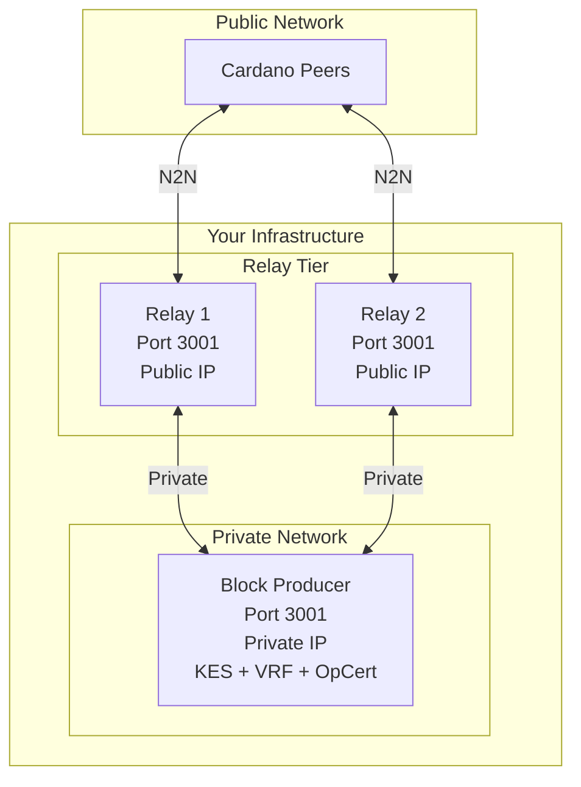

# Block Producer

Torsten can operate as a block-producing node (stake pool). This requires KES keys, VRF keys, and an operational certificate.

## Architecture

A block producer is never directly exposed to the public internet. Instead, it sits behind one or more [relay nodes](./relay.md) that handle all external network connectivity. The relays forward blocks and transactions to the BP over a private network, and the BP announces forged blocks back through the relays.

See the [Complete Deployment](#complete-deployment) section at the bottom of this page for the full architecture diagram and setup checklist.

## Overview

A block producer is a node that has been registered as a stake pool and is capable of minting new blocks when it is elected as a slot leader. The block production pipeline involves:

1. **Slot leader check** — Each slot, the node uses its VRF key and the epoch nonce to determine if it is elected to produce a block.
2. **Block forging** — If elected, the node assembles a block from pending mempool transactions, signs it with the KES key, and includes the VRF proof.
3. **Block announcement** — The forged block is propagated to connected peers via the N2N protocol.

## Required Keys

### Cold Keys (Offline)

Cold keys identify the stake pool and should be kept offline (air-gapped) after initial setup.

Generate cold keys using the CLI:

```bash
torsten-cli node key-gen \
  --cold-verification-key-file cold.vkey \
  --cold-signing-key-file cold.skey \
  --operational-certificate-counter-file opcert.counter
```

### KES Keys (Hot)

KES (Key Evolving Signature) keys are rotated periodically. Each KES key is valid for a limited number of KES periods (typically 62 periods of 129600 slots each on mainnet, approximately 90 days total).

Generate KES keys:

```bash
torsten-cli node key-gen-kes \
  --verification-key-file kes.vkey \
  --signing-key-file kes.skey
```

### VRF Keys

VRF (Verifiable Random Function) keys are used for slot leader election. They are generated once and do not need rotation.

Generate VRF keys:

```bash
torsten-cli node key-gen-vrf \
  --verification-key-file vrf.vkey \
  --signing-key-file vrf.skey
```

## Operational Certificate

The operational certificate binds the cold key to the current KES key. It must be regenerated each time the KES key is rotated.

Issue an operational certificate:

```bash
torsten-cli node issue-op-cert \
  --kes-verification-key-file kes.vkey \
  --cold-signing-key-file cold.skey \
  --operational-certificate-counter-file opcert.counter \
  --kes-period <current-kes-period> \
  --out-file opcert.cert
```

The `--kes-period` should be set to the current KES period at the time of issuance. You can calculate the current KES period as:

```
current_kes_period = current_slot / slots_per_kes_period
```

On mainnet, `slots_per_kes_period` is 129600.

## Running as Block Producer

Pass the key and certificate paths when starting the node:

```bash
torsten-node run \
  --config config.json \
  --topology topology.json \
  --database-path ./db \
  --socket-path ./node.sock \
  --host-addr 0.0.0.0 \
  --port 3001 \
  --shelley-kes-key kes.skey \
  --shelley-vrf-key vrf.skey \
  --shelley-operational-certificate opcert.cert
```

When all three arguments are provided, the node enters block production mode. Without them, it operates as a relay-only node.

## Block Producer Topology

A block producer should not be directly exposed to the public internet. Instead, it should connect only to your relay nodes:

```json
{
  "bootstrapPeers": null,
  "localRoots": [
    {
      "accessPoints": [
        { "address": "relay1.example.com", "port": 3001 },
        { "address": "relay2.example.com", "port": 3001 }
      ],
      "advertise": false,
      "hotValency": 2,
      "warmValency": 3,
      "trustable": true
    }
  ],
  "publicRoots": [{ "accessPoints": [], "advertise": false }],
  "useLedgerAfterSlot": -1
}
```

Key points:
- **No bootstrap peers** — The block producer syncs exclusively through your relays.
- **No public roots** — No connections to unknown peers.
- **Ledger peers disabled** — `useLedgerAfterSlot: -1` disables ledger-based peer discovery.
- **Only local roots** — All connections are to your own relay nodes.

## Leader Schedule

You can compute your pool's leader schedule for an epoch:

```bash
torsten-cli query leadership-schedule \
  --vrf-signing-key-file vrf.skey \
  --epoch-nonce <64-char-hex> \
  --epoch-start-slot <slot> \
  --epoch-length 432000 \
  --relative-stake 0.001 \
  --active-slot-coeff 0.05
```

This outputs all slots where your pool is elected to produce a block in the given epoch.

## KES Key Rotation

KES keys must be rotated before they expire. The rotation process:

1. Generate new KES keys:
   ```bash
   torsten-cli node key-gen-kes \
     --verification-key-file kes-new.vkey \
     --signing-key-file kes-new.skey
   ```

2. Issue a new operational certificate with the new KES key (on the air-gapped machine):
   ```bash
   torsten-cli node issue-op-cert \
     --kes-verification-key-file kes-new.vkey \
     --cold-signing-key-file cold.skey \
     --operational-certificate-counter-file opcert.counter \
     --kes-period <current-kes-period> \
     --out-file opcert-new.cert
   ```

3. Replace the KES key and certificate on the block producer and restart:
   ```bash
   cp kes-new.skey kes.skey
   cp opcert-new.cert opcert.cert
   # Restart the node
   ```

> **Important:** Always rotate KES keys before they expire. If a KES key expires, your pool will stop producing blocks until a new key is issued.

## Security Recommendations

- Keep cold keys on an air-gapped machine. They are only needed to issue new operational certificates.
- Restrict access to the block producer machine. Only your relay nodes should be able to connect.
- Monitor your pool's block production. Use the [Prometheus metrics endpoint](./monitoring.md) to track `torsten_blocks_applied_total`.
- Set up KES key rotation reminders well before expiry (2 weeks in advance is a good practice).
- Use firewalls to ensure the block producer is not reachable from the public internet.

## Snapshot Recovery & Block Forging Readiness

When a block producer starts up, several subsystems must be initialized before it can begin forging blocks. The path to readiness depends on how the node was bootstrapped.

### Epoch Nonce Establishment

The epoch nonce is critical for VRF leader election. It is derived from accumulated VRF contributions across epoch boundaries:

- **After Mithril import + full replay from genesis:** The nonce is computed correctly during replay. If the replay crosses at least one epoch boundary, `nonce_established` is set to `true` immediately and forging is enabled once the node reaches the chain tip.
- **After loading a ledger snapshot:** The serialized snapshot does not carry live nonce tracking state. The node must observe at least one live epoch transition before `nonce_established` becomes `true`. Until then, the node logs `Forge: skipping — epoch nonce not yet established` and will not attempt to forge.

On preview testnet (epoch length 86,400 slots = 1 day), expect up to one day after snapshot load before forging is enabled.

### Pool Stake Reconstruction

On startup, after loading a ledger snapshot, the node rebuilds the stake distribution from the UTxO store to ensure consistency:

1. `rebuild_stake_distribution()` recomputes per-pool stake totals from the current UTxO set and delegation map.
2. `recompute_snapshot_pool_stakes()` updates the mark/set/go snapshots so that the "set" snapshot (used for leader election) reflects the rebuilt distribution.

This runs automatically when the UTxO store is non-empty. After completion, the node logs the pool's stake in the "set" snapshot:

```
Block producer: pool stake in 'set' snapshot (used for leader election)
  pool_id=<hash>, pool_stake_lovelace=<n>, total_active_stake_lovelace=<n>, relative_stake=<f>
```

If your pool shows zero stake after startup, verify:

- The pool registration certificate transaction is confirmed on-chain.
- At least one stake address is delegated to the pool and that delegation is confirmed.
- The UTxO store was properly attached (the node logs `Rebuilding stake distribution from UTxO store` on startup).
- The "set" snapshot epoch is recent enough to include your pool's registration and delegation.

## Epoch Numbering

Each network has its own epoch length defined in the Shelley genesis configuration:

| Network  | `epoch_length` | Approximate Duration |
|----------|---------------|----------------------|
| Mainnet  | 432,000       | 5 days               |
| Preview  | 86,400        | 1 day                |
| Preprod  | 432,000       | 5 days               |

When a ledger snapshot is loaded, the node recalculates the current epoch from the tip slot using the genesis parameters. If the snapshot was saved with incorrect epoch parameters (for example, using mainnet's default 432,000 instead of preview's 86,400), the epoch number baked into the snapshot will be wrong. The node detects this automatically and corrects it:

```
Snapshot epoch differs from computed epoch — correcting
  snapshot_epoch=<wrong>, correct_epoch=<right>, tip_slot=<slot>
```

Without this correction, `apply_block` would attempt to process hundreds of spurious epoch transitions, and the stake snapshots would land at wrong epochs, causing `pool_stake=0` for block producers.

## Fork Recovery

When a block producer forges a block but another pool wins the slot battle (their block is adopted by the network instead), the forged block becomes orphaned. Torsten detects this situation during chain synchronization and recovers automatically.

### How Fork Detection Works

During ChainSync, the node presents historical chain points (up to 10 ancestors, walked backwards through the volatile DB) to the upstream peer. If the local tip is an orphaned forged block that the peer does not recognize, the ancestor blocks provide fallback intersection points.

### Recovery Cases

**Case A: Full Reset.** The intersection falls back to Origin despite having a non-trivial ledger tip. This means no peer recognizes any of the node's chain points. The node:

1. Clears the volatile DB.
2. Rolls back the ledger state to Origin.
3. Disables strict VRF verification (so replay can proceed without rejecting blocks due to stale nonce).
4. Reconnects and replays from the ImmutableDB.

**Case B: Targeted ImmutableDB Replay.** The intersection is behind the ledger tip but not at Origin. The node:

1. Clears the volatile DB.
2. Detaches the LSM UTxO store (switches to fast in-memory replay).
3. Replays the ImmutableDB from genesis up to the intersection slot.
4. Reattaches the UTxO store and resumes syncing from the canonical chain.

In both cases, orphaned forged blocks are not propagated to downstream peers. The node resumes normal operation on the canonical chain after recovery completes.

## Troubleshooting Block Producer Issues

### "Block producer has ZERO stake"

```
Block producer has ZERO stake in 'set' snapshot — will not be elected slot leader.
```

This warning appears at startup when the "set" snapshot contains no stake for your pool. Possible causes:

- **Pool not registered:** Submit a pool registration certificate transaction and wait for it to be confirmed.
- **No delegations:** At least one stake address must delegate to the pool. Submit a delegation certificate and wait for confirmation.
- **Snapshot too old:** The "set" snapshot reflects stake from two epoch boundaries ago. A newly registered pool must wait 2 epoch transitions before appearing in the "set" snapshot.
- **UTxO store not attached:** If the node started without a UTxO store, stake reconstruction is skipped. Check for the `Rebuilding stake distribution from UTxO store` log message.

### "Forge: skipping — epoch nonce not yet established"

```
Forge: skipping — epoch nonce not yet established
```

This is expected after loading a ledger snapshot. The node must observe at least one live epoch transition to establish a reliable epoch nonce. On preview testnet, this takes up to 1 day (one epoch). On mainnet, up to 5 days.

**No action required** — the node will begin forging automatically after the next epoch boundary.

### "VRF leader eligibility check failed"

VRF leader check failures during the first few epochs after a full replay are non-fatal and expected. The mark/set/go snapshot rotation means the "set" snapshot needs up to 3 epoch transitions to stabilize with correct stake distributions derived from the replayed state. During this window:

- The node may compute incorrect leader eligibility for some slots.
- Block verification for incoming blocks from peers is relaxed (strict VRF verification is disabled until `nonce_established` is true).
- Your pool may miss some leader slots — this is temporary and self-correcting.

### Pool Registered but No Forge Attempts

If your pool is registered on-chain but the node never logs any forge attempts:

1. **Check the "set" snapshot log:** Look for the startup message `Block producer: pool stake in 'set' snapshot`. Verify that `pool_stake_lovelace` is greater than zero.
2. **Check nonce establishment:** Look for `Forge: skipping — epoch nonce not yet established`. If present, wait for the next epoch boundary.
3. **Check the "set" snapshot availability:** If you see `Block producer: no 'set' snapshot available — leader election disabled until epoch transition`, the node has not yet completed enough epoch transitions. Wait for at least 2 epoch boundaries.
4. **Verify key files:** Ensure `--shelley-kes-key`, `--shelley-vrf-key`, and `--shelley-operational-certificate` are all provided and point to valid files. Without all three, the node runs in relay-only mode.
5. **Check KES period:** If the KES key has expired (current KES period exceeds the operational certificate's start period plus `maxKESEvolutions`), rotate the KES key and issue a new operational certificate.

## Complete Deployment

A full stake pool deployment consists of one block producer and one or more relay nodes working together:



### Deployment Checklist

1. **Set up relay nodes** ([Relay Node guide](./relay.md))
   - Install Torsten on relay machines
   - Import Mithril snapshot for fast initial sync
   - Configure relay topology with bootstrap peers and BP as local root
   - Open port 3001 to the public
   - Start relay nodes and verify they sync to tip

2. **Set up the block producer** (this page)
   - Install Torsten on the BP machine
   - Import Mithril snapshot
   - Generate cold keys, VRF keys, and KES keys
   - Issue an operational certificate
   - Configure BP topology with relays as local roots (no public peers)
   - Restrict firewall to relay IPs only
   - Start the BP node with `--shelley-kes-key`, `--shelley-vrf-key`, `--shelley-operational-certificate`

3. **Register the stake pool** on-chain (requires a transaction with pool registration certificate)

4. **Verify block production**
   - Confirm sync progress is 100% on all nodes
   - Check `peers_connected` metrics on relays and BP
   - Monitor `blocks_forged` metric on the BP after epoch transition
   - Set up [monitoring](./monitoring.md) and KES rotation reminders
