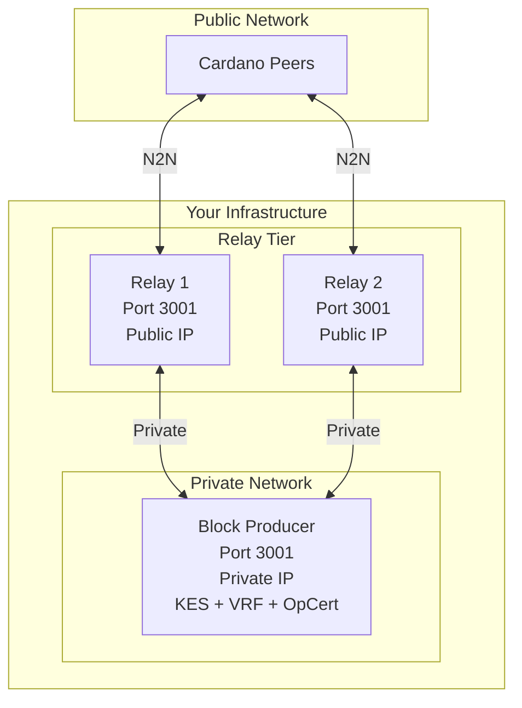

# Block Producer

Torsten can operate as a block-producing node (stake pool). This requires KES keys, VRF keys, and an operational certificate.

## Architecture

A block producer is never directly exposed to the public internet. Instead, it sits behind one or more [relay nodes](./relay.md) that handle all external network connectivity. The relays forward blocks and transactions to the BP over a private network, and the BP announces forged blocks back through the relays.

See the [Complete Deployment](#complete-deployment) section at the bottom of this page for the full architecture diagram and setup checklist.

## Overview

A block producer is a node that has been registered as a stake pool and is capable of minting new blocks when it is elected as a slot leader. The block production pipeline involves:

1. **Slot leader check** -- Each slot, the node uses its VRF key and the epoch nonce to determine if it is elected to produce a block.
2. **Block forging** -- If elected, the node assembles a block from pending mempool transactions, signs it with the KES key, and includes the VRF proof.
3. **Block announcement** -- The forged block is propagated to connected peers via the N2N protocol.

## Required Keys

### Cold Keys (Offline)

Cold keys identify the stake pool and should be kept offline (air-gapped) after initial setup.

Generate cold keys using the CLI:

```bash
torsten-cli node key-gen \
  --cold-verification-key-file cold.vkey \
  --cold-signing-key-file cold.skey \
  --operational-certificate-counter-file opcert.counter
```

### KES Keys (Hot)

KES (Key Evolving Signature) keys are rotated periodically. Each KES key is valid for a limited number of KES periods (typically 62 periods of 129600 slots each on mainnet, approximately 90 days total).

Generate KES keys:

```bash
torsten-cli node key-gen-kes \
  --verification-key-file kes.vkey \
  --signing-key-file kes.skey
```

### VRF Keys

VRF (Verifiable Random Function) keys are used for slot leader election. They are generated once and do not need rotation.

Generate VRF keys:

```bash
torsten-cli node key-gen-vrf \
  --verification-key-file vrf.vkey \
  --signing-key-file vrf.skey
```

## Operational Certificate

The operational certificate binds the cold key to the current KES key. It must be regenerated each time the KES key is rotated.

Issue an operational certificate:

```bash
torsten-cli node issue-op-cert \
  --kes-verification-key-file kes.vkey \
  --cold-signing-key-file cold.skey \
  --operational-certificate-counter-file opcert.counter \
  --kes-period <current-kes-period> \
  --out-file opcert.cert
```

The `--kes-period` should be set to the current KES period at the time of issuance. You can calculate the current KES period as:

```
current_kes_period = current_slot / slots_per_kes_period
```

On mainnet, `slots_per_kes_period` is 129600.

## Running as Block Producer

Pass the key and certificate paths when starting the node:

```bash
torsten-node run \
  --config config.json \
  --topology topology.json \
  --database-path ./db \
  --socket-path ./node.sock \
  --host-addr 0.0.0.0 \
  --port 3001 \
  --shelley-kes-key kes.skey \
  --shelley-vrf-key vrf.skey \
  --shelley-operational-certificate opcert.cert
```

When all three arguments are provided, the node enters block production mode. Without them, it operates as a relay-only node.

## Block Producer Topology

A block producer should not be directly exposed to the public internet. Instead, it should connect only to your relay nodes:

```json
{
  "bootstrapPeers": null,
  "localRoots": [
    {
      "accessPoints": [
        { "address": "relay1.example.com", "port": 3001 },
        { "address": "relay2.example.com", "port": 3001 }
      ],
      "advertise": false,
      "hotValency": 2,
      "warmValency": 3,
      "trustable": true
    }
  ],
  "publicRoots": [{ "accessPoints": [], "advertise": false }],
  "useLedgerAfterSlot": -1
}
```

Key points:
- **No bootstrap peers** -- The block producer syncs exclusively through your relays.
- **No public roots** -- No connections to unknown peers.
- **Ledger peers disabled** -- `useLedgerAfterSlot: -1` disables ledger-based peer discovery.
- **Only local roots** -- All connections are to your own relay nodes.

## Leader Schedule

You can compute your pool's leader schedule for an epoch:

```bash
torsten-cli query leadership-schedule \
  --vrf-signing-key-file vrf.skey \
  --epoch-nonce <64-char-hex> \
  --epoch-start-slot <slot> \
  --epoch-length 432000 \
  --relative-stake 0.001 \
  --active-slot-coeff 0.05
```

This outputs all slots where your pool is elected to produce a block in the given epoch.

## KES Key Rotation

KES keys must be rotated before they expire. The rotation process:

1. Generate new KES keys:
   ```bash
   torsten-cli node key-gen-kes \
     --verification-key-file kes-new.vkey \
     --signing-key-file kes-new.skey
   ```

2. Issue a new operational certificate with the new KES key (on the air-gapped machine):
   ```bash
   torsten-cli node issue-op-cert \
     --kes-verification-key-file kes-new.vkey \
     --cold-signing-key-file cold.skey \
     --operational-certificate-counter-file opcert.counter \
     --kes-period <current-kes-period> \
     --out-file opcert-new.cert
   ```

3. Replace the KES key and certificate on the block producer and restart:
   ```bash
   cp kes-new.skey kes.skey
   cp opcert-new.cert opcert.cert
   # Restart the node
   ```

> **Important:** Always rotate KES keys before they expire. If a KES key expires, your pool will stop producing blocks until a new key is issued.

## Security Recommendations

- Keep cold keys on an air-gapped machine. They are only needed to issue new operational certificates.
- Restrict access to the block producer machine. Only your relay nodes should be able to connect.
- Monitor your pool's block production. Use the [Prometheus metrics endpoint](./monitoring.md) to track `torsten_blocks_applied_total`.
- Set up KES key rotation reminders well before expiry (2 weeks in advance is a good practice).
- Use firewalls to ensure the block producer is not reachable from the public internet.

## Complete Deployment

A full stake pool deployment consists of one block producer and one or more relay nodes working together:



### Deployment Checklist

1. **Set up relay nodes** ([Relay Node guide](./relay.md))
   - Install Torsten on relay machines
   - Import Mithril snapshot for fast initial sync
   - Configure relay topology with bootstrap peers and BP as local root
   - Open port 3001 to the public
   - Start relay nodes and verify they sync to tip

2. **Set up the block producer** (this page)
   - Install Torsten on the BP machine
   - Import Mithril snapshot
   - Generate cold keys, VRF keys, and KES keys
   - Issue an operational certificate
   - Configure BP topology with relays as local roots (no public peers)
   - Restrict firewall to relay IPs only
   - Start the BP node with `--shelley-kes-key`, `--shelley-vrf-key`, `--shelley-operational-certificate`

3. **Register the stake pool** on-chain (requires a transaction with pool registration certificate)

4. **Verify block production**
   - Confirm sync progress is 100% on all nodes
   - Check `peers_connected` metrics on relays and BP
   - Monitor `blocks_forged` metric on the BP after epoch transition
   - Set up [monitoring](./monitoring.md) and KES rotation reminders
