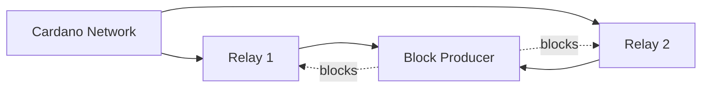

# Kubernetes Deployment

Dugite includes a Helm chart for deploying to Kubernetes as either a **relay node** or a **block producer**.

## Prerequisites

- Kubernetes 1.25+
- Helm 3.x
- A `StorageClass` that supports `ReadWriteOnce` persistent volumes

## Quick Start

Deploy a relay node on the preview testnet:

```bash
helm install dugite-relay ./charts/dugite-node \
  --set network.name=preview
```

This will:
1. Run a Mithril snapshot import (init container) for fast bootstrap
2. Start the node syncing with the preview testnet
3. Create a 100Gi persistent volume for the chain database
4. Expose Prometheus metrics on port 12798

## Chart Reference

### Node Role

The chart supports two deployment modes:

```yaml
# Relay node (default)
role: relay

# Block producer
role: producer
```

### Network Selection

```yaml
network:
  name: preview    # mainnet, preview, or preprod
  port: 3001       # N2N port
  hostAddr: "0.0.0.0"
```

Network magic is derived automatically from the network name. Override with `network.magic` if needed.

### Persistence

```yaml
persistence:
  enabled: true
  storageClass: ""    # Use default StorageClass
  size: 100Gi         # 100Gi for testnet, 500Gi+ for mainnet
  accessMode: ReadWriteOnce
  existingClaim: ""   # Use an existing PVC
```

### Resources

```yaml
resources:
  requests:
    cpu: "1"
    memory: 4Gi
  limits:
    cpu: "4"
    memory: 16Gi
```

For mainnet, increase memory limits to 24-32Gi during initial sync and ledger replay.

### Mithril Import

```yaml
mithril:
  enabled: true     # Run Mithril import on first startup
```

The init container is idempotent — it skips the import on subsequent restarts if blocks already exist.

### Ledger Replay

```yaml
ledger:
  replayLimit: null    # null = unlimited (replay all blocks)
  pipelineDepth: 150   # Chain sync pipeline depth
```

After Mithril import, the node replays all imported blocks through the ledger to build correct UTxO state, delegations, and protocol parameters. Set `replayLimit: 0` to skip replay for faster startup (at the cost of incomplete ledger state).

### Metrics and Monitoring

```yaml
metrics:
  enabled: true
  port: 12798
  serviceMonitor:
    enabled: false     # Set true if using Prometheus Operator
    interval: 30s
    labels: {}
```

When `serviceMonitor.enabled` is true, the chart creates a `ServiceMonitor` resource for automatic Prometheus scraping.

Available metrics include `sync_progress_percent`, `blocks_applied_total`, `utxo_count`, `epoch_number`, `peers_connected`, and more. See [Monitoring](./monitoring.md) for the full list.

## Relay Node Deployment

A relay node connects to the Cardano network, syncs blocks, and serves them to connected peers and local clients.

### Minimal Relay

```bash
helm install dugite-relay ./charts/dugite-node \
  --set network.name=mainnet \
  --set persistence.size=500Gi
```

### Relay with Custom Topology

```bash
helm install dugite-relay ./charts/dugite-node \
  --set network.name=mainnet \
  --set persistence.size=500Gi \
  -f relay-values.yaml
```

`relay-values.yaml`:

```yaml
topology:
  bootstrapPeers:
    - address: relays-new.cardano-mainnet.iohk.io
      port: 3001
  localRoots:
    - accessPoints:
        - address: dugite-producer.default.svc.cluster.local
          port: 3001
      advertise: false
      trustable: true
      valency: 1
  publicRoots:
    - accessPoints:
        - address: relays-new.cardano-mainnet.iohk.io
          port: 3001
      advertise: false
  useLedgerAfterSlot: 110332800
```

### Relay with Prometheus Operator

```bash
helm install dugite-relay ./charts/dugite-node \
  --set network.name=mainnet \
  --set metrics.serviceMonitor.enabled=true \
  --set metrics.serviceMonitor.labels.release=prometheus
```

## Block Producer Deployment

A block producer creates blocks when elected as slot leader. It requires KES, VRF, and operational certificate keys.

### Create Keys Secret

First, create a Kubernetes secret with your block producer keys:

```bash
kubectl create secret generic dugite-producer-keys \
  --from-file=kes.skey=kes.skey \
  --from-file=vrf.skey=vrf.skey \
  --from-file=node.cert=node.cert
```

### Deploy the Producer

```bash
helm install dugite-producer ./charts/dugite-node \
  --set role=producer \
  --set network.name=mainnet \
  --set producer.existingSecret=dugite-producer-keys \
  --set persistence.size=500Gi
```

### Producer Security

When `role=producer`, the chart automatically creates a `NetworkPolicy` that:
- Restricts N2N ingress to pods labeled `app.kubernetes.io/component: relay`
- Allows metrics scraping from any pod in the cluster
- Block producers should **never** be exposed directly to the internet

### Producer + Relay Architecture

A typical production deployment uses one or more relay nodes that shield the block producer:



Deploy both:

```bash
# Deploy the block producer
helm install dugite-producer ./charts/dugite-node \
  --set role=producer \
  --set network.name=mainnet \
  --set producer.existingSecret=dugite-producer-keys \
  -f producer-values.yaml

# Deploy relay(s) pointing to the producer
helm install dugite-relay ./charts/dugite-node \
  --set role=relay \
  --set network.name=mainnet \
  -f relay-values.yaml
```

`producer-values.yaml`:

```yaml
topology:
  bootstrapPeers: []
  localRoots:
    - accessPoints:
        - address: dugite-relay-dugite-node.default.svc.cluster.local
          port: 3001
      advertise: false
      trustable: true
      valency: 1
  publicRoots: []
  useLedgerAfterSlot: -1
```

`relay-values.yaml`:

```yaml
topology:
  bootstrapPeers:
    - address: relays-new.cardano-mainnet.iohk.io
      port: 3001
  localRoots:
    - accessPoints:
        - address: dugite-producer-dugite-node.default.svc.cluster.local
          port: 3001
      advertise: false
      trustable: true
      valency: 1
  publicRoots:
    - accessPoints:
        - address: relays-new.cardano-mainnet.iohk.io
          port: 3001
      advertise: false
  useLedgerAfterSlot: 110332800
```

## Verifying the Deployment

Check pod status:

```bash
kubectl get pods -l app.kubernetes.io/name=dugite-node
```

View logs:

```bash
kubectl logs -f deploy/dugite-relay-dugite-node
```

Query the node tip:

```bash
kubectl exec deploy/dugite-relay-dugite-node -- \
  dugite-cli query tip --testnet-magic 2
```

Check metrics:

```bash
kubectl port-forward svc/dugite-relay-dugite-node 12798:12798
curl -s http://localhost:12798/metrics | grep sync_progress
```

## Configuration Reference

All configurable values with defaults:

| Parameter | Default | Description |
|-----------|---------|-------------|
| `role` | `relay` | Node role: `relay` or `producer` |
| `image.repository` | `ghcr.io/michaeljfazio/dugite` | Container image |
| `image.tag` | Chart appVersion | Image tag |
| `network.name` | `preview` | Network: `mainnet`, `preview`, `preprod` |
| `network.port` | `3001` | N2N port |
| `mithril.enabled` | `true` | Run Mithril import on first start |
| `ledger.replayLimit` | `null` | Max blocks to replay (`null` = unlimited) |
| `ledger.pipelineDepth` | `150` | Chain sync pipeline depth |
| `persistence.enabled` | `true` | Enable persistent storage |
| `persistence.size` | `100Gi` | Volume size |
| `metrics.enabled` | `true` | Enable Prometheus metrics |
| `metrics.port` | `12798` | Metrics port |
| `metrics.serviceMonitor.enabled` | `false` | Create ServiceMonitor |
| `producer.existingSecret` | `""` | Secret with KES/VRF/cert keys |
| `resources.requests.cpu` | `1` | CPU request |
| `resources.requests.memory` | `4Gi` | Memory request |
| `resources.limits.memory` | `16Gi` | Memory limit |
