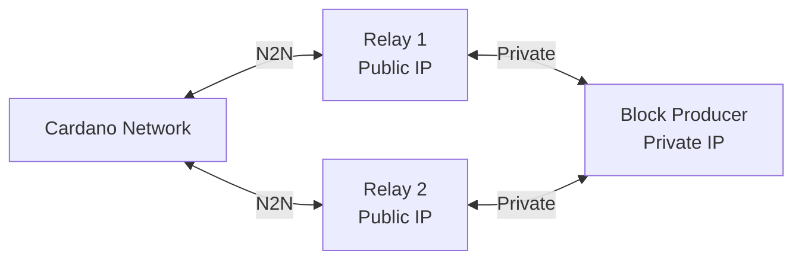

# Relay Node

A relay node is the public-facing component of a stake pool deployment. It bridges your block producer to the wider Cardano network while shielding the BP from direct internet exposure.

## Role in Stake Pool Architecture

In a properly secured stake pool, the block producer never communicates directly with the public network. Instead, one or more relay nodes handle all external connectivity:



- **Relays** accept inbound connections from any Cardano peer, discover peers via bootstrap/ledger, and forward blocks to/from the BP.
- **Block producer** connects only to your relays, never to the public internet.

## Running a Relay

A relay is simply a Torsten node started without block production keys:

```bash
torsten-node run \
  --config config.json \
  --topology topology-relay.json \
  --database-path ./db \
  --socket-path ./node.sock \
  --host-addr 0.0.0.0 \
  --port 3001
```

> **Tip:** For initial sync, use [Mithril snapshot import](./mithril.md) first to skip millions of blocks.

## Relay Topology

A relay topology combines public peer discovery with a local root pointing to your block producer.

### Preview Testnet Relay

```json
{
  "bootstrapPeers": [
    { "address": "preview-node.play.dev.cardano.org", "port": 3001 }
  ],
  "localRoots": [
    {
      "accessPoints": [
        { "address": "10.0.0.10", "port": 3001 }
      ],
      "advertise": false,
      "hotValency": 1,
      "warmValency": 2,
      "trustable": true,
      "behindFirewall": true
    }
  ],
  "publicRoots": [
    { "accessPoints": [], "advertise": false }
  ],
  "useLedgerAfterSlot": 102729600
}
```

### Mainnet Relay

```json
{
  "bootstrapPeers": [
    { "address": "backbone.cardano.iog.io", "port": 3001 },
    { "address": "backbone.mainnet.cardanofoundation.org", "port": 3001 },
    { "address": "backbone.mainnet.emurgornd.com", "port": 3001 }
  ],
  "localRoots": [
    {
      "accessPoints": [
        { "address": "10.0.0.10", "port": 3001 }
      ],
      "advertise": false,
      "hotValency": 1,
      "warmValency": 2,
      "trustable": true,
      "behindFirewall": true
    }
  ],
  "publicRoots": [
    { "accessPoints": [], "advertise": false }
  ],
  "useLedgerAfterSlot": 177724800
}
```

Key topology settings for relays:

- **`bootstrapPeers`** -- Trusted initial peers for syncing from genesis or after restart.
- **`localRoots` with `behindFirewall: true`** -- Your block producer. The relay waits for inbound connections from the BP rather than connecting outbound, which works correctly when the BP is behind a firewall.
- **`useLedgerAfterSlot`** -- Enables ledger-based peer discovery once synced past this slot, providing decentralized peer resolution from on-chain stake pool registrations.
- **`advertise: false`** -- Set to `true` if you want your relay to be discoverable via peer sharing.

## Multiple Relays

Running two or more relays provides redundancy. If one relay goes down, the block producer stays connected through the other.

To run multiple relays on the same machine, use different ports, database paths, and socket paths:

```bash
# Relay 1 on port 3001
torsten-node run \
  --config config.json \
  --topology topology-relay1.json \
  --database-path ./db-relay1 \
  --socket-path ./relay1.sock \
  --host-addr 0.0.0.0 \
  --port 3001

# Relay 2 on port 3002
torsten-node run \
  --config config.json \
  --topology topology-relay2.json \
  --database-path ./db-relay2 \
  --socket-path ./relay2.sock \
  --host-addr 0.0.0.0 \
  --port 3002
```

Each relay's topology should include the block producer as a local root. The block producer's topology should list all relays (see [Block Producer Topology](./block-producer.md#block-producer-topology)).

For production deployments, run relays on separate machines or in different availability zones for better fault tolerance.

## Firewall Configuration

Relay nodes need port 3001 (or your chosen port) open to the public for Cardano N2N traffic. The block producer should only be reachable from your relays.

### Relay firewall rules

```bash
# Allow inbound Cardano N2N from anywhere
sudo ufw allow 3001/tcp

# Allow SSH (adjust as needed)
sudo ufw allow 22/tcp

sudo ufw enable
```

### Block producer firewall rules

```bash
# Allow inbound only from relay IPs
sudo ufw allow from <relay1-ip> to any port 3001
sudo ufw allow from <relay2-ip> to any port 3001

# Allow SSH (adjust as needed)
sudo ufw allow 22/tcp

# Deny everything else
sudo ufw default deny incoming
sudo ufw enable
```

> **Important:** The block producer should have no public-facing ports. All Cardano traffic flows exclusively through your relays.

## Monitoring

Torsten exposes Prometheus metrics on port 12798 by default. Key metrics to watch on a relay:

| Metric | What it tells you |
|--------|-------------------|
| `peers_connected` | Number of active peer connections. Should be > 0 at all times |
| `sync_progress_percent` | Sync progress (10000 = 100%). Must be at 100% for the BP to produce blocks |
| `blocks_received` | Total blocks received from peers. Should increase steadily |
| `slot_number` | Current slot. Compare against network tip to verify sync |

```bash
curl -s http://localhost:12798/metrics | grep -E "peers_connected|sync_progress"
```

See [Monitoring](./monitoring.md) for the full list of available metrics and Grafana dashboard setup.

## Next Steps

- [Block Producer](./block-producer.md) -- Set up key generation, operational certificates, and block production
- [Topology](./topology.md) -- Full topology format reference
- [Monitoring](./monitoring.md) -- Prometheus metrics and alerting
