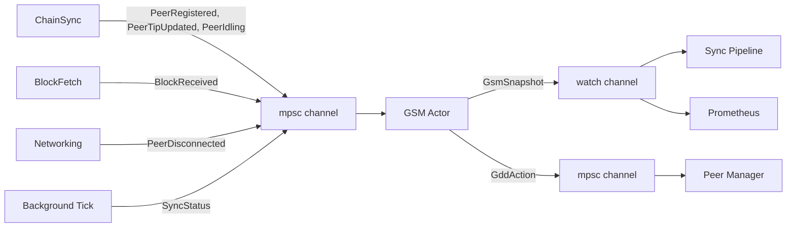

# Ouroboros Genesis: Wire GSM, GDD, BLP into Sync Pipeline

**Date**: 2026-04-01
**Issues**: #316 (GSM/GDD/BLP wiring), #333 (Genesis consensus mode)
**Scope**: Phases 1-3 (GDD wiring, BLP integration, proper CaughtUp condition). Phase 4 (CSJ) deferred to separate issue.
**Cross-validated against**: `ouroboros-consensus` (Haskell), `cardano-ledger`, `ouroboros-network`

## Overview

Wire the existing but dormant Genesis State Machine (GSM), Genesis Density Disconnector (GDD), and Limit on Eagerness (LoE) code into the live sync pipeline using an event-based actor architecture. This gives Dugite eclipse resistance during initial sync, matching the Haskell cardano-node's Ouroboros Genesis implementation.

## Architecture: Event-Based GSM Actor

The GSM runs as a dedicated tokio task that exclusively owns the `GenesisStateMachine`. No shared mutable state (`Arc<RwLock<>>`) — the sync pipeline and networking code communicate with the GSM through channels.



### Rationale

- **Correctness**: Single-threaded event processing eliminates race conditions between concurrent sync tasks updating peer state. Matches Haskell's STM-based sequential evaluation model.
- **Performance**: `try_send` on producers is non-blocking. Sync pipeline reads LoE limit via `watch` (zero-cost borrow, no locking). No RwLock contention.
- **Robustness**: Channel buffers decouple producer cadence from GSM evaluation cadence. If the channel fills, events are dropped with a warning — the sync pipeline is never blocked.
- **Extensibility**: Phase 4 (CSJ) adds new event variants without modifying existing call sites.

## State Machine

### States

```
PreSyncing  — Waiting for HAA (Honest Availability Assumption) satisfaction
Syncing     — Active block download with LoE/GDD protection
CaughtUp    — Normal Praos operation at chain tip
```

### Transition Graph

Matches Haskell `Ouroboros.Consensus.Node.GSM`:

```
StartUp ──[marker present AND tip age ≤ maxCaughtUpAge]──► CaughtUp
StartUp ──[otherwise]──────────────────────────────────────► PreSyncing

PreSyncing ──[HAA satisfied: active_blp ≥ min_active_blp]──► Syncing
Syncing ──[HAA lost: active_blp < min_active_blp]──────────► PreSyncing
Syncing ──[CaughtUp condition met]──────────────────────────► CaughtUp
CaughtUp ──[tip age > maxCaughtUpAge + jitter]──────────────► PreSyncing
```

**Key difference from v1 spec**: `Syncing→PreSyncing` regression on HAA loss is now included, matching Haskell.

### Constants (matching Haskell defaults)

| Parameter | Value | Haskell Source |
|-----------|-------|----------------|
| `min_active_blp` | 5 | `Configuration.hs:74` |
| `max_caught_up_age_secs` | 1200 (20 min) | `Node.hs:1087` |
| `min_caught_up_dwell_secs` | 1200 (20 min) | `Node.hs:936` |
| `anti_thundering_herd_secs` | 0–300 (uniform random) | `GSM.hs:316` |
| `genesis_window_slots` | `3k/f` (129,600 on mainnet) | `StabilityWindow.hs` |
| `gdd_rate_limit_ms` | 1000 (1 second) | `Node/Genesis.hs` |

## Types

### GsmEvent (inbound to actor)

```rust
pub enum GsmEvent {
    /// Peer completed ChainSync find_intersect — register for density tracking.
    PeerRegistered {
        addr: SocketAddr,
        intersection_slot: u64,
        tip_slot: u64,
    },
    /// Peer disconnected — remove from density tracking.
    PeerDisconnected {
        addr: SocketAddr,
    },
    /// Block header received from peer — record in density window.
    /// Emitted when ChainSync delivers a header, BEFORE validation.
    /// This matches Haskell's `csLatestSlot` which is set on header
    /// arrival, not after candidate fragment insertion.
    BlockReceived {
        addr: SocketAddr,
        slot: u64,
    },
    /// Peer reported new tip via ChainSync header.
    PeerTipUpdated {
        addr: SocketAddr,
        tip_slot: u64,
    },
    /// Peer sent MsgAwaitReply — it has no more headers to send right now.
    /// Maps to Haskell's `csIdling = True` in `ChainSyncState`.
    PeerIdling {
        addr: SocketAddr,
    },
    /// Peer resumed sending headers after idling (roll-forward/roll-backward).
    /// Maps to Haskell's `csIdling = False`.
    PeerActive {
        addr: SocketAddr,
    },
    /// Periodic sync status update from background tick.
    SyncStatus {
        active_blp_count: usize,
        all_chainsync_idle: bool,
        tip_age_secs: u64,
        immutable_tip_slot: u64,
    },
}
```

### PeerChainInfo (internal to actor)

```rust
/// Per-peer chain state tracked by the GSM actor for GDD evaluation.
pub struct PeerChainInfo {
    /// Density window tracking blocks in the genesis window for this peer.
    pub density_window: DensityWindow,
    /// Most recent tip slot reported by this peer.
    pub tip_slot: u64,
    /// Intersection slot where this peer's chain diverges from ours.
    pub intersection_slot: u64,
    /// Whether the peer is currently idling (sent MsgAwaitReply).
    /// Critical for GDD Guard 4: idling peers use lower_bound comparison,
    /// non-idling peers use upper_bound (benefit of the doubt).
    pub idling: bool,
    /// Most recent header slot received from this peer (may be beyond
    /// the candidate fragment if not yet validated). Maps to Haskell's
    /// `csLatestSlot`.
    pub latest_slot: Option<u64>,
}
```

### GsmSnapshot (outbound via watch)

```rust
pub struct GsmSnapshot {
    /// Current Genesis sync state.
    pub state: GenesisSyncState,
    /// LoE ceiling slot. None means no constraint (CaughtUp).
    /// In PreSyncing: Some(0) — freeze chain selection completely.
    /// In Syncing: Some(min_intersection_slot) — common prefix approximation.
    /// In CaughtUp: None — no constraint.
    pub loe_slot: Option<u64>,
}
```

### GddAction (outbound via mpsc)

```rust
pub enum GddAction {
    /// Disconnect a peer identified by GDD as having insufficient chain density.
    DisconnectPeer(SocketAddr),
}
```

## GSM Actor

### Lifecycle

```rust
pub async fn run_gsm_actor(
    config: GsmConfig,
    enabled: bool,
    mut event_rx: mpsc::Receiver<GsmEvent>,
    snapshot_tx: watch::Sender<GsmSnapshot>,
    action_tx: mpsc::Sender<GddAction>,
)
```

The actor:
1. Creates `GenesisStateMachine::new(config, enabled)`
2. Publishes initial `GsmSnapshot`
3. Enters main loop:
   - `tokio::select!` on:
     - `event_rx.recv()` — dispatch to GSM methods, then run GDD if state is Syncing
     - `gdd_interval.tick()` (every 1 second) — run `gdd_evaluate()`, send disconnect actions
4. After each event or tick, re-publish `GsmSnapshot` if state or LoE changed

### Event Dispatch

| Event | GSM Method Called |
|-------|-------------------|
| `PeerRegistered` | `register_peer(addr, intersection_slot, tip_slot)` |
| `PeerDisconnected` | `deregister_peer(&addr)` |
| `BlockReceived` | `record_block(&addr, slot)` + update `latest_slot` |
| `PeerTipUpdated` | `update_peer_tip(&addr, tip_slot)` |
| `PeerIdling` | Set `peer_info[addr].idling = true` |
| `PeerActive` | Set `peer_info[addr].idling = false` |
| `SyncStatus` | `evaluate(...)` + update LoE |

### State Transition Logic

```rust
fn evaluate(
    &mut self,
    active_blp_count: usize,
    all_chainsync_idle: bool,
    tip_age_secs: u64,
    immutable_tip_slot: u64,
) -> Option<GenesisSyncState> {
    match self.state {
        PreSyncing => {
            if active_blp_count >= self.config.min_active_blp {
                // HAA satisfied → Syncing
                self.state = Syncing;
            }
        }
        Syncing => {
            if active_blp_count < self.config.min_active_blp {
                // HAA lost → PreSyncing (NEW: matches Haskell)
                self.state = PreSyncing;
            } else if all_chainsync_idle
                && tip_age_secs < self.config.max_caught_up_age_secs
                && self.all_peers_within_window(immutable_tip_slot)
            {
                // CaughtUp condition met
                self.state = CaughtUp;
                self.caught_up_since = Some(Instant::now());
                self.write_marker();
            }
        }
        CaughtUp => {
            // Enforce minimum dwell time (20 min) before allowing regression
            let dwell_ok = self.caught_up_since
                .map(|t| t.elapsed().as_secs() >= self.config.min_caught_up_dwell_secs)
                .unwrap_or(true);

            if dwell_ok {
                let jitter = self.anti_thundering_herd_jitter_secs;
                if tip_age_secs > self.config.max_caught_up_age_secs + jitter {
                    self.state = PreSyncing;
                    self.remove_marker();
                }
            }
        }
    }
}
```

### GDD Tick (Every 1 Second)

The GDD evaluation interval is 1 second, matching Haskell's `defaultGDDRateLimit = 1.0`.

1. If state is not `Syncing`, skip (GDD only runs during Syncing)
2. Call `gdd_evaluate()` to get list of peers to disconnect
3. For each peer, send `GddAction::DisconnectPeer(addr)` via `action_tx`
4. Call `deregister_peer(&addr)` for each disconnected peer
5. Recompute LoE (disconnected peers no longer constrain it)

### LoE Computation

The LoE prevents the immutable tip from advancing past the common prefix of all candidate chains.

- **PreSyncing**: `Some(0)` — completely freeze chain selection (matches Haskell's `AF.Empty AnchorGenesis`)
- **Syncing**: `Some(min_intersection_slot)` — the minimum intersection slot across all registered peers. This is an approximation of the Haskell's `sharedCandidatePrefix` (which computes the actual common chain fragment prefix). Since we don't maintain per-peer candidate fragments, the intersection slot is the best available proxy.
- **CaughtUp**: `None` — no constraint (matches Haskell's `LoEDisabled`)

**Known simplification**: Haskell computes the LoE as the youngest header present on ALL candidate fragments (the actual fork point). Our slot-based approximation is conservative — it may hold the LoE back further than necessary when peers have the same chain but different tip heights. This is safe (more restrictive, not less) and will be refined if per-peer candidate fragment tracking is added in Phase 4.

After GDD disconnects sparse peers, the LoE is recomputed from surviving peers only, which may advance the LoE tip. This matches Haskell's behavior where `sharedCandidatePrefix` is recomputed after disconnections on the next GDD cycle.

## GDD Algorithm (Haskell-Correct)

The GDD algorithm is ported directly from `densityDisconnect` in `Ouroboros.Consensus.Genesis.Governor`. It uses **integer arithmetic only** — no floating point.

### Per-Peer Density Bounds

For each peer, given:
- `sgen` = genesis window size in slots (`3k/f`)
- `loe_intersection_slot` = the LoE tip slot (anchor for density comparison)
- `first_slot_after_window = loe_intersection_slot + 1 + sgen`

Compute:
```rust
// Clip the peer's blocks to those within the genesis window
let blocks_in_window: u64 = peer.density_window
    .blocks_before(first_slot_after_window);

// Does the peer have any block/header at or after the genesis window end?
let has_block_after: bool =
    peer.latest_slot.unwrap_or(0) >= first_slot_after_window
    || peer.density_window.has_block_at_or_after(first_slot_after_window);

// Potential unknown slots: if peer hasn't reached end of window yet,
// those trailing slots could still contain blocks
let potential_slots: u64 = if has_block_after {
    0  // peer has passed the window — no unknown slots
} else {
    first_slot_after_window
        .saturating_sub(peer.density_window.head_slot().unwrap_or(loe_intersection_slot) + 1)
};

let lower_bound: u64 = blocks_in_window;           // definite blocks observed
let upper_bound: u64 = lower_bound + potential_slots; // optimistic maximum

// Does this peer offer more than k total blocks after intersection?
let offers_more_than_k: bool = peer.density_window.total_block_count() > k;
```

### Four-Guard Disconnection Criterion

For each peer pair (peer0, peer1), peer0 is flagged for disconnection if ALL four guards pass:

```rust
// Guard 1: peer0 has sent at least some signal
// (prevents disconnecting a peer that literally hasn't communicated yet)
let guard1 = peer0.idling
    || blocks_in_window_0 > 0
    || has_block_after_0;

// Guard 2: chains genuinely disagree
// (if peers have identical chain tips in the window, no disagreement)
let guard2 = peer0.last_block_in_window != peer1.last_block_in_window;

// Guard 3: comparison is meaningful
// Either peer1 has a credible long fork (>k blocks total),
// OR peer0's density is fully determined (no unknown trailing slots)
let guard3 = offers_more_than_k_1 || (lower_bound_0 == upper_bound_0);

// Guard 4: peer1 dominates peer0's density
// Idling peers: lower_bound comparison (all data is in)
// Non-idling peers: upper_bound comparison (benefit of the doubt)
let guard4 = lower_bound_1 >= if peer0.idling {
    lower_bound_0
} else {
    upper_bound_0
};

if guard1 && guard2 && guard3 && guard4 {
    losing_peers.insert(peer0.addr);
}
```

**Complexity**: O(n^2) peer pairs. Acceptable because peer count is small (typically <50).

**No floating point**: All comparisons are `u64`. This matches Haskell's `Word64` arithmetic exactly.

### DensityWindow Additions

The existing `DensityWindow` in `dugite-consensus` needs these additional methods:

- `blocks_before(slot) -> u64`: count of blocks with slot < `slot`
- `has_block_at_or_after(slot) -> bool`: any block with slot >= `slot`
- `head_slot() -> Option<u64>`: highest slot recorded
- `total_block_count() -> u64`: total blocks after intersection (not just within window)

## CaughtUp Condition (Phase 3)

### Haskell Reference

Haskell's `blockUntilCaughtUp` (in `GSM.hs`) requires:
1. At least one peer exists
2. ALL peers are idle (`csIdling = True`, sent `MsgAwaitReply`)
3. No candidate chain is better than the current selection

### Our Implementation

```
CaughtUp when:
  all_chainsync_idle AND
  tip_age < max_caught_up_age AND
  all registered peers' tips are within genesis_window of immutable_tip
```

**Known simplification**: Haskell checks actual chain quality (`candidateOverSelection`), we check slot proximity. This is conservative — if peers have tips within the genesis window and are idle, the chains are unlikely to differ. The simplification is safe because:
1. If a peer had a better chain, it would not be idle (it would be sending headers)
2. GDD would have disconnected peers with significantly different chain density
3. The genesis window check ensures we're not declaring CaughtUp while far behind

### Minimum CaughtUp Dwell Time

After `Syncing→CaughtUp` transition, the GSM enforces a **20-minute minimum dwell** before allowing `CaughtUp→PreSyncing` regression. This prevents network thrashing when the tip oscillates near the `max_caught_up_age` boundary.

Matches Haskell's `threadDelay minCaughtUpDuration` in `enterSyncing'`.

### Anti-Thundering-Herd Jitter

On node startup, generate a random jitter value in `[0, 300]` seconds. Add this to the `max_caught_up_age` threshold for CaughtUp regression. This prevents a fleet of nodes from all regressing simultaneously if the network stalls.

Matches Haskell's `antiThunderingHerd` in `GSM.hs`.

## Producer Integration

### ChainSync — PeerRegistered + PeerTipUpdated + PeerIdling

In `sync.rs`, after `find_intersect()` completes for a peer:
```rust
let _ = gsm_tx.try_send(GsmEvent::PeerRegistered {
    addr: peer_addr,
    intersection_slot: intersect_point.slot().map(|s| s.0).unwrap_or(0),
    tip_slot: peer_tip.slot().map(|s| s.0).unwrap_or(0),
});
```

When a ChainSync header is received (roll-forward):
```rust
let _ = gsm_tx.try_send(GsmEvent::PeerTipUpdated {
    addr: peer_addr,
    tip_slot: header_slot,
});
// Also track as a block for density
let _ = gsm_tx.try_send(GsmEvent::BlockReceived {
    addr: peer_addr,
    slot: header_slot,
});
// Peer is actively sending — not idling
let _ = gsm_tx.try_send(GsmEvent::PeerActive { addr: peer_addr });
```

When peer sends MsgAwaitReply (no more headers):
```rust
let _ = gsm_tx.try_send(GsmEvent::PeerIdling { addr: peer_addr });
```

### BlockFetch — BlockReceived

When a block is received from a peer in the block fetch path:
```rust
let _ = gsm_tx.try_send(GsmEvent::BlockReceived {
    addr: fetcher_addr,
    slot: block.slot().0,
});
```

### Networking — PeerDisconnected

In `peer_disconnected()`:
```rust
let _ = gsm_tx.try_send(GsmEvent::PeerDisconnected { addr });
```

### Background Tick — SyncStatus

The existing background GSM evaluation task (in `node/mod.rs`) emits `SyncStatus` instead of calling `gsm.evaluate()` directly:
```rust
let _ = gsm_tx.try_send(GsmEvent::SyncStatus {
    active_blp_count: active_blp,
    all_chainsync_idle: all_idle,
    tip_age_secs,
    immutable_tip_slot: immutable_tip.slot().map(|s| s.0).unwrap_or(0),
});
```

## Consumer Integration

### Sync Pipeline — LoE Enforcement

Replace:
```rust
let loe_limit: Option<u64> = { let gsm = self.gsm.read().await; gsm.loe_limit(...) };
```

With:
```rust
let loe_limit: Option<u64> = self.gsm_snapshot_rx.borrow().loe_slot;
```

No async, no locking — `watch::Receiver::borrow()` is synchronous and lock-free.

**Note on LoE enforcement mechanism**: Haskell's LoE constrains chain selection (via `trimToLoE` in `ChainSel.hs`), which indirectly prevents immutable advancement. Our implementation directly gates `flush_to_immutable` with `loe_slot`. This is functionally equivalent — both prevent the immutable tip from advancing past the LoE ceiling — but architecturally simpler since we don't have a separate ChainSel module.

### Peer Manager — GDD Disconnect

A new task (or integrated into the existing peer management loop) consumes `GddAction`:
```rust
while let Some(action) = gdd_action_rx.recv().await {
    match action {
        GddAction::DisconnectPeer(addr) => {
            warn!(%addr, "GDD: disconnecting sparse peer");
            peer_manager.disconnect_peer(&addr).await;
        }
    }
}
```

### Metrics

The existing Prometheus metrics code reads from `watch::Receiver<GsmSnapshot>`:
- `gsm_state` gauge: 0=PreSyncing, 1=Syncing, 2=CaughtUp
- `gsm_loe_slot` gauge: current LoE ceiling (0 if None)
- `gdd_disconnections_total` counter: incremented on each GDD disconnect

## Node Struct Changes

### Before
```rust
pub(crate) gsm: Arc<RwLock<crate::gsm::GenesisStateMachine>>,
```

### After
```rust
pub(crate) gsm_event_tx: mpsc::Sender<GsmEvent>,
pub(crate) gsm_snapshot_rx: watch::Receiver<GsmSnapshot>,
```

The `Arc<RwLock<GenesisStateMachine>>` is removed entirely. The actor owns it exclusively.

## Channel Configuration

| Channel | Type | Capacity | Backpressure |
|---------|------|----------|--------------|
| `GsmEvent` | `mpsc::channel` | 1024 | `try_send` — drop on full, log warning |
| `GsmSnapshot` | `watch::channel` | 1 (latest) | Automatic — always latest value |
| `GddAction` | `mpsc::channel` | 64 | `send().await` — ok to block, rare events |

## GsmConfig Updates

```rust
pub struct GsmConfig {
    /// Minimum active big ledger peers to transition PreSyncing → Syncing (HAA)
    pub min_active_blp: usize,                    // default: 5
    /// Maximum tip age (seconds) before CaughtUp → PreSyncing regression
    pub max_caught_up_age_secs: u64,              // default: 1200 (20 min)
    /// Minimum dwell time in CaughtUp before regression is allowed
    pub min_caught_up_dwell_secs: u64,            // default: 1200 (20 min)
    /// Anti-thundering-herd jitter range [0, N] seconds
    pub anti_thundering_herd_max_secs: u64,       // default: 300
    /// Genesis window size in slots (3k/f)
    pub genesis_window_slots: u64,                // default: 129,600
    /// GDD evaluation rate limit in milliseconds
    pub gdd_rate_limit_ms: u64,                   // default: 1000 (1 second)
    /// Security parameter k
    pub security_param_k: u64,                    // default: 2160
    /// Path for the caught_up marker file
    pub marker_path: PathBuf,
}
```

## Files Changed

| File | Changes |
|------|---------|
| `crates/dugite-node/src/gsm.rs` | Rewrite `gdd_evaluate()` with 4-guard integer algorithm. Add `GsmEvent`, `GsmSnapshot`, `GddAction`, `PeerIdling`/`PeerActive` events. Add `run_gsm_actor()`. Add `idling` and `latest_slot` to `PeerChainInfo`. Add `caught_up_since`, `anti_thundering_herd_jitter_secs`. Update `GsmConfig` with new fields. Remove `#[allow(dead_code)]`. |
| `crates/dugite-consensus/src/chain_selection.rs` | Add `blocks_before()`, `has_block_at_or_after()`, `head_slot()`, `total_block_count()` to `DensityWindow`. |
| `crates/dugite-node/src/node/mod.rs` | Replace `gsm: Arc<RwLock<>>` with channel handles. Spawn GSM actor task + GDD action consumer task. Update background tick to emit `SyncStatus` event. |
| `crates/dugite-node/src/node/sync.rs` | Replace `gsm.read().await.loe_limit()` with `gsm_snapshot_rx.borrow().loe_slot`. Emit `PeerRegistered`, `BlockReceived`, `PeerTipUpdated`, `PeerIdling`, `PeerActive` events at appropriate call sites. |
| `crates/dugite-node/src/node/networking.rs` | Emit `PeerDisconnected` events. Add GDD action consumer task for peer disconnection. |

## Tests

### Unit Tests (in `gsm.rs`)

1. **Actor state transitions**: Send `SyncStatus` events with varying peer counts and tip ages. Assert `GsmSnapshot` transitions through PreSyncing → Syncing → CaughtUp.
2. **Syncing→PreSyncing regression**: Reach Syncing state, then drop BLP count below threshold. Assert regression to PreSyncing.
3. **GDD 4-guard disconnect**: Register 3 peers with different densities via events. Assert correct peers flagged by all 4 guards. Test each guard independently:
   - Guard 1: peer with no signal → not disconnected
   - Guard 2: peers with same chain tip → not disconnected
   - Guard 3: peer1 has ≤k blocks and peer0's bounds differ → not disconnected
   - Guard 4: idling vs non-idling density comparison
4. **GDD integer arithmetic**: Verify density bounds use u64 only. Test edge cases: zero blocks, full window, exactly k+1 blocks.
5. **LoE snapshot values**: Assert `loe_slot` is `Some(0)` in PreSyncing, `Some(min_intersection)` in Syncing, `None` in CaughtUp.
6. **LoE advances after GDD disconnect**: Register 2 peers (intersection 100 and 500). Disconnect peer at 100 via GDD. Assert LoE advances to 500.
7. **CaughtUp condition**: Register peers with tips inside/outside genesis window. Assert CaughtUp only when all peers are within window AND idle AND tip fresh.
8. **Minimum CaughtUp dwell**: Reach CaughtUp, immediately send stale tip_age. Assert no regression until 20 min elapsed.
9. **Anti-thundering-herd**: Set jitter to 100s. Send tip_age = max_age + 50. Assert no regression (within jitter). Send tip_age = max_age + 150. Assert regression.
10. **Channel backpressure**: Fill the event channel, verify `try_send` returns `Err(TrySendError::Full)` and doesn't panic.
11. **Peer lifecycle**: Register peer, send blocks, set idling, disconnect peer. Verify density tracking is cleaned up.
12. **CaughtUp regression**: Reach CaughtUp, wait past dwell time, then send stale `tip_age_secs`. Verify regression to PreSyncing and marker file removed.

### Integration Test

13. **Full actor lifecycle**: Spawn actor, send event sequence simulating real sync (register peers, receive blocks, GDD evaluations, reach CaughtUp). Verify all snapshots and actions are correct end-to-end.

### DensityWindow Tests (in `chain_selection.rs`)

14. **blocks_before**: Record blocks at slots [10, 20, 30, 40]. Assert `blocks_before(25)` == 2.
15. **has_block_at_or_after**: Record blocks at slots [10, 20]. Assert `has_block_at_or_after(15)` == true, `has_block_at_or_after(25)` == false.
16. **head_slot**: Record blocks at [10, 5, 20]. Assert `head_slot()` == Some(20).
17. **total_block_count**: Record 5 blocks. Assert `total_block_count()` == 5.

## Known Simplifications vs Haskell

These are documented deviations that are safe (conservative) and can be refined later:

| Aspect | Haskell | Dugite | Safety |
|--------|---------|---------|--------|
| LoE computation | Common prefix of all candidate fragments (chain fragment) | Minimum intersection slot (u64) | Conservative — may hold LoE back further than necessary |
| CaughtUp condition | No candidate chain better than selection | All peers idle + tip fresh + peers within genesis window | Conservative — equivalent when GDD has run |
| GDD wake-up | STM-triggered on any peer state change | 1-second timer poll | Slightly delayed response (max 1s) but same steady-state behavior |
| LoE enforcement | Constrains chain selection (indirect) | Directly gates flush_to_immutable | Functionally equivalent |
| Guard 2 (chain disagreement) | Compares `lastPoint` of clipped fragments | Compares last block slot in window | Approximate — could miss same-slot different-block edge case |

## Out of Scope

- **ChainSync Jumping (CSJ)**: Deferred to Phase 4, separate GitHub issue.
- **Big Ledger Peer classification from ledger state**: The `identify_big_ledger_peers()` function exists but full integration with stake distribution queries (90% cumulative stake threshold) is out of scope. BLP count for GSM transitions uses the existing `big_ledger_peers` set in `NodePeerManager`.
- **Genesis-specific peer selection policy**: Full Genesis requires prioritizing BLPs in peer selection. Current P2P governor policy is sufficient for Phases 1-3.
- **Genesis BlockFetch mode**: Haskell uses single-peer sequential fetching with 10s grace period rotation during Genesis sync. Current multi-peer BlockFetch is retained.
- **Historicity Check**: Haskell disconnects peers sending MsgAwaitReply with candidate tips older than ~37 hours. Can be added independently.
- **Limit on Patience (LoP)**: Haskell's leaky-bucket rate enforcement on ChainSync peers during Syncing state. Can be added independently.
