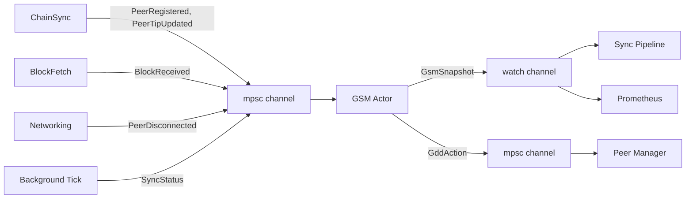

# Ouroboros Genesis: Wire GSM, GDD, BLP into Sync Pipeline

**Date**: 2026-04-01
**Issues**: #316 (GSM/GDD/BLP wiring), #333 (Genesis consensus mode)
**Scope**: Phases 1-3 (GDD wiring, BLP integration, proper CaughtUp condition). Phase 4 (CSJ) deferred to separate issue.

## Overview

Wire the existing but dormant Genesis State Machine (GSM), Genesis Density Disconnector (GDD), and Limit on Eagerness (LoE) code into the live sync pipeline using an event-based actor architecture. This gives Torsten eclipse resistance during initial sync, matching the Haskell cardano-node's Ouroboros Genesis implementation.

## Architecture: Event-Based GSM Actor

The GSM runs as a dedicated tokio task that exclusively owns the `GenesisStateMachine`. No shared mutable state (`Arc<RwLock<>>`) — the sync pipeline and networking code communicate with the GSM through channels.



### Rationale

- **Correctness**: Single-threaded event processing eliminates race conditions between concurrent sync tasks updating peer state.
- **Performance**: `try_send` on producers is non-blocking. Sync pipeline reads LoE limit via `watch` (zero-cost borrow, no locking). No RwLock contention.
- **Robustness**: Channel buffers decouple producer cadence from GSM evaluation cadence. If the channel fills, events are dropped with a warning — the sync pipeline is never blocked.
- **Extensibility**: Phase 4 (CSJ) adds new event variants without modifying existing call sites.

## Types

### GsmEvent (inbound to actor)

```rust
pub enum GsmEvent {
    /// Peer completed ChainSync find_intersect — register for density tracking.
    PeerRegistered {
        addr: SocketAddr,
        intersection_slot: u64,
        tip_slot: u64,
    },
    /// Peer disconnected — remove from density tracking.
    PeerDisconnected {
        addr: SocketAddr,
    },
    /// Block received from peer — record in density window.
    BlockReceived {
        addr: SocketAddr,
        slot: u64,
    },
    /// Peer reported new tip via ChainSync header.
    PeerTipUpdated {
        addr: SocketAddr,
        tip_slot: u64,
    },
    /// Periodic sync status update from background tick.
    SyncStatus {
        active_blp_count: usize,
        all_chainsync_idle: bool,
        tip_age_secs: u64,
        immutable_tip_slot: u64,
    },
}
```

### GsmSnapshot (outbound via watch)

```rust
pub struct GsmSnapshot {
    /// Current Genesis sync state.
    pub state: GenesisSyncState,
    /// LoE ceiling slot. None means no constraint (CaughtUp).
    pub loe_slot: Option<u64>,
}
```

### GddAction (outbound via mpsc)

```rust
pub enum GddAction {
    /// Disconnect a peer identified by GDD as having insufficient chain density.
    DisconnectPeer(SocketAddr),
}
```

## GSM Actor

### Lifecycle

```rust
pub async fn run_gsm_actor(
    config: GsmConfig,
    enabled: bool,
    mut event_rx: mpsc::Receiver<GsmEvent>,
    snapshot_tx: watch::Sender<GsmSnapshot>,
    action_tx: mpsc::Sender<GddAction>,
)
```

The actor:
1. Creates `GenesisStateMachine::new(config, enabled)`
2. Publishes initial `GsmSnapshot`
3. Enters main loop:
   - `tokio::select!` on:
     - `event_rx.recv()` — dispatch to GSM methods
     - `gdd_interval.tick()` (every 10 seconds) — run `gdd_evaluate()`, send disconnect actions
4. After each event or tick, re-publish `GsmSnapshot` if state or LoE changed

### Event Dispatch

| Event | GSM Method Called |
|-------|-------------------|
| `PeerRegistered` | `register_peer(addr, intersection_slot, tip_slot)` |
| `PeerDisconnected` | `deregister_peer(&addr)` |
| `BlockReceived` | `record_block(&addr, slot)` |
| `PeerTipUpdated` | `update_peer_tip(&addr, tip_slot)` |
| `SyncStatus` | `evaluate(active_blp_count, all_chainsync_idle, tip_age_secs)` + update LoE |

### GDD Tick

Every 10 seconds (configurable via `GsmConfig::gdd_interval_secs`):
1. Call `gdd_evaluate()` to get list of peers to disconnect
2. For each peer, send `GddAction::DisconnectPeer(addr)` via `action_tx`
3. Call `deregister_peer(&addr)` for each disconnected peer (they're gone)

### LoE Snapshot Update

After `SyncStatus` events, recompute `loe_slot`:
- `PreSyncing`: `Some(0)` — don't advance immutable tip
- `Syncing`: `Some(min_peer_tip_slot)` — don't advance past common prefix of all candidate chains. Computed from `peer_info` map (minimum tip slot across all registered peers).
- `CaughtUp`: `None` — no constraint

This replaces the current `loe_limit(candidate_tips)` method which requires passing tip points. The actor already has the peer info internally.

## Producer Integration

### ChainSync — PeerRegistered + PeerTipUpdated

In `sync.rs`, after `find_intersect()` completes for a peer:
```rust
let _ = gsm_tx.try_send(GsmEvent::PeerRegistered {
    addr: peer_addr,
    intersection_slot: intersect_point.slot().map(|s| s.0).unwrap_or(0),
    tip_slot: peer_tip.slot().map(|s| s.0).unwrap_or(0),
});
```

When a ChainSync header is received (roll-forward):
```rust
let _ = gsm_tx.try_send(GsmEvent::PeerTipUpdated {
    addr: peer_addr,
    tip_slot: header_slot,
});
```

### BlockFetch — BlockReceived

When a block is received from a peer in the block fetch path:
```rust
let _ = gsm_tx.try_send(GsmEvent::BlockReceived {
    addr: fetcher_addr,
    slot: block.slot().0,
});
```

### Networking — PeerDisconnected

In `peer_disconnected()`:
```rust
let _ = gsm_tx.try_send(GsmEvent::PeerDisconnected { addr });
```

### Background Tick — SyncStatus

The existing background GSM evaluation task (in `node/mod.rs`) emits `SyncStatus` instead of calling `gsm.evaluate()` directly:
```rust
let _ = gsm_tx.try_send(GsmEvent::SyncStatus {
    active_blp_count: active_blp,
    all_chainsync_idle: all_idle,
    tip_age_secs,
    immutable_tip_slot: immutable_tip.slot().map(|s| s.0).unwrap_or(0),
});
```

## Consumer Integration

### Sync Pipeline — LoE Enforcement

Replace:
```rust
let loe_limit: Option<u64> = { let gsm = self.gsm.read().await; gsm.loe_limit(...) };
```

With:
```rust
let loe_limit: Option<u64> = self.gsm_snapshot_rx.borrow().loe_slot;
```

No async, no locking — `watch::Receiver::borrow()` is synchronous and lock-free.

### Peer Manager — GDD Disconnect

A new task (or integrated into the existing peer management loop) consumes `GddAction`:
```rust
while let Some(action) = gdd_action_rx.recv().await {
    match action {
        GddAction::DisconnectPeer(addr) => {
            warn!(%addr, "GDD: disconnecting sparse peer");
            peer_manager.disconnect_peer(&addr).await;
        }
    }
}
```

### Metrics

The existing Prometheus metrics code reads from `watch::Receiver<GsmSnapshot>`:
- `gsm_state` gauge: 0=PreSyncing, 1=Syncing, 2=CaughtUp
- `gsm_loe_slot` gauge: current LoE ceiling (0 if None)

## Phase 3: Proper CaughtUp Condition

Replace the current heuristic (tip age only) with the Genesis protocol condition.

### Current (heuristic)
```
CaughtUp when: all_chainsync_idle AND tip_age < max_tip_age
```

### New (Genesis-correct)
```
CaughtUp when:
  all_chainsync_idle AND
  tip_age < max_tip_age AND
  all registered peers' tips are within genesis_window_slots of immutable_tip_slot
```

The `SyncStatus` event now includes `immutable_tip_slot`. The actor checks:
```rust
let all_peers_in_window = self.peer_info.values().all(|info| {
    info.tip_slot <= immutable_tip_slot + self.config.genesis_window_slots
});
```

This ensures CaughtUp is only declared when the node has genuinely caught up to all known peers, not just when headers stop arriving.

### Regression

CaughtUp → PreSyncing regression remains tip-age-based (existing logic). This handles the case where the node falls behind after being caught up.

## Node Struct Changes

### Before
```rust
pub(crate) gsm: Arc<RwLock<crate::gsm::GenesisStateMachine>>,
```

### After
```rust
pub(crate) gsm_event_tx: mpsc::Sender<GsmEvent>,
pub(crate) gsm_snapshot_rx: watch::Receiver<GsmSnapshot>,
```

The `Arc<RwLock<GenesisStateMachine>>` is removed entirely. The actor owns it exclusively.

## Channel Configuration

| Channel | Type | Capacity | Backpressure |
|---------|------|----------|--------------|
| `GsmEvent` | `mpsc::channel` | 1024 | `try_send` — drop on full, log warning |
| `GsmSnapshot` | `watch::channel` | 1 (latest) | Automatic — always latest value |
| `GddAction` | `mpsc::channel` | 64 | `send().await` — ok to block, rare events |

## Files Changed

| File | Changes |
|------|---------|
| `crates/torsten-node/src/gsm.rs` | Add `GsmEvent`, `GsmSnapshot`, `GddAction` types. Add `run_gsm_actor()`. Remove `#[allow(dead_code)]`. Update LoE to use internal peer state. Add `gdd_interval_secs` to `GsmConfig`. |
| `crates/torsten-node/src/node/mod.rs` | Replace `gsm: Arc<RwLock<>>` with channel handles. Spawn GSM actor task. Update background tick to emit `SyncStatus` event. |
| `crates/torsten-node/src/node/sync.rs` | Replace `gsm.read().await.loe_limit()` with `gsm_snapshot_rx.borrow().loe_slot`. Emit `PeerRegistered`, `BlockReceived`, `PeerTipUpdated` events at appropriate call sites. |
| `crates/torsten-node/src/node/networking.rs` | Emit `PeerDisconnected` events. Add GDD action consumer task for peer disconnection. |
| `crates/torsten-node/src/node/chainsync.rs` | Emit `PeerTipUpdated` on header roll-forward (if separate from sync.rs). |

## Tests

### Unit Tests (in `gsm.rs`)

1. **Actor state transitions**: Send `SyncStatus` events with varying peer counts and tip ages. Assert `GsmSnapshot` transitions through PreSyncing → Syncing → CaughtUp.
2. **GDD disconnect**: Register 3 peers with different densities via events. Assert correct peers appear in `GddAction::DisconnectPeer`.
3. **LoE snapshot values**: Assert `loe_slot` is `Some(0)` in PreSyncing, `Some(min_tip)` in Syncing, `None` in CaughtUp.
4. **CaughtUp condition (Phase 3)**: Register peers with tips inside/outside genesis window. Assert CaughtUp only when all peers are within window.
5. **Channel backpressure**: Fill the event channel, verify `try_send` returns `Err(TrySendError::Full)` and doesn't panic.
6. **Peer lifecycle**: Register peer, send blocks, disconnect peer. Verify density tracking is cleaned up.
7. **CaughtUp regression**: Reach CaughtUp, then send stale `tip_age_secs`. Verify regression to PreSyncing.

### Integration Test

8. **Full actor lifecycle**: Spawn actor, send event sequence simulating real sync (register peers, receive blocks, evaluate GDD, reach CaughtUp). Verify all snapshots and actions are correct end-to-end.

## Out of Scope

- **ChainSync Jumping (CSJ)**: Deferred to Phase 4, separate GitHub issue.
- **Big Ledger Peer classification from ledger state**: The `identify_big_ledger_peers()` function exists but full integration with stake distribution queries is out of scope. BLP count for GSM transitions uses the existing `big_ledger_peers` set in `NodePeerManager`.
- **Genesis-specific peer selection policy**: Full Genesis requires prioritizing BLPs in peer selection. Current P2P governor policy is sufficient for Phases 1-3.
