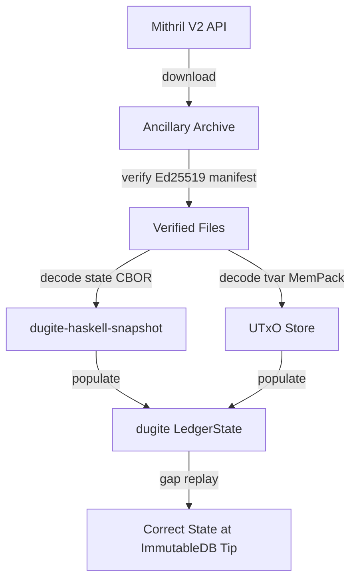

# Mithril Ancillary Ledger State Import

**Date**: 2026-04-06
**Issue**: #347
**Status**: Design

## Problem

After Mithril snapshot import, dugite constructs a fresh `LedgerState` from hardcoded defaults + genesis overlays instead of restoring the actual ledger state. This produces incorrect protocol parameters, epoch nonces, governance state, stake snapshots, treasury/reserves, and other fields. The node must replay all blocks from genesis (~10h on preview) to reach correct state. Two heuristic patches fix only `max_tx_ex_units.mem` and `protocol_version_major`, leaving dozens of other fields wrong.

## Solution

Download the Mithril **ancillary archive** (available via the V2 `/artifact/cardano-database` API), which contains the real cardano-node ledger state snapshots. Decode the Haskell CBOR `ExtLedgerState` into dugite's native `LedgerState`, populate the UTxO store from the `tables/tvar` file, and replay only the small gap from snapshot slot to immutable tip.

## Architecture

Five components:



### Component 1: `dugite-haskell-snapshot` (new module in dugite-serialization)

A CBOR decoder for the Haskell `ExtLedgerState` snapshot format. Pure decoding, no side effects.

**Not a new crate** — add as a module `haskell_snapshot` within `dugite-serialization` since it is fundamentally a serialization concern and can reuse existing CBOR primitives.

### Component 2: Mithril API Upgrade (dugite-node/src/mithril.rs)

Switch from legacy `/artifact/snapshots` to V2 `/artifact/cardano-database`. Download the ancillary archive alongside immutables.

### Component 3: Ancillary Verification (dugite-node/src/mithril.rs)

Ed25519 manifest signature verification + SHA-256 per-file digest checks.

### Component 4: Ledger State Population (dugite-node/src/node/mod.rs)

After Mithril import, decode the Haskell snapshot and populate dugite's `LedgerState`. Replay only the gap from snapshot slot to ImmutableDB tip.

### Component 5: Cleanup (dugite-node/src/node/mod.rs)

Remove the "stale defaults" and "protocol version behind era" heuristic corrections.

## Detailed Design

### 1. CBOR Structure (verified against real preview ancillary archive + Haskell source)

The ancillary archive contains:

```
immutable/NNNNN.{chunk,primary,secondary}   # Next incomplete immutable trio
ledger/<slot>/meta                          # JSON: {"backend":"utxohd-mem","checksum":<crc32>}
ledger/<slot>/state                         # CBOR: ExtLedgerState (~16MB)
ledger/<slot>/tables/tvar                   # CBOR+MemPack: UTxO set (~610MB)
ancillary_manifest.json                     # SHA-256 digests + Ed25519 signature
```

The `state` file CBOR structure (verified field-by-field against real data and Koios):

```
state_file = array(2) [
  snapshot_version = 1,
  ExtLedgerState = array(2) [

    HFC_LedgerState_Telescope = array(7) [  -- length = era_index + 1
      Byron:   array(2) [start_bound, end_bound],
      Shelley: array(2) [start_bound, end_bound],
      Allegra: array(2) [start_bound, end_bound],
      Mary:    array(2) [start_bound, end_bound],
      Alonzo:  array(2) [start_bound, end_bound],
      Babbage: array(2) [start_bound, end_bound],
      Conway:  array(2) [start_bound, current_state]
    ],

    HeaderState = array(2) [
      WithOrigin(AnnTip),     -- [] for Origin, [AnnTip] for At
      HFC_ConsensusState_Telescope = array(7) [...]
    ]
  ]
]

where:
  bound = array(3) [relative_time_pico: int, slot: uint, epoch: uint]

  -- NOTE: Peras adds optional 4th field to bound; handle array(3) or array(4)

  current_state = array(2) [
    shelley_version = 2,
    ShelleyLedgerState = array(3|4) [  -- array(3) pre-Peras, array(4) post-Peras
      WithOrigin(ShelleyTip),
      NewEpochState,
      shelley_transition: uint32,
      ?latest_peras_cert_round: StrictMaybe(uint64)  -- only in array(4)
    ]
  ]

  -- CRITICAL: ShelleyTip = [slot, blockNo, hash]
  --           AnnTip     = [slot, hash, blockNo]   (different field order!)

  WithOrigin(x) = [] | [x]  -- no tag byte, just array length 0 or 1
  StrictMaybe(x) = [] | [x] -- same encoding as WithOrigin
  Nonce = [0] | [1, bytes(32)]
```

#### NewEpochState (array(7))

```
NewEpochState = array(7) [
  [0] epoch: uint,
  [1] blocksMadePrev: map(bytes(28) → uint),
  [2] blocksMadeCur:  map(bytes(28) → uint),
  [3] EpochState = array(4) [
    [0] ChainAccountState = array(2) [treasury: uint, reserves: uint],
    [1] LedgerState = array(2) [
      [0] CertState,      -- *** FIRST (not UTxOState!) ***
      [1] UTxOState
    ],
    [2] SnapShots = array(4) [mark, set, go, fee: uint],
    [3] NonMyopic = array(2) [map(pool→likelihood), rewardPot: uint]
  ],
  [4] rewardUpdate: StrictMaybe(PulsingRewUpdate),
  [5] PoolDistr = array(2) [map(bytes(28)→IndividualPoolStake), totalStake: uint],
  [6] stashedAVVM: null  -- Conway encodes () as null/0xf6
]
```

#### UTxOState (array(6))

```
UTxOState = array(6) [
  [0] utxo: map(empty),     -- always empty in EmptyMK (UTxO-HD); real UTxO in tables/tvar
  [1] deposited: uint,       -- total deposits in lovelace
  [2] fees: uint,            -- accumulated fees
  [3] ConwayGovState = array(7) [
    [0] proposals,
    [1] committee: StrictMaybe(Committee),
    [2] constitution: array(2) [anchor, script_hash?],
    [3] curPParams:  array(31),   -- current protocol parameters
    [4] prevPParams: array(31),   -- previous epoch's protocol parameters
    [5] futurePParams,            -- tagged sum: [0]=none, [1,pp]=definite, [2,maybe_pp]=potential
    [6] drepPulsingState          -- always serialized as DRComplete
  ],
  [4] instantStake: map,     -- IncrementalStake (credential → coin)
  [5] donation: uint          -- treasury donation buffer
]
```

#### PParams (array(31)) — verified against Koios

```
array(31) [
  [ 0] txFeePerByte:                uint,         -- a.k.a. minFeeA
  [ 1] txFeeFixed:                  uint,         -- a.k.a. minFeeB
  [ 2] maxBlockBodySize:            uint32,
  [ 3] maxTxSize:                   uint32,
  [ 4] maxBlockHeaderSize:          uint16,
  [ 5] keyDeposit:                  uint,         -- lovelace
  [ 6] poolDeposit:                 uint,         -- lovelace
  [ 7] eMax:                        uint,         -- max pool retirement epoch
  [ 8] nOpt:                        uint16,       -- desired number of pools
  [ 9] a0:                          rational,     -- pool pledge influence
  [10] rho:                         rational,     -- monetary expansion rate
  [11] tau:                         rational,     -- treasury growth rate
  [12] protocolVersion:             array(2) [major: uint, minor: uint],
  [13] minPoolCost:                 uint,         -- lovelace
  [14] coinsPerUTxOByte:            uint,         -- lovelace per byte
  [15] costModels:                  map(uint → array),  -- PlutusV1=0, V2=1, V3=2
  [16] prices:                      array(2) [mem: rational, steps: rational],
  [17] maxTxExUnits:                array(2) [mem: uint, steps: uint],
  [18] maxBlockExUnits:             array(2) [mem: uint, steps: uint],
  [19] maxValSize:                  uint32,
  [20] collateralPercentage:        uint16,
  [21] maxCollateralInputs:         uint16,
  [22] poolVotingThresholds:        array(5) [rationals],
  [23] dRepVotingThresholds:        array(10) [rationals],
  [24] committeeMinSize:            uint16,
  [25] committeeMaxTermLength:      uint,         -- epochs
  [26] govActionLifetime:           uint,         -- epochs
  [27] govActionDeposit:            uint,         -- lovelace
  [28] dRepDeposit:                 uint,         -- lovelace
  [29] dRepActivity:                uint,         -- epochs
  [30] minFeeRefScriptCostPerByte:  rational
]
```

#### CertState (array(3)) — Conway order: V, P, D

```
CertState = array(3) [
  [0] VState = array(3) [
    dReps:            map(credential → DRepState),
    committeeState:   map((tag,credential) → authorization),
    dormantEpochs:    uint
  ],
  [1] PState = array(4) [
    vrfKeyHashes:          map(bytes(32) → uint),      -- VRF key → refcount
    stakePools:            map(bytes(28) → StakePoolState(9|10)),
    futureStakePoolParams: map(bytes(28) → PoolParams(9)),
    retirements:           map(bytes(28) → uint)        -- pool → epoch
  ],
  [2] DState = array(4) [
    accounts:         map(credential → ConwayAccountState(4)),
    futureGenDelegs:  map,    -- empty in Conway
    genDelegs:        map,    -- genesis delegates
    iRewards:         array(4) [iRReserves, iRTreasury, deltaReserves, deltaTreasury]
  ]
]

where:
  credential = [0, bytes(28)] | [1, bytes(28)]  -- KeyHash | ScriptHash
  ConwayAccountState = array(4) [balance, deposit, stakePoolDelegation?, dRepDelegation?]
    -- nullable fields use CBOR null (0xf6), not StrictMaybe []
  StakePoolState = array(9|10) [vrf, pledge, cost, margin, rewardAccount, owners, relays, metadata, deposit, ?delegators]
```

#### SnapShots (array(4)) — dual format

```
SnapShots = array(4) [mark, set, go, fee: uint]

SnapShot (old format, currently on preview) = array(3) [
  stake:       map(credential → uint),       -- CompactCoin per staker
  delegations: map(credential → bytes(28)),   -- staker → pool hash
  poolParams:  map(bytes(28) → array(9|10))   -- pool → StakePoolSnapShot or PoolParams
]

SnapShot (new format, current Haskell HEAD) = array(2) [
  activeStake:   map(credential → StakeWithDelegation),
  poolSnapshots: map(bytes(28) → StakePoolSnapShot(10))
]

-- Decoder must handle BOTH formats by checking array length (2 vs 3)
-- ssStakeMarkPoolDistr is NOT serialized — recompute on decode
```

#### PraosState (array(7|8)) — in HeaderState telescope

```
Conway_ConsensusState = array(2) [
  start_bound,
  PraosState_versioned = array(2) [
    version = 0,
    PraosState = array(7|8) [
      lastSlot:               WithOrigin(uint),    -- [] or [slot]
      oCertCounters:          map(bytes(28) → uint),
      evolvingNonce:          Nonce,
      candidateNonce:         Nonce,
      epochNonce:             Nonce,
      ?previousEpochNonce:    Nonce,                -- only in array(8)
      labNonce:               Nonce,
      lastEpochBlockNonce:    Nonce
    ]
  ]
]
```

### 2. UTxO Table (tables/tvar) — MemPack Format

```
tvar_file = array(1) [
  map(indefinite) {
    bytes(34) → bytes(N),   -- MemPack TxIn → MemPack TxOut
    ...
  }
]
```

**TxIn encoding** (34 bytes packed):
```
bytes(34) = TxId(32 bytes, big-endian) || TxIx(2 bytes, LITTLE-ENDIAN)
```
NOTE: TxIx uses host-native byte order (little-endian on x86_64/ARM64). The comment in
Haskell's `Snapshots.hs` says "big-endian txix" but the implementation uses `writeWord8ArrayAsWord16#`
which is host-native. Verified against real data: TxIx=1 encodes as `01 00`, not `00 01`.

**TxOut encoding** (MemPack binary, NOT CBOR):
First byte is a **tag** (0-5) identifying the TxOut variant:

| Tag | Variant | Fields |
|-----|---------|--------|
| 0 | TxOutCompact | CompactAddr + CompactValue |
| 1 | TxOutCompactDH | CompactAddr + CompactValue + DataHash(32 bytes) |
| 2 | AddrHash28_AdaOnly | Credential + Addr28Extra + CompactCoin (optimized) |
| 3 | AddrHash28_AdaOnly_DataHash32 | Credential + Addr28Extra + CompactCoin + DataHash32 |
| 4 | TxOutCompactDatum | CompactAddr + CompactValue + Datum(MemPack) |
| 5 | TxOutCompactRefScript | CompactAddr + CompactValue + Datum(MemPack) + Script(MemPack) |

Distribution on preview: ~49% tag 0, ~34% tag 2, ~15% tag 4, ~2% tags 1/5.

Sub-encodings:
- **CompactAddr**: VarLen(length) + raw address bytes. VarLen uses 7-bit groups, LSB first,
  continuation bit in MSB. Typical Shelley address (57 bytes): `0x39` (1 byte) + 57 bytes.
- **CompactValue (ADA-only)**: `tag(0) + VarLen(lovelace)`
- **CompactValue (multi-asset)**: `tag(1) + VarLen(lovelace) + VarLen(numAssets) + MultiAsset_repr`
- Tags 2/3 are optimized representations for enterprise/pointer addresses with ADA-only value;
  require `decodeAddress28`/`decodeDataHash32` unpacking.

**Implementation approach**: Build a MemPack decoder by porting the `MemPack` trait instances
from cardano-ledger's `Babbage/TxOut.hs`. Start with tags 0 and 2 (ADA-only variants, ~83%
of entries), then extend to multi-asset (tag 4/5) and datum variants (tag 1/3).

### 3. Mithril V2 API Integration

#### API Flow

```
1. GET /artifact/cardano-database          → list snapshots
2. Select latest snapshot by epoch
3. GET /artifact/cardano-database/{hash}   → get detail with locations
4. Download immutables via template URI    → per-file archives
5. Download ancillary via direct URI       → single tar.zst archive
6. Verify immutables via Mithril STM certificate chain
7. Verify ancillary via Ed25519 manifest signature
```

#### Ancillary Verification Algorithm

```
1. Extract ancillary tar.zst to temp directory
2. Parse ancillary_manifest.json:
   {
     "data": {
       "file_path_1": "sha256_hex_1",
       "file_path_2": "sha256_hex_2",
       ...
     },
     "signature": "ed25519_hex"
   }
3. Verify each file's SHA-256 digest
4. Compute manifest hash:
   sha256 = SHA256::new()
   for (key, value) in BTreeMap_sorted_entries:
     sha256.update(key.to_utf8_bytes())
     sha256.update(value.to_utf8_bytes())  // hex STRING bytes, not decoded
   hash = sha256.finalize()
5. Verify Ed25519 signature over hash using ancillary verification key
```

#### Ancillary Verification Keys

| Network | Key (hex-encoded JSON byte array) |
|---------|----------------------------------|
| Preview | `5b3138392c3139322c3231362c3135302c3131342c3231362c3233372c3231302c34352c31382c32312c3139362c3230382c3234362c3134362c322c3235322c3234332c3235312c3139372c32382c3135372c3230342c3134352c33302c31342c3232382c3136382c3132392c38332c3133362c33365d` |
| Preprod | Same as Preview |
| Mainnet | `5b32332c37312c39362c3133332c34372c3235332c3232362c3133362c3233352c35372c3136342c3130362c3138362c322c32312c32392c3132302c3136332c38392c3132312c3137372c3133382c3230382c3133382c3231342c39392c35382c32322c302c35382c332c36395d` |

### 4. Ledger State Population

Map decoded Haskell state to dugite's `LedgerState`:

| dugite field | Source path in Haskell snapshot |
|---|---|
| `epoch` | `NewEpochState[0]` |
| `protocol_params` | `NES[3].LedgerState[1].GovState[3]` (curPParams) |
| `prev_protocol_params` | `NES[3].LedgerState[1].GovState[4]` (prevPParams) |
| `treasury` | `NES[3].EpochState[0][0]` (ChainAccountState) |
| `reserves` | `NES[3].EpochState[0][1]` |
| `evolving_nonce` | `HeaderState.Telescope[6].PraosState[2]` |
| `candidate_nonce` | `HeaderState.Telescope[6].PraosState[3]` |
| `epoch_nonce` | `HeaderState.Telescope[6].PraosState[4]` |
| `lab_nonce` | `HeaderState.Telescope[6].PraosState[5 or 6]` (depends on array length) |
| `delegations` | `NES[3].LedgerState[0].DState[0]` → extract pool delegations from ConwayAccountState |
| `pool_params` | `NES[3].LedgerState[0].PState[1]` |
| `reward_accounts` | `NES[3].LedgerState[0].DState[0]` → extract balances from ConwayAccountState |
| `governance` | `NES[3].LedgerState[1].GovState` (proposals, committee, constitution) |
| `snapshots` | `NES[3].EpochState[2]` (mark/set/go) |
| `stake_distribution` | Recomputed from mark snapshot pool distribution |
| `tip` | `ShelleyLedgerState[0]` (ShelleyTip: slot, blockNo, hash) |
| `utxo_set` | `tables/tvar` (separate file) |
| `opcert_counters` | `HeaderState.Telescope[6].PraosState[1]` |

### 5. Startup Flow After Import

```
1. Download immutables archive (existing flow, or upgrade to V2 per-file)
2. Download ancillary archive (NEW)
3. Verify ancillary manifest (Ed25519)
4. Extract ledger/<newest_slot>/state → decode ExtLedgerState
5. Extract ledger/<newest_slot>/tables/tvar → populate UTxO store
6. Populate dugite LedgerState from decoded state
7. Save native dugite ledger snapshot (for fast subsequent restarts)
8. Determine gap: snapshot_slot to ImmutableDB_tip_slot
9. Replay gap blocks using ApplyOnly mode (no crypto validation)
10. Start normal sync from ImmutableDB tip
```

Expected gap size: ~900 slots (15 minutes of blocks), taking seconds to replay.

### 6. Cleanup

Remove from `dugite-node/src/node/mod.rs`:
- "Stale defaults" detection and genesis params overlay (~lines 467-510)
- "Protocol version behind era" correction (~lines 512-541)
- Genesis params overlay logic for loaded snapshots

These become dead code once the snapshot always has correct state.

## Version Compatibility

The decoder must handle format variations across cardano-node versions:

| Feature | cardano-node ≤10.6 | cardano-node ≥10.7 |
|---------|--------------------|--------------------|
| ShelleyLedgerState | array(3) | array(4) — Peras field |
| PraosState | array(7) | array(8) — previousEpochNonce |
| Bound | array(3) | array(3 or 4) — Peras round |
| StakePoolState | array(9) | array(10) — delegators set |
| SnapShot | array(3) old format | array(2) new format |

Strategy: check array length before decoding, branch accordingly. All formats decode to the same dugite internal types.

## Testing Strategy

1. **Golden tests**: Save real ancillary state files as test fixtures; decode and verify against known Koios values
2. **Round-trip**: Decode Haskell snapshot → populate dugite LedgerState → compare PParams, nonces, treasury/reserves against Koios for the same epoch
3. **Integration**: Full Mithril import on preview → verify node starts, syncs, and produces correct tip
4. **Cross-validation**: After gap replay, query protocol params via N2C and compare with `cardano-cli query protocol-parameters` from a Haskell node

## Acceptance Criteria

- [ ] After Mithril import, `LedgerState` has correct protocol parameters matching Koios
- [ ] No "stale defaults" or "protocol version behind era" warnings on clean startup
- [ ] Startup time after Mithril import is minutes (gap replay), not hours (full replay)
- [ ] Epoch nonces, stake distribution, treasury, and governance state are correct
- [ ] Block production works immediately after Mithril import
- [ ] UTxO set from tvar is correctly populated and queryable
- [ ] Heuristic correction code is removed
